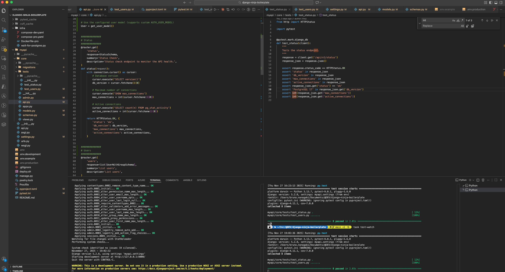

# Configurando o Django

Agora que já temos a nossa infra toda configurada, vamos começar a subir o Django e criar a nossa primeira rota de API!

## Criando a app `core`:

Para começar a nossa API, vamos criar uma app nova chamada `core`, que vai ter coisas relacionadas ao sistema, como API de check de status e de gerência de usuários. Posteriormente criaremos outras apps para a nossa API.

Para a estrutura de pastas das apps ficarem dentro da pasta do projeto "myapi˜, vamos primeiro dar um cd no "myapi" e criar o app a partir de lá. Desse jeito, acho que fica mais organizado:

```bash
cd myapi
python ../manage.py startapp core
```

Na raíz do projeto vai ter as pastas `src` e `tests`, que o Django cria por padrão. Podemos apagá-las para não ficar lixo.

A estrutura de pastas do projeto ficará assim:

```bash
.
├── db.sqlite3
├── infra
│   ├── compose-dev.yaml
│   └── wait-for-postgres.py
├── manage.py
├── myapi
│   ├── __init__.py
│   ├── asgi.py
│   ├── core
│   │   ├── __init__.py
│   │   ├── admin.py
│   │   ├── apps.py
│   │   ├── migrations
│   │   │   └── __init__.py
│   │   ├── models.py
│   │   ├── tests.py
│   │   └── views.py
│   ├── settings.py
│   ├── urls.py
│   └── wsgi.py
├── poetry.lock
├── Procfile
├── pyproject.toml
├── pytest.ini
├── README.md
```

## Editando o `./myapi/core/apps.py` e `./myapi/settings.py`

Vamos editar o arquivo `./myapi/core/apps.py` para o seguinte:

```python title="./myapi/core/apps.py"
class CoreConfig(AppConfig):
    default_auto_field = 'django.db.models.BigAutoField'
    # name = 'core'        # ==> Remover
    name = 'myapi.core'    # <== Adicionar
```

E agora no `./myapi/settings.py`, vamos incluir o seguinte:

- Tirar a SECRET_KEY do `settings.py` e importar o `.env` através da lib `decouple`
- Adicionar ALLOWED_HOSTS já com o domínio que futuramente colocaremos pra nossa Prod
- Adicionar a nossa app `core` em `INSTALLED_APPS`, junto com a extensão `django_extensions`, que poderemos usar mais pra frente
- Configurar o Banco de Dados Postgres ao invés do SQLIte

```python title="./myapi/settings.py" hl_lines="12-13"
from decouple import Csv, config

ALLOWED_HOSTS = config('ALLOWED_HOSTS', default='localhost,127.0.0.1', cast=Csv())

INSTALLED_APPS = [
    'django.contrib.admin',
    'django.contrib.auth',
    'django.contrib.contenttypes',
    'django.contrib.sessions',
    'django.contrib.messages',
    'django.contrib.staticfiles',
    'django_extensions',   # <= Adicione isso
    'myapi.core',          # <= Adicione isso
]

# Remova esse bloco:
#DATABASES = {
#    'default': {
#        'ENGINE': 'django.db.backends.sqlite3',
#        'NAME': BASE_DIR / 'db.sqlite3',
#    }
#}
DATABASES = {
    'default': {
        'ENGINE': 'django.db.backends.postgresql',
        'NAME': config('POSTGRES_DB', default='postgres'),
        'USER': config('POSTGRES_USER', default='devuser'),
        'PASSWORD': config('POSTGRES_PASSWORD', default='devpassword'),
        'HOST': config('DATABASE_HOST', default='localhost'),
        'PORT': config('DATABASE_PORT', default='5432'),
    }
}
```

## Criando `./myapi/api.py`:

Vamos criar um arquivo novo chamado `./myapi/api.py`. Esse será o arquivo principal da nossa API, que vai agrupar as rotas dos demais apps, como as do `core`:

```python title="./myapi/api.py"
from ninja import NinjaAPI

api = NinjaAPI()

api.add_router('', 'myapi.core.api.router')
```

## Editando `./myapi/urls.py`:

Agora vamos editar o `./myapi/urls.py`, adicionando a rota principal da nossa API, que vou chamar de `api/v1/`:

```python title="./myapi/urls.py"
from django.contrib import admin
from django.urls import path

from .api import api

urlpatterns = [
    path('admin/', admin.site.urls),
]

api_urlpatterns = [
    path('api/v1/', api.urls),
]

urlpatterns += api_urlpatterns
```

## Criando uma API de status no `core`

Agora sim vamos criar a nossa primeira API de status. A ideia é que a rota `api/v1/status` nos retorne com o status da API, a versão do banco, o maximo de conexões suportadas e a quantidade de conexões ativas. Como já temos o nosso banco configurado no `settings.py`, para se conectar a ele é só importar `connections` do `django.db`!

Na pasta `core`, vamos criar um arquivo chamado `api.py`, onde incluiremos as nossas rotas:

```python title="./myapi/core/api.py"
from datetime import datetime
from django.db import connection
from http import HTTPStatus
from ninja import Router

from .schemas import (
    StatusSchema,
)

router = Router(tags=['Admin'])

@router.get(
    'status',
    response=StatusSchema,
    summary='Status Check',
    description='Status check endpoint to monitor the API health.',
)
def status(request):
    with connection.cursor() as cursor:
        # Database version
        cursor.execute('SELECT version()')
        db_version = cursor.fetchone()[0]

        # Maximum number of connections
        cursor.execute('SHOW max_connections')
        max_connections = int(cursor.fetchone()[0])

        # Active connections
        cursor.execute('SELECT count(*) FROM pg_stat_activity')
        active_connections = int(cursor.fetchone()[0])

    return HTTPStatus.OK, {
        'updated_at': str(datetime.now())
        'db_version': db_version,
        'max_connections': max_connections,
        'active_connections': active_connections,
    }
```

E vamos também definir o Schema que é usado no retorno dessa API

```python title="./myapi/core/schemas.py"
from ninja import Schema

class StatusSchema(Schema):
    updated_at: str
    db_version: str
    max_connections: int
    active_connections: int
```

## Rodando o servidor

Certo, agora para iniciar o servidor, basta dar o comando `task run`

Note que ele vai subir o Banco de Dados, aguardar ele ficar disponível, rodar a migração e subir o Web server:

```bash
[+] Running 1/1
 ✔ Container postgres-dev  Running                                                                                                                                                                                        0.0s


🔴 Waiting for Postgres to accept connections...

🟢 Postgres is ready!
Operations to perform:
  Apply all migrations: admin, auth, contenttypes, sessions
Running migrations:
  Applying contenttypes.0001_initial... OK
  Applying auth.0001_initial... OK
  Applying admin.0001_initial... OK
  Applying admin.0002_logentry_remove_auto_add... OK
  Applying admin.0003_logentry_add_action_flag_choices... OK
  Applying contenttypes.0002_remove_content_type_name... OK
  Applying auth.0002_alter_permission_name_max_length... OK
  Applying auth.0003_alter_user_email_max_length... OK
  Applying auth.0004_alter_user_username_opts... OK
  Applying auth.0005_alter_user_last_login_null... OK
  Applying auth.0006_require_contenttypes_0002... OK
  Applying auth.0007_alter_validators_add_error_messages... OK
  Applying auth.0008_alter_user_username_max_length... OK
  Applying auth.0009_alter_user_last_name_max_length... OK
  Applying auth.0010_alter_group_name_max_length... OK
  Applying auth.0011_update_proxy_permissions... OK
  Applying auth.0012_alter_user_first_name_max_length... OK
  Applying sessions.0001_initial... OK
Watching for file changes with StatReloader
Performing system checks...

System check identified no issues (0 silenced).
November 27, 2025 - 21:53:16
Django version 5.2.8, using settings 'myapi.settings'
Starting development server at http://127.0.0.1:8000/
Quit the server with CONTROL-C.

WARNING: This is a development server. Do not use it in a production setting. Use a production WSGI or ASGI server instead.
For more information on production servers see: https://docs.djangoproject.com/en/5.2/howto/deployment/
```

E para testar, você pode entrar na Doc Swagger que ele cria automaticamente: http://localhost:8000/api/v1/docs

## Criando testes

Mas vamos criar os testes automatizados para garantir que a nossa API responde conforme o esperado.

Vamos criar uma pasta `tests` do dentro do nosso app `core`, e criar um arquivo chamado `test_status.py`. O arquivo padrão `tests.py` a gente pode remover.

```python title="./myapi/core/tests/test_status.py"
from http import HTTPStatus

import pytest


@pytest.mark.django_db
def test_status(client):
    """
    Tests the status endpoint.
    """
    response = client.get('/api/v1/status')
    response_json = response.json()

    assert response.status_code == HTTPStatus.OK
    assert 'updated_at' in response_json
    assert 'db_version' in response_json
    assert 'max_connections' in response_json
    assert 'active_connections' in response_json
    assert 'PostgreSQL 17' in response_json.get('db_version')
    assert int(response_json.get('max_connections'))
    assert int(response_json.get('active_connections'))
```

E agora vamos rodar o `task test`:

```bash
[+] Running 1/1
 ✔ Container postgres-dev  Running                                                                                                                                                                                        0.0s


🔴 Waiting for Postgres to accept connections...

🟢 Postgres is ready!
18:59:55 system | web.1 started (pid=54711)
18:59:55 system | test.1 started (pid=54712)
18:59:55 test.1 | ============================= test session starts ==============================
18:59:55 test.1 | platform darwin -- Python 3.13.7, pytest-9.0.1, pluggy-1.6.0 -- /Users/bruno.nonogaki/Library/Caches/pypoetry/virtualenvs/django-ninja-boilerplate-59IP_pmI-py3.13/bin/python
18:59:55 test.1 | cachedir: .pytest_cache
18:59:55 test.1 | django: version: 5.2.8, settings: myapi.settings (from ini)
18:59:55 test.1 | rootdir: /Users/bruno.nonogaki/Documents/@DEV/@STUDY/django-ninja-boilerplate
18:59:55 test.1 | configfile: pytest.ini (WARNING: ignoring pytest config in pyproject.toml!)
18:59:55 test.1 | plugins: django-4.11.1, cov-7.0.0
18:59:55 test.1 | collecting ... collected 1 item
18:59:55 test.1 |
18:59:56 test.1 | myapi/core/tests/test_status.py::test_status PASSED                      [100%]
18:59:56 test.1 |
18:59:56 test.1 | ============================== 1 passed in 0.31s ===============================
18:59:56 system | test.1 stopped (rc=0)
18:59:56 system | sending SIGTERM to web.1 (pid 54711)
18:59:56 system | web.1 stopped (rc=-15)
```

Show, os testes passaram!!!

Agora uma forma legal de programar no VSCode é dividir o terminal em dois. Em um você roda o `task run`, e no outro você deixa rodando o `task test-watch`. Dessa forma, sempre que você for alterando algum arquivo e salvando, o VSCode roda os testes.



## Criando usuário admin padrão

Para criar um "super user" no Django, o comando é `python manage.py createsuperuser`. Mas seria legal se a gente pudesse já por padrão criar esse usuário na inicialização do serviço. Mais especificamente, vamos criar o superuser automaticamente depois de rodar a migration.

Para isso, vamos adicionar um script no `./myapi/core/apps.py`:

```python title="./myapi/core/apps.py"
from decouple import config
from django.apps import AppConfig
from django.contrib.auth import get_user_model
from django.db.models.signals import post_migrate

class CoreConfig(AppConfig):
    default_auto_field = 'django.db.models.BigAutoField'
    name = 'myapi.core'

    def ready(self):
        # Create/update default superuser after migrations run.
        def create_default_superuser(sender, **kwargs):
            User = get_user_model()
            username = config('DJANGO_ADMIN_USER', default='admin')
            email = config('DJANGO_ADMIN_EMAIL', default='admin@admin.com')
            password = config('DJANGO_ADMIN_PASSWORD', default='devpassword')

            try:
                existing = User.objects.filter(username=username).first()
                if existing:
                    changed = False
                    if not existing.is_superuser:
                        existing.is_superuser = True
                        changed = True
                    if not existing.is_staff:
                        existing.is_staff = True
                        changed = True
                    if email and getattr(existing, 'email', None) != email:
                        existing.email = email
                        changed = True
                    if password:
                        existing.set_password(password)
                        changed = True
                    if changed:
                        existing.save()
                else:
                    # create_superuser will set is_superuser and is_staff
                    User.objects.create_superuser(username=username, email=email, password=password)
            except Exception:
                # Don't raise during migrate; fail silently to avoid breaking deploys.
                pass

        post_migrate.connect(create_default_superuser, sender=self)
```

## Estrutura do projeto até agora

Por enquanto, a estrutura do nosso projeto está assim:

```bash
.
├── infra
│   ├── compose-dev.yaml
│   └── wait-for-postgres.py
├── manage.py
├── myapi
│   ├── __init__.py
│   ├── api.py
│   ├── asgi.py
│   ├── core
│   │   ├── __init__.py
│   │   ├── admin.py
│   │   ├── api.py
│   │   ├── apps.py
│   │   ├── migrations
│   │   │   ├── __init__.py
│   │   ├── models.py
│   │   ├── schemas.py
│   │   ├── tests
│   │   │   └── test_status.py
│   │   └── views.py
│   ├── settings.py
│   ├── urls.py
│   └── wsgi.py
├── poetry.lock
├── Procfile
├── pyproject.toml
├── pytest.ini
└── README.md
```
