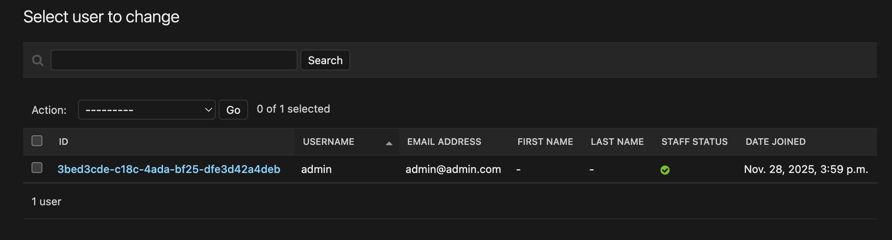

# Fazendo o CRUD de Users

Para praticarmos um pouco de CRUD básico no Django Ninja, vamos desenvolver o CRUD de usuários, que é um Model que já vem por padrão no Django. Mas vamos aumentar um pouco a complexidade reescrevendo esse Model padrão para alterar o id de `int` para `UUID`.


## Criando a app `users`

Primeiramente, vamos criar uma nova `app` para `users`:
```bash
cd myapi
python ../manage.py startapp users
```

Isso vai criar uma nova pasta chamada `users` dentro de `myapi`, com os arquivos default dentro. A primeira coisa que temos que fazer depois disso é registrar a nossa app dentro do arquivo `settings.py`

```python title="./myapi/settings.py" hl_lines="11"
INSTALLED_APPS = [
    'django.contrib.admin',
    'django.contrib.auth',
    'django.contrib.contenttypes',
    'django.contrib.sessions',
    'django.contrib.messages',
    'django.contrib.staticfiles',
    'corsheaders',
    'django_extensions',
    'myapi.core',
    'myapi.users',  # <= Adicione isso
]
```

## Recriando o Model Users

Vamos editar o arquivo `./myapi/users/models.py` e criar o nosso modelo novo de Users, herdando de AbstractUser:

```python title="./myapi/users/models.py"
import uuid

from django.contrib.auth.models import AbstractUser
from django.db import models


class UUIDUser(AbstractUser):
    id = models.UUIDField(primary_key=True, default=uuid.uuid4, editable=False)

    def __str__(self):
        return self.username
```

Agora precisamos definir no `settings.py` que esse é o nosso novo model de Users:

```python title="./myapi/settings.py"
# Custom User Model
AUTH_USER_MODEL = 'users.UUIDUser'
```

E como redefinimos o model, se quisermos que ele apareça no Admin do Django, vamos precisar registrá-lo no arquivo `admin.py` do app core:

```python title="./myapi/users/admin.py"
from django.contrib import admin
from django.contrib.auth.admin import UserAdmin

from .models import UUIDUser


# Register custom User with full Django Admin interface
@admin.register(UUIDUser)
class MyUserAdmin(UserAdmin):
    # Fields that will appear in the user list
    list_display = ('id', 'username', 'email', 'first_name', 'last_name', 'is_staff', 'date_joined')

    # Fields for search
    search_fields = ('username', 'email', 'first_name', 'last_name')

    # Filters in the sidebar
    list_filter = ('is_staff', 'is_superuser', 'is_active', 'date_joined')

    # Organization of fields in the edit form
    fieldsets = UserAdmin.fieldsets + (
        ('UUID Info', {'fields': ('id',)}),  # Shows UUID (read-only)
    )

    # Read-only fields
    readonly_fields = ('id', 'date_joined', 'last_login')
```

Boa, agora é só rodar a migration com o atalho que criamos no `Taskipy`:

```bash
task migrate
```

Agora se entrarmos no admin do Django, veremos que o ID do usuário admin (que foi criado automaticamente depois da migration), está como UUID ao invés de inteiro:



## Criando o CRUD de Users

### Get

Vamos começar com um GET simples na lista de usuários. Mas antes disso, vamos criar um Schema de Users. Como o Django já implementa por padrão o Model de Users, a gente pode usar um objeto chamado `ModelSchema` para criar automaticamente o Schema a partir do Model. Vamos usar bastante isso mais pra frente. Então para criar um Schema para Users, poderíamos fazer simplesmente isso:

```python title="./myapi/users/schemas.py"
from ninja import ModelSchema, Schema

from django.contrib.auth.models import User


class UserSchema(ModelSchema):

    class Meta:
        model = User
        fields = '__all__'
```

Mas atenção, que isso exporia todos os campos do Model User, inclusive a senha, então poderíamos fazer assim para excluir alguns campos:

```python title="./myapi/users/schemas.py"
from ninja import ModelSchema, Schema

from django.contrib.auth.models import User


class UserSchema(ModelSchema):

    class Meta:
        model = User
        exclude = ['password', 'last_login', 'date_joined', 'user_permissions', 'groups']
```

Mas como a gente redefiniu o nosso Model de Users para usar UUID, não podemos usar o User do `django.contrib.auth.models`. Ao invés disso, usaremos o `get_user_model()`. Faremos assim:

```python title="./myapi/users/schemas.py"
from django.contrib.auth import get_user_model
from ninja import Field, ModelSchema, Schema

# Use configured user model so schemas work with AUTH_USER_MODEL
User = get_user_model()

class UserSchema(ModelSchema):
    class Meta:
        model = User
        exclude = ['password', 'last_login', 'date_joined', 'user_permissions', 'groups']
```

Uma outra forma de criar nosso Schema é com o método `create_schema`, e podemos aproveitar e trazer a lista de grupos de o usuário faz parte, usando o `depth = 1`:

```python title="./myapi/users/schemas.py"
from django.contrib.auth import get_user_model
from ninja.orm import create_schema

# Use configured user model so schemas work with AUTH_USER_MODEL
User = get_user_model()

UserSchemaWithGroups = create_schema(
    User,
    depth=1,
    fields=['id', 'username', 'first_name', 'last_name', 'email', 'groups'],
    custom_fields=[('get_full_name', str, None)],
)
```

E agora vamos criar a nossa primeira rota de GET na app users. Mas antes disso, vamos declarar essa nova rota no arquivo principal `./api.py`:

```python title="./api.py" hl_lines="2"
api.add_router('', 'myapi.core.api.router')
api.add_router('', 'myapi.users.api.router') # <= Adicione isso
```

Agora sim vamos criar o arquivo `api.py` dentro da pasta `users`:

```python title="./myapi/users/api.py"
import uuid
from .schemas import (
    UserSchema, #não estamos usando, mas está aqui para referência
    UserSchemaWithGroups
)
from django.contrib.auth import get_user_model
from ninja.pagination import paginate
from django.shortcuts import get_object_or_404
from ninja import Router

User = get_user_model()

router = Router(tags=['Users'])

##############
# Users
##############

@router.get(
    'users',
    response=list[UserSchemaWithGroups],
    summary='List users',
    description='List users',
)
@paginate # O Django Ninja já oferece suporte nativo para paginação!
def list_users(request):
    return User.objects.all()


@router.get(
    'users/{id}',
    response=UserSchemaWithGroups,
    summary='Get user detail',
    description='Retrieve user details by ID',
)
def get_user_detail(request, id: uuid.UUID):
    return get_object_or_404(User, id=id) # Esse método é do Django, e retorna o usuário, se for encontrado, ou Erro 404 se não existir

@router.get(
    'users/username/{username}',
    response=UserWithGroupsSchema,
    summary='Get user detail',
    description='Retrieve user details by Username',
)
def get_user_detail_by_username(request, username: str):
    return get_object_or_404(User, username=username)
```

E agora vamos criar um teste para esses endpoints:

```python title="./myapi/users/tests/test_users.py"
from http import HTTPStatus

import pytest


@pytest.mark.django_db
def test_list_users(client):
    response = client.get('/api/v1/users')
    data = response.json()

    assert response.status_code == HTTPStatus.OK
    assert data['count'] == 1
    assert data['items'][0]['username'] == 'admin'

@pytest.mark.django_db
def test_get_user_detail(client):
    # Obtendo o ID do usuário admin
    User = get_user_model()
    admin = User.objects.get(username=config('DJANGO_ADMIN_USER'))
    response = client.get(f'/api/v1/users/{admin.id}')
    data = response.json()

    assert response.status_code == HTTPStatus.OK
    assert data['username'] == config('DJANGO_ADMIN_USER')

@pytest.mark.django_db
def test_get_user_detail_by_username(client):
    User = get_user_model()
    admin = User.objects.get(username=config('DJANGO_ADMIN_USER'))

    response = client.get(f'/api/v1/users/username/{admin.username}')
    data = response.json()

    assert response.status_code == HTTPStatus.OK
    assert data['username'] == config('DJANGO_ADMIN_USER')
```

### Post

Aqui é o mesmo esquema, vamos criar um Schema para o POST, e a rota do POST, e o teste de criação de usuário.

Para o Schema, vamos pedir como input da API apenas o usuário, nome, sobrenome, email e senha:

```python title="./myapi/users/models.py"
class UserCreateSchema(Schema):
    username: str = Field(..., example='newuser')
    first_name: str = Field(..., example='Firstname')
    last_name: str = Field(..., example='Lastname')
    email: str = Field(..., example='newuser@email.com')
    password: str = Field(..., example='strongpassword')
```

Agora a API. Aqui vamos colocar uma lógica para ele já barrar usuários com username ou e-mail repetidos. E o retorno de sucesso da API vai ser um 201 CREATED ao invés de 200 OK.

```python title="./myapi/users/api.py"
from ninja.responses import Response
from .schemas import (
    StatusSchema,
    UserSchema,
    UserWithGroupsSchema,
    UserCreateSchema,
)

@router.post(
    'users',
    response=UserWithGroupsSchema,
    summary='Create user',
    description='Create a new user',
)
def create_users(request, data: UserCreateSchema):
    # Pre-create validation: check username and email uniqueness
    if User.objects.filter(username=data.username).exists():
        return Response({'detail': 'Username or email already exist!'}, status=409)
    if User.objects.filter(email=data.email).exists():
        return Response({'detail': 'Username or email already exist!'}, status=409)

    try:
        user = User.objects.create_user(
            username=data.username,
            first_name=data.first_name,
            last_name=data.last_name,
            email=data.email,
            password=data.password,
        )
    except:
        return Response({'detail': 'Unable to create user'}, status=500)

    return Response(UserWithGroupsSchema.from_orm(user), status=201)

```

Agora vamos testar as situações de criar um novo usuário com sucesso, e de criar usuários repetidos esperando um erro:

```python title="./myapi/users/tests/test_users.py"
@pytest.mark.django_db
def test_create_users_success(client):
    user_payload = {
        'username': 'admin_new',
        'first_name': 'New',
        'last_name': 'Admin',
        'email': 'admin_new@admin.com',
        'password': 'myadminpassword',
    }
    response = client.post('/api/v1/users', data=json.dumps(user_payload), content_type='application/json')
    response_json = response.json()

    assert response.status_code == HTTPStatus.CREATED
    assert response_json['username'] == user_payload['username']


@pytest.mark.django_db
def test_create_users_duplicated_username(client):
    user_payload = {
        'username': 'admin',
        'first_name': 'New',
        'last_name': 'Admin',
        'email': 'admin_new@admin.com',
        'password': 'myadminpassword',
    }
    response = client.post('/api/v1/users', data=json.dumps(user_payload), content_type='application/json')
    assert response.status_code == HTTPStatus.CONFLICT


@pytest.mark.django_db
def test_create_users_duplicated_email(client):
    user_payload = {
        'username': 'admin_new',
        'first_name': 'New',
        'last_name': 'Admin',
        'email': 'admin@admin.com',
        'password': 'myadminpassword',
    }
    response = client.post('/api/v1/users', data=json.dumps(user_payload), content_type='application/json')
    assert response.status_code == HTTPStatus.CONFLICT
```

### Delete

O Delete não recebe nenhum payload, então não precisamos criar nenhum Schema novo. Vamos criar apenas a API e o teste. A API vai retornar un 204 NO CONTENT no caso de sucesso na deleção:

```python title="./myapi/users/api.py"
@router.delete(
    'users/{id}',
    summary='Delete user',
    response={204: None},
    description='Delete an user',
)
def delete_user(request, id: uuid.UUID):
    user = get_object_or_404(User, id=id)
    user.delete()
    return Response(None, status=204)
```

Agora vamos testar

```python title="./myapi/users/tests/test_users.py"
@pytest.mark.django_db
def test_delete_user(client):
    user_payload = {
        'username': 'admin_new',
        'first_name': 'New',
        'last_name': 'Admin',
        'email': 'admin_new@admin.com',
        'password': 'myadminpassword',
    }
    response = client.post('/api/v1/users', data=json.dumps(user_payload), content_type='application/json')
    user_id = response.json()['id']

    response = client.delete(f'/api/v1/users/{user_id}')
    assert response.status_code == HTTPStatus.NO_CONTENT
```

### Patch

Por fim, faremos o PATCH. Mas no caso do Patch a gente precisa de um Payload na request, então vamos criar um Schema novo:

```python title="./myapi/users/schemas.py"
class UserPatchSchema(Schema):
    username: str | None = None
    first_name: str | None = None
    last_name: str | None = None
    email: str | None = None
```

Agora vamos importar esse Schema na API e usar no Patch:

```python title="./myapi/users/api.py"
from .schemas import (
    StatusSchema,
    UserCreateSchema,
    UserPatchSchema,
    UserWithGroupSchema,
    UserPatchSchema,
)

@router.patch(
    'users/{id}',
    response=UserWithGroupSchema,
    summary='Update user partially',
    description='Update only specified user fields',
)
def patch_user(request, id: uuid.UUID, payload: UserPatchSchema):
    user = get_object_or_404(User, id=id)

    for field, value in payload.dict(exclude_unset=True).items():
        setattr(user, field, value)

    user.save()
    return Response(UserWithGroupSchema.from_orm(user), status=200)
```

E agora o teste:

```python title="./myapi/users/tests/test_users.py"
@pytest.mark.django_db
def test_patch_user(client):
    response = create_user()
    user_id = response.json()['id']

    patch_data = {
        'first_name': 'NewName',
        'email': 'newemail@admin.com',
    }

    response = client.patch(f'/api/v1/users/{user_id}', data=json.dumps(patch_data), content_type='application/json')

    response_json = response.json()
    assert response.status_code == HTTPStatus.OK
    assert response_json['first_name'] == 'NewName'
    assert response_json['email'] == 'newemail@admin.com'

```


## Implementando filtros na rota

Vamos melhorar um pouco a busca de usuários, implementando filtros na rota de GET

```python title="./myapi/users/api.py"
@router.get(
    'users',
    response=list[UserWithGroupsSchema],
    summary='List users',
    description='List users or filter by id/username',
)
@paginate
def list_users(request, id: uuid.UUID = None, username: str = None):
    queryset = User.objects.all()

    if id:
        user = get_object_or_404(User, id=id)
        return [user]

    if username:
        user = get_object_or_404(User, username=username)
        return [user]

    logger.info(f'All users retrieved by {request.auth}')
    return queryset
```

E os testes:

```python title="./myapi/users/tests/test_users.py"
@pytest.mark.django_db
def test_list_users_filter_by_id(client):
    User = get_user_model()
    admin = User.objects.get(username=config('DJANGO_ADMIN_USER'))

    response = client.get(f'/api/v1/users?id={admin.id}')
    data = response.json()

    assert response.status_code == HTTPStatus.OK
    assert data['items'][0]['username'] == config('DJANGO_ADMIN_USER')


@pytest.mark.django_db
def test_list_users_filter_by_username(client):
    response = client.get(f'/api/v1/users?username={config("DJANGO_ADMIN_USER")}')
    data = response.json()

    assert response.status_code == HTTPStatus.OK
    assert data['items'][0]['username'] == config('DJANGO_ADMIN_USER')
```