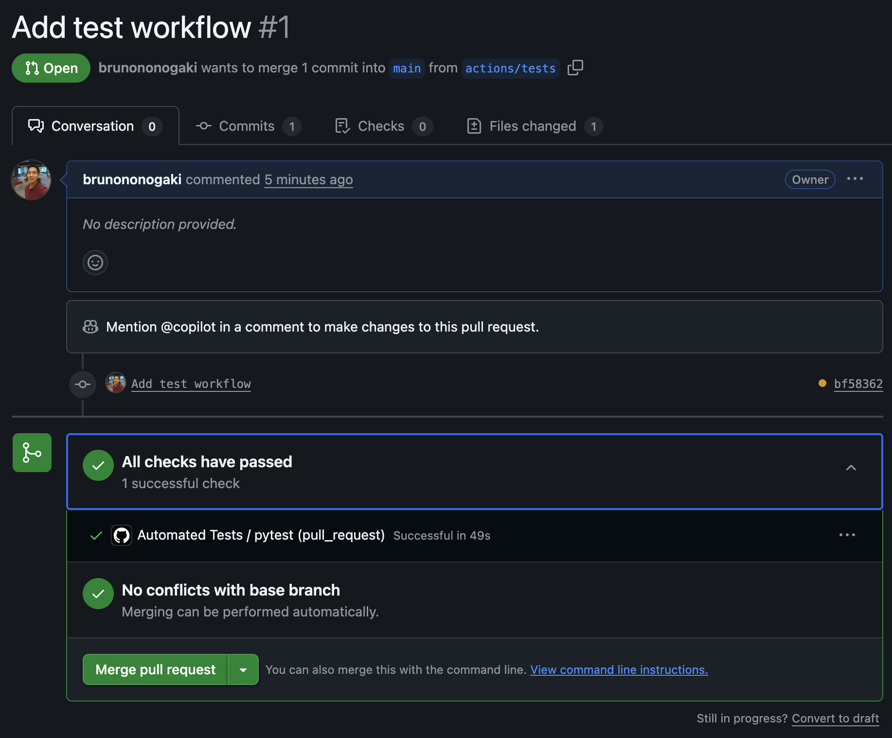
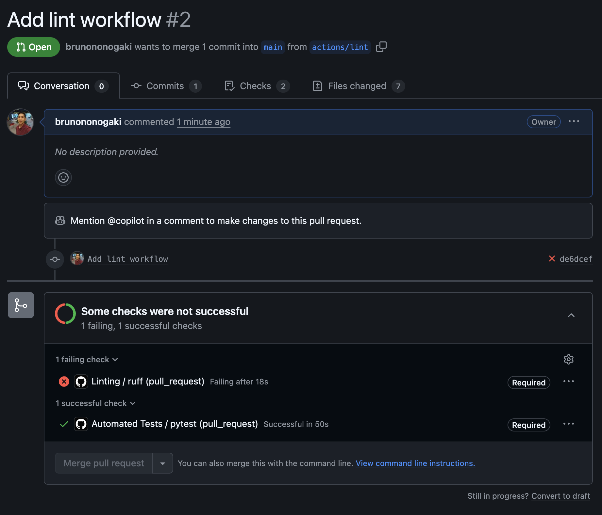
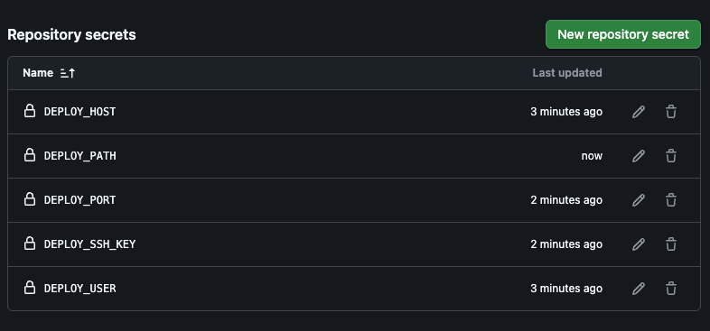

# Implementando CD/CD

Nesse capítulo, vamos implementar o CI/CD nesse projeto através de Workflows do GitHub Action. A ideia é que ao fazer um Pull Request para a branch `main`, o Workflow será chamado para:

* Executar os testes
* Rodar o Linter com o Ruff
* Fazer deploy no servidor

Nesse exemplo, vou subir a aplicação toda em uma VPS da Hostinger. Para não complicar muito por enquanto, esse deploy será feito em HTTP na porta 8000 mesmo, mas depois podemos colocar um Nginx ou um Traefik na frente, mas vamos aos poucos.

## Criando Workflow de Testes

Como já temos os nossos testes automatizados rolando no projeto, basta criarmos um Workflow para executá-los. Esses workflows são colocados em uma pasta especial chamada `.github`, na raíz do projeto, dentro de um subdiretório chamado 'Workflows'. Vamos primeiro criar essa estrutura:

```bash
mkdir -p .github/workflows
```

Agora dentro dessa pasta, vamos criar o arquivo `tests.yaml`

```yaml title=".github/workflows/tests.yaml"
name: Automated Tests

on: pull_request

jobs:
  pytest:
    name: pytest
    runs-on: ubuntu-latest

    steps:
      - name: "Download code"    
        uses: actions/checkout@v4

      - name: "Install Python 3.13"
        uses: actions/setup-python@v5
        with:
          python-version: '3.13'    

      - name: "Install Poetry"
        run: pipx install poetry

      - name: "Install dependencies"
        run: poetry install

      - name: "Run tests"
        run: poetry run task test
```

!!! note
    
    É importante termos o arquivo .env.development no repositório, porque o nosso script do `task test` utiliza ele para criar um link simbólico para o .env.

Agora, se a gente criar uma nova branch, commitar esse arquivo, fazer um git pull, e depois um Pull Request, esse job será chamado.
```bash
git checkout -b "action/tests"
git add .
git commit -m "Adding tests workflow"
git push --set-upstream origin actions/tests 
```




!!! warning

    Caso os testes falhem, ainda assim o GitHub vai permitir fazermos o merge para a main. O ideal seria isso não ser possível, pois não queremos subir um código quebrado. Para isso, vamos nos Settings do nosso projeto, e navegar nas seguintes opções (pode ser que a interface mude no futuro, mas a ideia é essa):

    * Settings --> Branches --> Add Branch ruleset
    * Crie um nome para o ruleset, por exemplo: branch-main-protection
    * Mude para `Enabled`
    * Em `Target branches`, clique em Add target e selecione `Include default branch`
    * Marque as opções:
      * Restrict deletions
      * Require a pull request before merging
      * Require status checks to pass
        * Adicione o check `pytest`
      * Block force pushes


## Criando o Workflow de Lint

O Workflow de Linting será o mesmo padrão, porque já temos o comando `task link` no nosso arquivo `pyproject.toml`. Então basta criar esse novo Workflow, subir para o repositório, e configurar esse job nas configurações do `Require status checks to pass`, para assim impedir que alguém faça um merge para a main sem rodar o `ruff`.

```yaml title=".github/workflows/lint.yaml"
name: Linting

on: pull_request

jobs:
  pytest:
    name: ruff
    runs-on: ubuntu-latest

    steps:
      - name: "Download code"    
        uses: actions/checkout@v4

      - name: "Install Python 3.13"
        uses: actions/setup-python@v5
        with:
          python-version: '3.13'    

      - name: "Install Poetry"
        run: pipx install poetry

      - name: "Install dependencies"
        run: poetry install

      - name: "Run linting"
        run: poetry run task lint
```



!!! warning
        
    Ops, veja agora que o linter falhou, e com isso a gente não consegue fazer o merge na branch `main`!
    Mas vou corrigir isso pelo VSCode mesmo, vendo erro por erro e atacando a resolução. Por isso é importante fazer isso logo no começo do projeto, para não acumular muita coisa para consertar. O Copilot ou alguma outra IA podem te dar uma boa mão na resolução desses problemas


## Criando os Scripts para Deployment em Produção

Vamos preparar a infraestrutura para o Deployment em produção. Criaremos basicamente um `compose-pro.yaml` para subir os containers de Prod, e um Dockerfile para criarmos uma imagem do nosso WebServer de Prod usando `uvicorn`, ao invés de subir com o `python manage.py runserver`, que é destinado apenas para desenvolvimento.

Além disso, vamos criar também um script `deploy.sh` pra ficar mais fácil de subir tudo.

Começando com o arquivo do docker-compose, vamos declarar dois containers:
* Um container de Postgres, com a diferença que aqui em Prod temos que mapear o volume para os dados persistirem caso ele reinicie. E aqui não vamos expor nenhuma porta, porque o nosso servidor web vai conseguir falar internamente através da network do docker.
* Um container do nosso Web Server Django, expondo a porta 8000, mas sendo buildado através de um Dockerfile, que vai levantar um servidor Uvicorn:


```yaml title="infra/compose-pro.yaml"
version: '3.9'

services:
  database:
    container_name: postgres-prod
    image: postgres:17.0
    env_file:
      - ../.env.production
    restart: unless-stopped    
    volumes:
      - pgdata:/var/lib/postgresql/data
    logging:
      driver: "json-file"
      options:
        max-size: "10m"
        max-file: "3"

  web:
    container_name: django-ninja-prod
    build:
      context: ..
      dockerfile: infra/Dockerfile-pro
    env_file:
      - ../.env.production
    ports:
      - "8000:8000"
    depends_on:
      - database
    restart: unless-stopped
    volumes:
      - ../:/app
    environment:
      - DJANGO_SETTINGS_MODULE=myapi.settings
    logging:
      driver: "json-file"
      options:
        max-size: "10m"
        max-file: "3"

volumes:
  pgdata:
```

E o `Dockerfile-pro` ficará assim:

```Dockerfile title="infra/Docuerfile-pro"
FROM python:3.13-slim


# Install system dependencies
RUN apt-get update && apt-get install -y build-essential libpq-dev && rm -rf /var/lib/apt/lists/*

WORKDIR /app


 # Copy only dependency files for faster cache install
COPY pyproject.toml poetry.lock ./
RUN pip install --no-cache-dir poetry && poetry config virtualenvs.create false && poetry install --no-interaction --no-ansi --only main

# Copy the rest of the code
COPY . .

# Expose Uvicorn port
EXPOSE 8000

# Default command (can be overridden in docker-compose)
CMD ["uvicorn", "myapi.asgi:application", "--host", "0.0.0.0", "--port", "8000"]
```

Agora se dermos um `docker compose --file infra/compose-pro.yaml up -d`, os dois containers irão subir. Mas para ficar mais fácil depois na hora de criarmos o nosso Workflow do GitHub Actions, vamos criar um arquivo `deploy.sh`, com permissão de execução. Outra coisa que o script vai fazer também é criar o link simbólico do arquivo `.env.production` para `.env`. Assim, não precisamos fazer nada disso no script do Workflow.

```shell title="/deploy.sh"
#!/bin/bash

# Deploy script for production environment

set -e  # Exit on any error

if [ "$1" = "down" ]; then
  echo "🛑 Stopping and removing production containers..."
  docker compose --file infra/compose-pro.yaml down
  exit 0
fi

if [ "$1" = "up" ] || [ -z "$1" ]; then
  # Default: up (build, up, migrate)
  echo "🚀 Starting production deployment..."
  # Check if .env.production exists
  if [ ! -f .env.production ]; then
      echo "❌ Error: .env.production file not found!"
      exit 1
  fi
  # Symlink .env.production to .env
  ln -sf .env.production .env
  # Build and start containers
  docker compose --file infra/compose-pro.yaml up -d --build
  # Run migrations inside the web container
  WEB_CONTAINER=$(docker compose --file infra/compose-pro.yaml ps -q web)
  if [ -n "$WEB_CONTAINER" ]; then
    docker compose --file infra/compose-pro.yaml exec web python manage.py migrate
  else
    echo "Web container not found. Migration step skipped."
  fi
  echo "✅ Deployment complete! Containers are up and migrations applied."
  exit 0
fi

echo "Usage: $0 [up|down]"
exit 1
```

!!! success

    Pronto! Agora, em teoria, se você acessar o servidor manualmente, criar um arquivo `.env.production` lá dentro com os dados do seu ambiente, e rodar um `./deploy.sh`, o serviço de banco e web deverão subir com sucesso!


## Criando o Workflow de Deploy na VPS da Hostinger

E agora vamos criar o nosso workflow de Deploy em uma VPS da Hostinger. Eis o que iremos precisar:

* IP do servidor na Hostinger
* Usuário
* Chave SSH
* Diretório no servidor onde colocarmos o código

!!! tip

    Para gerar uma chave SSH para um usuário, você pode fazer o seguinte:
    ```bash
    ssh-keygen -t rsa -b 4096 -f ~/.ssh/vps_key
    ssh-copy-id -i ~/.ssh/vps_key.pub root@<IP_SERVIDOR>
    ```
    Nessa pasta serão criados os arquivos vps_key (chave privada) e vps_key.pub (chave pública). A chave pública foi copiada para dentro do servidor, e a chave privada é o que usaremos para criar as Secrets no GitHub para autenticação no servidor.

Com posse dessas informações, vamos criar as SECRETS dentro do nosso repositório no GitHub.

* No repositório no GitHub, vá em `Settings`
* Vá para o menu `Secrets and variables` -> `Actions`  
* Clique em `New repository secret`, e crie as seguintes variáveis:
  * DEPLOY_HOST: IP do seu servidor
  * DEPLOY_USER: Usuário para logar no servidor. Nesse caso, usaremos o `root` mesmo, pois é só um lab.
  * DEPLOY_SSH_KEY: Conteúdo da Chave Privada gerada anteriormente
  * DEPLOY_PORT: 22, que é a porta padrão do SSH. Mas caso o seu servidor escute por outra porta, é só ajustar
  * DEPLOY_PATH: /root/django-ninja-boilerplate, ou o diretório que você deseja colocar o código no servidor

Vai ficar assim:



E agora vamos criar o nosso workflow de deploy, com a diferença que não chamaremos ele nos pull requests, mas sim quando houver algum push na branch main. E usaremos as actions `rsync-deployments` para copiar o código do repo para o servidor, e o `ssh-action` para rodar o script de deploy.

```yaml title=".github/workflows/deploy.yaml"
name: Deploy to VPS

on:
  push:
    branches:
      - main

jobs:
  deploy:
    name: Deploy to Server
    runs-on: ubuntu-latest

    steps:
      - name: Checkout code
        uses: actions/checkout@v4

      - name: Sync code to server
        uses: burnett01/rsync-deployments@7.1.0
        with:
          switches: -avz --delete --exclude='.git*' --exclude='.env.production'
          path: ./
          remote_path: ${{ secrets.DEPLOY_PATH }}
          remote_host: ${{ secrets.DEPLOY_HOST }}
          remote_user: ${{ secrets.DEPLOY_USER }}
          remote_key: ${{ secrets.DEPLOY_SSH_KEY }}
          remote_port: ${{ secrets.DEPLOY_PORT || 22 }}

      - name: Deploy via SSH
        uses: appleboy/ssh-action@v1.0.0
        with:
          host: ${{ secrets.DEPLOY_HOST }}
          username: ${{ secrets.DEPLOY_USER }}
          key: ${{ secrets.DEPLOY_SSH_KEY }}
          port: ${{ secrets.DEPLOY_PORT || 22 }}
          script: |
            set -e
            cd ${{ secrets.DEPLOY_PATH }}
            echo "Chamando o script de deploy"
            ./deploy.sh
```

!!! tip

    A primeira execução desse Workflow vai falhar, porque não temos o arquivo `.env.production` criado. Então quando ele rodar pela primeira vez e criar a pasta com o projeto, acesse o servidor e crie o arquivo `.env.production` manualmente. A partir disso, o workflow vai funcionar, porque no setp de `Sync code to server`, estamos excluindo do rsync o arquivo .env.production, para que ele não seja removido.

Agora, quando você fizer um push para a branch main, os containers do WebServer e do Banco de Dados irão subir:
```bash
CONTAINER ID   IMAGE                    COMMAND                  CREATED         STATUS                 PORTS                                                                                          NAMES
113c6f842156   infra-web                "uvicorn myapi.asgi:…"   6 seconds ago   Up 6 seconds           0.0.0.0:8000->8000/tcp, [::]:8000->8000/tcp                                                    django-ninja-prod
056561459f60   postgres:17.0            "docker-entrypoint.s…"   6 seconds ago   Up 6 seconds           5432/tcp                                                                                       postgres-prod
```


!!! success

    Sucesso!!! Nosso CI/CD ta prontinho, com testes automatizados e deploy para produção!