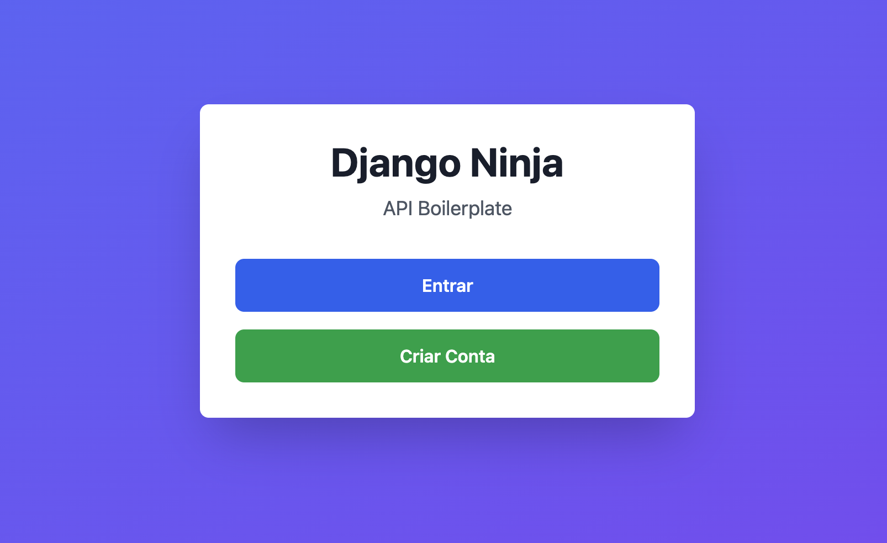

# Iniciando um projeto React com Next.js para o Front-end

Precisaremos de um Front-End para consumir o nosso Backend Django Ninja. Para isso, optei por criar um projeto usando `React com Next.js`. Para ficar mais fácil, deixarei o código do front nesse mesmo repositório, tudo dentro da pasta `next` na raíz do projeto.

## Construindo o ambiente

### Criando a pasta do projeto do Front-End

A primeira coisa é criar a pasta `next` na raíz do projeto, e entrar nela:

```bash
mkdir -p next
cd next
```

### Definindo a versão do Node

Eu já tenho o NVM e o Node instalados, então criaremos um arquivo na pasta react chamado `.nvmrc`, onde definiremos a versão do Node que utilizaremos:

```bash title=".nvmrc"
lts/iron

```

E agora para usar essa versão, basta dar o comando:

```bash
nvm install lts/iron
nvm use

Now using node v20.19.6 (npm v10.8.2)
```

### Criando o projeto com o NPM

Para criar o projeto, faremos:

```bash
npm init
# Defina um nome de projeto, author, description, ou deixe tudo default

npm install next@16.0.7
npm install react@19.2.1
npm install react-dom@19.2.1
```

Isso vai criar um arquivo `package.json` assim:

```javascript
{
  "name": "frontend",
  "version": "1.0.0",
  "main": "index.js",
  "scripts": {
    "dev": "next dev"
  },
  "author": "Bruno Nonogaki",
  "license": "ISC",
  "description": "Sample front-end to consume our Django API",
  "dependencies": {
    "next": "^16.0.7",
    "react": "^19.2.1",
    "react-dom": "^19.2.1"
  }
}
```

Vamos adicionar o nosso primeiro script e apagar esse de "test" que ele criou automaticamente

```javascript
"scripts": {
  "dev": "next dev",
}
```

Agora vamos criar um arquivo `index.js` em uma nova pasta chamada /pages/:

```javascript title="./next/pages/index.js"
function Home() {
  return <h1>Teste</h1>;
}
export default Home;
```

!!! success

    Sucesso! Agora se você der o comando `npm run dev`, o front já estará disponivel na URL http://localhost:3000
    ```bash
    > frontend@1.0.0 dev
    > next dev

      ▲ Next.js 16.0.7 (Turbopack)
      - Local:         http://localhost:3000
      - Network:       http://192.168.0.3:3000

    ✓ Starting...
    ✓ Ready in 406ms
    ```

## Criando Containers de Dev

Vamos criar um container no ambiente de dev para subir o front, e depois podemos subir ele junto com o banco de dados no comando `task run` que já temos implementado. Como por enquanto esse projeto tem o foco mais no BackEnd, acho que fica mais fácil assim. Futuramente, pode ser que a gente separe as duas coisas.

Para o ambiente de `dev`, podemos subir o React com o `npm run dev`.

Primeiro vamos criar um Dockerfile para _buildar_ uma imagem de Node com o React.

```Dockerfile title="./next/infra/Dockerfile-dev"
FROM node:20-alpine

WORKDIR /app

COPY package*.json ./

RUN npm install

COPY . .

EXPOSE 3000

CMD ["npm", "run", "dev"]
```

E agora o arquivo de compose para subir esse serviço, expondo a porta 3000 (padrão do Next):

```yaml title="./next/infra/compose-dev.yaml"
version: "3.8"

services:
  frontend-dev:
    build:
      context: ..
      dockerfile: infra/Dockerfile-dev 
    container_name: myfront-dev
    ports:
      - "3000:3000"
    volumes:
      - ../pages:/app/pages
      - ../public:/app/public
    environment:
      - NEXT_PUBLIC_API_URL=${NEXT_PUBLIC_API_URL}
    command: npm run dev
    restart: unless-stopped
    env_file:
      - ../../.env.development
    logging:
      driver: "json-file"
      options:
        max-size: "10m"
        max-file: "3"
```

E agora vamos editar o arquivo `pyproject.toml` para iniciar e baixar esses containers nos comandos de services-up, services-down e services-stop:

```toml title="./pyproject.toml" hl_lines="2-4"
[tool.taskipy.tasks]
services-up = "docker compose -f infra/compose-dev.yaml up -d && docker compose -f next/infra/compose-dev.yaml up -d"
services-stop = "docker compose -f infra/compose-dev.yaml stop && docker compose -f next/infra/compose-dev.yaml stop"
services-down = "docker compose -f infra/compose-dev.yaml down && docker compose -f next/infra/compose-dev.yaml down"
create-env-dev = "ln -sf .env.development .env"
create-env-prod = "ln -sf .env.production .env"
run = 'task create-env-dev && task services-up && python infra/wait-for-postgres.py && python manage.py migrate && python manage.py runserver'
down = "pkill -f 'manage.py runserver'; task services-down"
test = 'task create-env-dev && task services-up && python infra/wait-for-postgres.py && honcho start web test'
test-watch = 'pytest-watch'
lint = 'ruff check'
format = 'ruff format '
migrate = 'python manage.py makemigrations && python manage.py migrate'
commit = 'poetry run cz commit'
```

!!! success

    Agora quando dermos o comando `task run` no ambiente de dev, subiremos o Postgres, o Front, além de preparar o arquivo .env com o link simbólico, rodar a migração do banco e iniciar o backend na console

## Criando Containers de Prod

Para o ambiente de Produção, da mesma forma como fizemos o Backend, vamos colocar o [Traefik](../Appendix/01_Configurando_o_Traefik.md) como Reverse Proxy.

Primeiramente, vamos criar o `Dockerfile-pro`:

```Dockerfile title="./next/infra/Dockerfile-pro"
FROM node:20-alpine

WORKDIR /app

COPY package*.json ./

RUN npm install

COPY . .

# Build argument for environment variable
ARG NEXT_PUBLIC_API_URL
ENV NEXT_PUBLIC_API_URL=${NEXT_PUBLIC_API_URL}

RUN npm run build

EXPOSE 3000

CMD ["npm", "start"]
```


!!! note

    Eu precisarei usar a variável `NEXT_PUBLIC_API_URL` do meu .env futuramente, e ela precisa ser carregada no container na etapa de build, para eu poder chamá-la no código com um `process.env.NEXT_PUBLIC_API_URL`. Por isso, declarei ela aqui no arquivo Dockerfile.

E agora o compose:

```yaml title="./next/infra/compose-pro.yaml"
version: "3.8"

services:
  frontend:
    build:
      context: ..
      dockerfile: infra/Dockerfile-pro
      args:
        NEXT_PUBLIC_API_URL: ${NEXT_PUBLIC_API_URL}      
    container_name: boilerplate_front
    expose:
      - "3000"
    restart: unless-stopped
    networks:
      - my-network
    volumes:
      - ../pages:/app/pages
      - ../public:/app/public
    env_file:
      - ../../.env.production
    labels:
      - "traefik.enable=true"
      - "traefik.http.routers.frontend.rule=Host(`${FRONTEND_FQDN}`)"
      - "traefik.http.routers.frontend.entrypoints=websecure"
      - "traefik.http.routers.frontend.tls=true"
      - "traefik.http.routers.frontend.tls.certresolver=letsencrypt"
      - "traefik.http.services.frontend.loadbalancer.server.port=3000"
      - "traefik.docker.network=my-network"
    logging:
      driver: "json-file"
      options:
        max-size: "10m"
        max-file: "3"

networks:
  my-network:
    external: true
```

!!! note

    O nosso container do Front ficará disponível na URL https://react.brunononogaki.com. Para mais detalhes dessa configuração do Traefik, configura esse [Apêndice](../Appendix/01_Configurando_o_Traefik.md).

## Arrumando o script de deploy

Para que o nosso workflow de deploy no Github Actions consiga subir esse container também, precisaremos editar o arquivo `./deploy.sh`.


!!! note

    Repare que agora nos comandos de docker compose, passamos também o parâmetro `--env-file`, para ele carregar o .env. Caso contrário, como o .env não está na mesma pasta do compose.yml, o docker compose não cosegue carregar as variáveis.


```shell title="./deploy.sh" hl_lines="10 31-33"
#!/bin/bash

# Deploy script for production environment

set -e  # Exit on any error

if [ "$1" = "down" ]; then
  echo "🛑 Stopping and removing production containers..."
  docker compose --file infra/compose-pro.yaml down
  docker compose --file next/infra/compose-pro.yaml down
  exit 0
fi

if [ "$1" = "up" ] || [ -z "$1" ]; then
  # Default: up (build, up, migrate)
  echo "🚀 Starting production deployment..."

  # Check if .env.production exists
  if [ ! -f .env.production ]; then
      echo "❌ Error: .env.production file not found!"
      exit 1
  fi

  # Symlink .env.production to .env
  ln -sf .env.production .env

  # Build and start backend containers
  echo "📦 Building and starting backend..."
  docker compose --env-file .env.production --file infra/compose-pro.yaml --project-name django-ninja up -d --build

  # Build and start frontend containers
  echo "📦 Building and starting frontend..."
  docker compose --env-file .env.production --file next/infra/compose-pro.yaml --project-name django-ninja up -d --build

  # Run migrations inside the web container
  WEB_CONTAINER=$(docker compose --file infra/compose-pro.yaml ps -q web)
  if [ -n "$WEB_CONTAINER" ]; then
    echo "🔄 Running migrations..."
    docker compose --file infra/compose-pro.yaml exec web python manage.py migrate
  else
    echo "⚠️  Web container not found. Migration step skipped."
  fi

  echo "✅ Deployment complete! Backend and frontend are up and running."
  exit 0
fi

echo "Usage: $0 [up|down]"
exit 1
```

!!! success

    Feito! Agora o nosso front-end está disponível na produção, em https://react.brunononogaki.com

## Instalando o TailwindCSS

Vamos utilizar o `TailwindCSS` na versão 3 para estilizar a nossa página, então já vamos deixar essa dependência instalada no `next`, como uma dependência de DEV, porque o tailwind é usado no build, e não é necessário em runtime. Deixando apenas como dependência de DEV, diminuímos o tamanho do `node_modules` em produção, e o deploy fica mais leve!

```bash
cd next
npm install -D tailwindcss@3 postcss autoprefixer
```

E agora vamos inicializar o Tailwind:
```bash
npx tailwindcss init -p
```

Esse comando vai gerar automaticamente os seguintes arquivos:

* postcss.config.js
* tailwind.config.js

No arquivo `tailwind.config.js`, adicione as pastas do projeto na lista de content. Por enquanto vamos adicionar somente as pastas de `pages` e `components`. Se tivermos outras pastas depois com arquivos `.jsx`, basta adicionar na lista:

```javascript title="./next/tailwind.config.js" hl_lines="3-6"
/** @type {import('tailwindcss').Config} */
module.exports = {
  content: [
    './pages/**/*.{js,ts,jsx,tsx,mdx}',
    './components/**/*.{js,ts,jsx,tsx,mdx}',
  ],
  theme: {
    extend: {},
  },
  plugins: [],
}
```

Vamos criar um arquivo chamado `globals.css` dentro de uma pasta chamada styles, com esse conteúdo:

```css title="./next/styles/globals.css"
@tailwind base;
@tailwind components;
@tailwind utilities;
```

E depois criar um arquivo `_app.js` na raíz do diretório `pages` com isso:

```javascript title="./next/pages/_app.js"
import 'styles/globals.css';

export default function App({ Component, pageProps }) {
  return <Component {...pageProps} />;
}
```

O arquivo `_app.js` é um arquivo especial no Next.js. Ele é o componente raiz/wrapper de toda a aplicação, e é aqui que a gente importa o `globals.css`.

!!! tip

    O next tem a capacidade nativa de fazer os imports apontando diretamente o caminho do arquivo, sem ter que fazer aquele import relativo usando `../` ou `../../xxxx`. Por esse motivo fizemos o import do css apenas com 'styles/globals.css'. Para isso funcionar, basta criar um arquivo chamado `jsconfig.json` dentro da pasta do next com o seguinte conteúdo:

    ```json
    {
      "compilerOptions": {
        "baseUrl": ".",
    }
    ```

## Criando uma Home de teste

Agora vamos criar uma pagininha de Home bem simples, apenas para testar se o Tailwind está funcionando. No arquivo `index.js` da raíz do diretório `pages`, altere todo o conteúdo para isso:

```javascript title="./next/pages/index.js"
export default function Home() {
  return (
    <div className="min-h-screen bg-gradient-to-br from-blue-500 to-purple-600 flex items-center justify-center p-4">
      <div className="bg-white rounded-lg shadow-2xl p-8 max-w-md w-full text-center">
        <h1 className="text-4xl font-bold text-gray-900 mb-2">Django Ninja</h1>
        <p className="text-gray-600 mb-8 text-lg">API Boilerplate</p>
        
        <button className="w-full bg-blue-600 hover:bg-blue-700 text-white font-semibold py-3 px-4 rounded-lg mb-4">
          Entrar
        </button>
        
        <button className="w-full bg-green-600 hover:bg-green-700 text-white font-semibold py-3 px-4 rounded-lg">
          Criar Conta
        </button>
      </div>
    </div>
  );
}
```

!!! success

    Agora ao abrir a página `http://localhost:3000`, você deverá ver uma página assim:
    

    Claro que ainda vamos evoluir bastate, é só para testar se o Tailwind está funcional!

