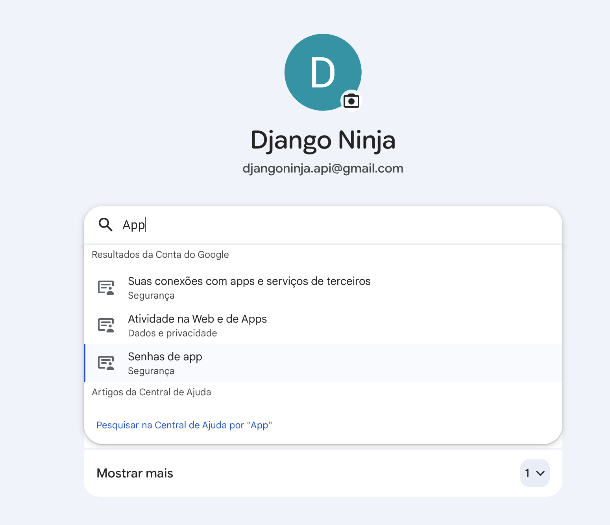
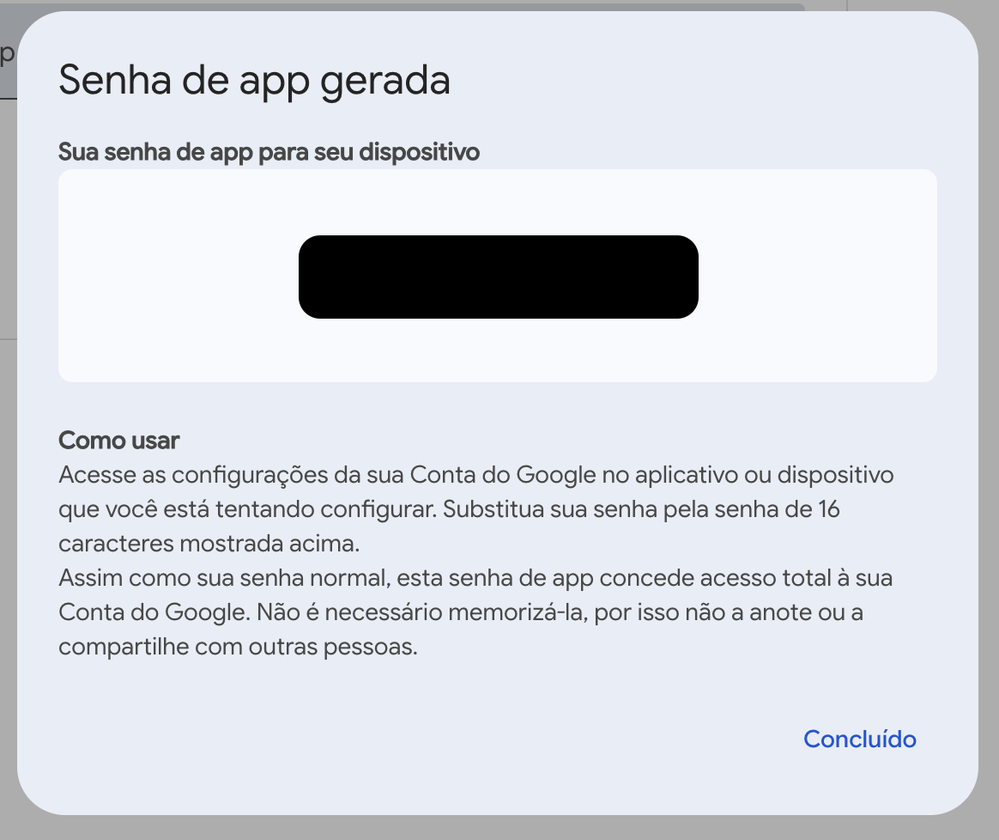

# Integrando o GMail para envio dos e-mails

Agora que já temos os nossos testes no ambiente de desenvolvimento rolando, vamos integrar com um serviço real de e-mail. Nesse caso, usaremos o próprio Gmail mesmo, criando uma conta gratuita e configurando o SMTP nele.

A ideia é mexer apenas no arquivo `./infra/mailer.py`, que criamos justamente para abstrair a lógica do serviço de envio de e-mails!

## Configurando o Gmail

Para configurar uma conta no Gmail, siga os passos abaixo:

1. Crie uma nova conta no Gmail. Nesse projeto estou usando djangoninja.api@gmail.com
2. Com a conta logada, entre em https://myaccount.google.com
3. Vá no menu **Segurança e login** e ative a **Verificação em duas etapas**
4. Na barra de pesquisa, procure por "App", e entre em **Senhas de app**
   
5. Dê um nome para o seu app, por exemplo "django-ninja-boilerplate"
6. Anote a senha que será gerada:
   
7. Configure esses dados no arquivo `.env.production` no servidor VPS

```bash
GMAIL_EMAIL=djangoninja.api@gmail.com
GMAIL_APP_PASSWORD=xxxx xxxx xxxx xxxx
```

!!! note

    Não é necessário alterar o arquivo .env.development, porque no modo de desenvolvimento, o pytest-django automaticamente usa o backend de teste, independente do que está no settings.py, e os nossos testes continuarão funcionando normalmente.


## Alterando o `settings.py`

Agora vamos adicionar essas configurações no final do arquivo `settings.py`:

```python title="./myapi/settings.py"
# Email Configuration - Gmail via Django
EMAIL_BACKEND = 'django.core.mail.backends.smtp.EmailBackend'
EMAIL_HOST = 'smtp.gmail.com'
EMAIL_PORT = 587
EMAIL_USE_TLS = True
EMAIL_HOST_USER = config('GMAIL_EMAIL', default='')
EMAIL_HOST_PASSWORD = config('GMAIL_APP_PASSWORD', default='')
DEFAULT_FROM_EMAIL = config('GMAIL_EMAIL', default='')
```

!!! success

    Pronto! Agora se testarmos a criação de usuários manualmente pela API no nosso servidor de produção, deveremos receber um e-mail para fazer a ativação da conta! 🤓

