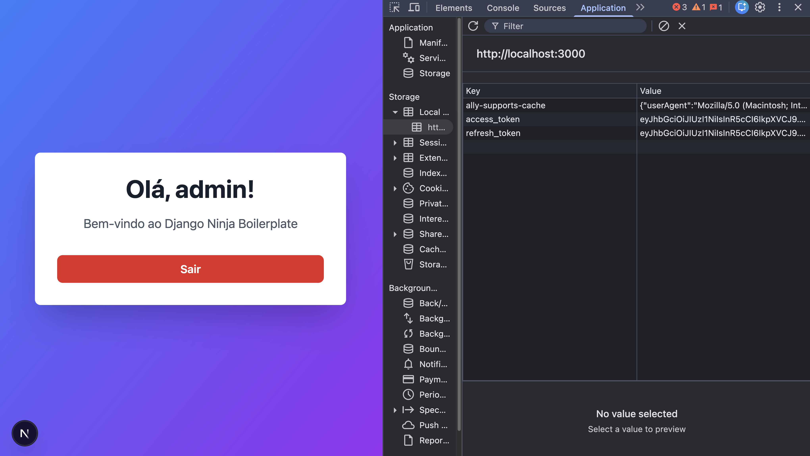
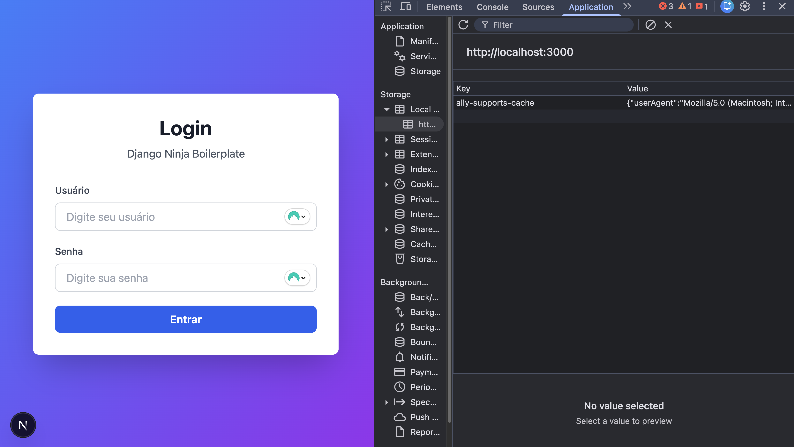

# Criando a tela de login

Agora com a estrutura do nosso front montada, vamos criar uma tela de login. Então vamos mudar o `index.js` que tinhamos criado antes para testar o `Tailwind CSS`, e construir um simples formulário com os campos de usuário, senha e um botão de login. Por enquanto apenas isso.

## Construindo a interface

Vamos inicialmente criar apenas uma interface de login, sem integrar a API ainda. Essa interface vai apenas receber um usuário e senha, e printar na console do navegador o usuário e senha inserido, bem básico:

```javascript title="./next/pages/index.js"
import { useState } from "react";

export default function Home() {
  const [username, setUsername] = useState("");
  const [password, setPassword] = useState("");

  const handleLogin = (e) => {
    e.preventDefault();
    // TODO: Integrar com API de login
    console.log("Login attempt:", { username, password });
  };

  return (
    <div className="min-h-screen bg-gradient-to-br from-blue-500 to-purple-600 flex items-center justify-center p-4">
      <div className="bg-white rounded-lg shadow-2xl p-8 max-w-md w-full">
        <h1 className="text-3xl font-bold text-gray-900 mb-2 text-center">
          Login
        </h1>
        <p className="text-gray-600 mb-8 text-center">
          Django Ninja Boilerplate
        </p>

        <form onSubmit={handleLogin} className="space-y-5">
          {/* Campo Username */}
          <div>
            <label
              htmlFor="username"
              className="block text-sm font-medium text-gray-700 mb-2"
            >
              Usuário
            </label>
            <input
              id="username"
              type="text"
              placeholder="Digite seu usuário"
              value={username}
              onChange={(e) => setUsername(e.target.value)}
              className="w-full px-4 py-2 border border-gray-300 rounded-lg focus:outline-none focus:ring-2 focus:ring-blue-500 focus:border-transparent"
              required
            />
          </div>

          {/* Campo Senha */}
          <div>
            <label
              htmlFor="password"
              className="block text-sm font-medium text-gray-700 mb-2"
            >
              Senha
            </label>
            <input
              id="password"
              type="password"
              placeholder="Digite sua senha"
              value={password}
              onChange={(e) => setPassword(e.target.value)}
              className="w-full px-4 py-2 border border-gray-300 rounded-lg focus:outline-none focus:ring-2 focus:ring-blue-500 focus:border-transparent"
              required
            />
          </div>

          {/* Botão Login */}
          <button
            type="submit"
            className="w-full bg-blue-600 hover:bg-blue-700 text-white font-semibold py-2 px-4 rounded-lg transition duration-200"
          >
            Entrar
          </button>
        </form>
      </div>
    </div>
  );
}
```

!!! note

    Veja que a estrutura é simples, mas está praticamente pronta para integrarmos a nossa API. Os dados de usuário e senha estão sendo atualizados no state `username` e `password`, e o formulário está chamando a função `handleLogin()`, que atualmente só faz um `console.log()`, mas que podemos fazer uma chamada na API usando a função `loginUser()` que colocamos no `utils/auth.js`

## Criando a Home do usuário

Outra página que já vamos deixar criada é uma Home do Usuário, para ser aberta em caso de login com sucesso. Por enquanto vamos fazer uma página bem simples, apenas listando o nome do usuário (confirmando que conseguimos pegar a informação do usuário logado através do endpoint `api/v1/me` da nossa API), e um botão de logout.

```javascript title="./next/pages/home.js"
import { useEffect, useState } from "react";
import { useRouter } from "next/router";
import { getToken, logoutUser, getCurrentUser } from "utils/auth";

export default function Home() {
  const router = useRouter();
  const [user, setUser] = useState(null);
  const [isLoading, setIsLoading] = useState(true);

  useEffect(() => {
    // Verifica se o usuário está autenticado
    if (!getToken()) {
      router.push("/");
      return;
    }

    // Busca dados do usuário autenticado
    const fetchUser = async () => {
      try {
        const userData = await getCurrentUser();

        // Verificar se houve erro
        if (userData.status_code && userData.status_code !== 200) {
          logoutUser();
          router.push("/");
          return;
        }

        setUser(userData);
      } catch (error) {
        console.error("Erro ao buscar dados do usuário:", error);
        logoutUser();
        router.push("/");
      } finally {
        setIsLoading(false);
      }
    };

    fetchUser();
  }, [router]);

  const handleLogout = () => {
    logoutUser();
    router.push("/");
  };

  if (isLoading) {
    return (
      <div className="min-h-screen bg-gradient-to-br from-blue-500 to-purple-600 flex items-center justify-center p-4">
        <div className="text-white text-center">
          <p className="text-xl">Carregando...</p>
        </div>
      </div>
    );
  }

  return (
    <div className="min-h-screen bg-gradient-to-br from-blue-500 to-purple-600 flex items-center justify-center p-4">
      <div className="bg-white rounded-lg shadow-2xl p-8 max-w-md w-full text-center">
        <h1 className="text-4xl font-bold text-gray-900 mb-4">
          Olá, {user?.username || "Usuário"}!
        </h1>
        <p className="text-gray-600 mb-8 text-lg">
          Bem-vindo ao Django Ninja Boilerplate
        </p>

        <button
          onClick={handleLogout}
          className="w-full bg-red-600 hover:bg-red-700 text-white font-semibold py-2 px-4 rounded-lg transition duration-200"
        >
          Sair
        </button>
      </div>
    </div>
  );
}
```

## Adicionando a lógica de Login

Pronto, agora podemos voltar no `index.js`, para remover aqueles `console.log()` que colocamos, e de fato implementar o login, com direcionamento para a Home do usuário no caso de sucesso.

Para isso a função `handleLogin` deverá agora chamar a função `loginUser()` que escrevemos no `auth.js`  e verificar se o login ocorreu com sucesso (`200 OK`). Caso negativo, exibimos a mensagem que vem no retorno do nosso endpoint, que no momento é `Invalid credentials`. Lembra-se que essa mensagem a gente adicionou lá nos erros customizados do nosso backend, e agora estamos exibindo aqui no frontend! No caso de login com sucesso, fazemos um encaminhamento para a página `/home`:

```javascript title="./next/pages/index.js" hl_lines="12-32"
import { useState } from "react";
import { useRouter } from "next/router";
import { loginUser } from "utils/auth";

export default function Home() {
  const router = useRouter();
  const [username, setUsername] = useState("");
  const [password, setPassword] = useState("");
  const [isLoading, setIsLoading] = useState(false);
  const [error, setError] = useState("");

  const handleLogin = async (e) => {
    e.preventDefault();
    setError("");
    setIsLoading(true);

    try {
      const response = await loginUser(username, password);

      // Verificar se houve erro (status_code presente)
      if (response.status_code && response.status_code !== 200) {
        setError(response.message || "Erro ao fazer login");
        setIsLoading(false);
        return;
      }

      // Se o login foi bem-sucedido, redireciona para home
      router.push("/home");
    } finally {
      setIsLoading(false);
    }
  };

  return (
    <div className="min-h-screen bg-gradient-to-br from-blue-500 to-purple-600 flex items-center justify-center p-4">
      <div className="bg-white rounded-lg shadow-2xl p-8 max-w-md w-full">
        <h1 className="text-3xl font-bold text-gray-900 mb-2 text-center">
          Login
        </h1>
        <p className="text-gray-600 mb-8 text-center">
          Django Ninja Boilerplate
        </p>

        <form onSubmit={handleLogin} className="space-y-5">
          {/* Mensagem de Erro */}
          {error && (
            <div className="bg-red-50 border border-red-200 text-red-700 px-4 py-3 rounded-lg text-sm">
              {error}
            </div>
          )}

          {/* Campo Username */}
          <div>
            <label
              htmlFor="username"
              className="block text-sm font-medium text-gray-700 mb-2"
            >
              Usuário
            </label>
            <input
              id="username"
              type="text"
              placeholder="Digite seu usuário"
              value={username}
              onChange={(e) => setUsername(e.target.value)}
              className="w-full px-4 py-2 border border-gray-300 rounded-lg focus:outline-none focus:ring-2 focus:ring-blue-500 focus:border-transparent"
              required
            />
          </div>

          {/* Campo Senha */}
          <div>
            <label
              htmlFor="password"
              className="block text-sm font-medium text-gray-700 mb-2"
            >
              Senha
            </label>
            <input
              id="password"
              type="password"
              placeholder="Digite sua senha"
              value={password}
              onChange={(e) => setPassword(e.target.value)}
              className="w-full px-4 py-2 border border-gray-300 rounded-lg focus:outline-none focus:ring-2 focus:ring-blue-500 focus:border-transparent"
              required
            />
          </div>

          {/* Botão Login */}
          <button
            type="submit"
            disabled={isLoading}
            className="w-full bg-blue-600 hover:bg-blue-700 disabled:bg-blue-400 text-white font-semibold py-2 px-4 rounded-lg transition duration-200 disabled:cursor-not-allowed"
          >
            {isLoading ? "Entrando..." : "Entrar"}
          </button>
        </form>
      </div>
    </div>
  );
}
```

!!! success

    Boa! O nosso login já está funcionando! Agora ao fazer o login, seremos direcionados para uma página de Home, e o navegador vai armazenar o access token e o refresh token no `local storage`:
    

    E ao fazer o logout, esses dados são removidos no navegador:
    