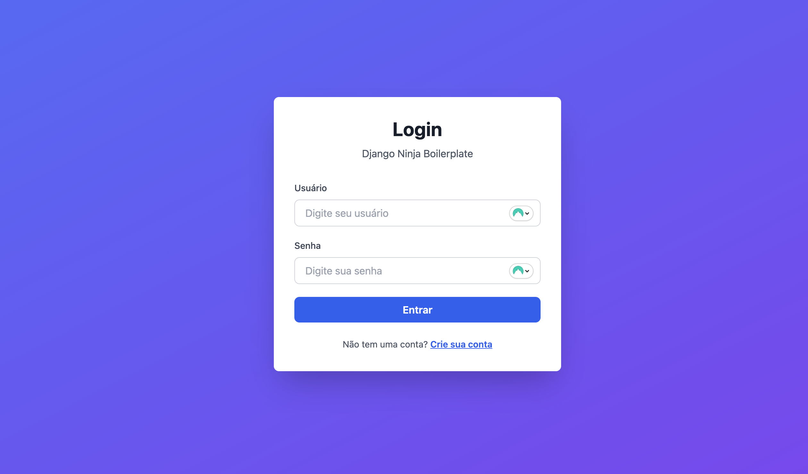
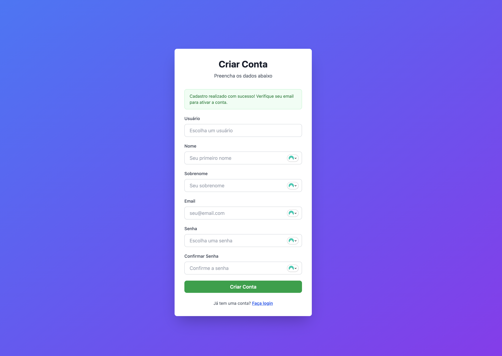
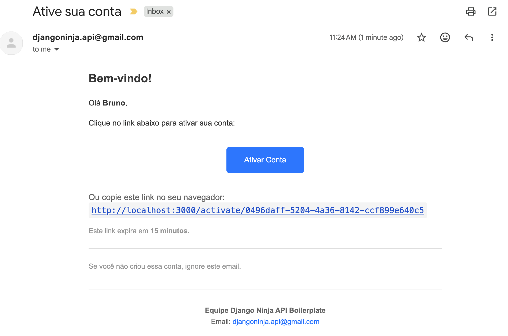

# Criando a tela de cadastro

Seguindo na evolução do nosso app, vamos agora criar um botão para o usuário poder fazer o seu cadastro na plataforma.

## Criando o link na página inicial

Primeiramente, lá no `index.js`, vamos criar um link para uma outra página `/registration`, assim:

```javascript title="./next/pages/index.js" hl_lines="1 17-26"
import Link from "next/link";

// ... restante do código existente...
          {/* Botão Login */}
          <button
            type="submit"
            disabled={isLoading}
            className="w-full bg-blue-600 hover:bg-blue-700 disabled:bg-blue-400 text-white font-semibold py-2 px-4 rounded-lg transition duration-200 disabled:cursor-not-allowed"
          >
            {isLoading ? "Entrando..." : "Entrar"}
          </button>
        </form>

        {/* Link para Signup */}
        <div className="mt-6 text-center">
          <p className="text-gray-600 text-sm">
            Não tem uma conta?{" "}
            <Link href="/registration" className="text-blue-600 hover:text-blue-700 font-semibold underline">
              Crie sua conta
            </Link>
          </p>
        </div>
      </div>
    </div>
  );
}
```

Esse link foi posicionado logo após o botão de login:


## Criando a página de registro

Agora vamos criar a página `registration.jsx`, que será um formulário muito parecido com a tela de login:

```javascript title="./next/pages/registration.jsx"
import { useState } from "react";
import Link from "next/link";

export default function Registration() {
  const [username, setUsername] = useState("");
  const [firstName, setFirstName] = useState("");
  const [lastName, setLastName] = useState("");
  const [email, setEmail] = useState("");
  const [password, setPassword] = useState("");
  const [passwordConfirm, setPasswordConfirm] = useState("");
  const [error, setError] = useState("");
  const [success, setSuccess] = useState("");
  const [isLoading, setIsLoading] = useState(false);

  const handleSignup = async (e) => {
    e.preventDefault();
    setError("");
    setSuccess("");
    setIsLoading(true);

    // Validações simples
    if (
      !username ||
      !firstName ||
      !lastName ||
      !email ||
      !password ||
      !passwordConfirm
    ) {
      setError("Todos os campos são obrigatórios");
      setIsLoading(false);
      return;
    }

    if (password !== passwordConfirm) {
      setError("As senhas não conferem");
      setIsLoading(false);
      return;
    }

    if (password.length < 6) {
      setError("A senha deve ter pelo menos 6 caracteres");
      setIsLoading(false);
      return;
    }

    // TODO: Integrar com API de cadastro
    setSuccess("Cadastro realizado com sucesso! Verifique seu email para ativar a conta.");
    console.log("Signup data:", {
      username,
      email,
      password,
    });
  };

  return (
    <div className="min-h-screen bg-gradient-to-br from-blue-500 to-purple-600 flex items-center justify-center p-4">
      <div className="bg-white rounded-lg shadow-2xl p-8 max-w-md w-full">
        <h1 className="text-3xl font-bold text-gray-900 mb-2 text-center">
          Criar Conta
        </h1>
        <p className="text-gray-600 mb-8 text-center">
          Preencha os dados abaixo
        </p>

        <form onSubmit={handleSignup} className="space-y-5">
          {/* Mensagem de Erro */}
          {error && (
            <div className="bg-red-50 border border-red-200 text-red-700 px-4 py-3 rounded-lg text-sm">
              {error}
            </div>
          )}

          {/* Mensagem de Sucesso */}
          {success && (
            <div className="bg-green-50 border border-green-200 text-green-700 px-4 py-3 rounded-lg text-sm">
              {success}
            </div>
          )}

          {/* Campo Username */}
          <div>
            <label
              htmlFor="username"
              className="block text-sm font-medium text-gray-700 mb-2"
            >
              Usuário
            </label>
            <input
              id="username"
              type="text"
              placeholder="Escolha um usuário"
              value={username}
              onChange={(e) => setUsername(e.target.value)}
              className="w-full px-4 py-2 border border-gray-300 rounded-lg focus:outline-none focus:ring-2 focus:ring-blue-500 focus:border-transparent"
              required
            />
          </div>

          {/* Campo Nome */}
          <div>
            <label
              htmlFor="firstName"
              className="block text-sm font-medium text-gray-700 mb-2"
            >
              Nome
            </label>
            <input
              id="firstName"
              type="text"
              placeholder="Seu primeiro nome"
              value={firstName}
              onChange={(e) => setFirstName(e.target.value)}
              className="w-full px-4 py-2 border border-gray-300 rounded-lg focus:outline-none focus:ring-2 focus:ring-blue-500 focus:border-transparent"
              required
            />
          </div>

          {/* Campo Sobrenome */}
          <div>
            <label
              htmlFor="lastName"
              className="block text-sm font-medium text-gray-700 mb-2"
            >
              Sobrenome
            </label>
            <input
              id="lastName"
              type="text"
              placeholder="Seu sobrenome"
              value={lastName}
              onChange={(e) => setLastName(e.target.value)}
              className="w-full px-4 py-2 border border-gray-300 rounded-lg focus:outline-none focus:ring-2 focus:ring-blue-500 focus:border-transparent"
              required
            />
          </div>

          {/* Campo Email */}
          <div>
            <label
              htmlFor="email"
              className="block text-sm font-medium text-gray-700 mb-2"
            >
              Email
            </label>
            <input
              id="email"
              type="email"
              placeholder="seu@email.com"
              value={email}
              onChange={(e) => setEmail(e.target.value)}
              className="w-full px-4 py-2 border border-gray-300 rounded-lg focus:outline-none focus:ring-2 focus:ring-blue-500 focus:border-transparent"
              required
            />
          </div>

          {/* Campo Senha */}
          <div>
            <label
              htmlFor="password"
              className="block text-sm font-medium text-gray-700 mb-2"
            >
              Senha
            </label>
            <input
              id="password"
              type="password"
              placeholder="Escolha uma senha"
              value={password}
              onChange={(e) => setPassword(e.target.value)}
              className="w-full px-4 py-2 border border-gray-300 rounded-lg focus:outline-none focus:ring-2 focus:ring-blue-500 focus:border-transparent"
              required
            />
          </div>

          {/* Campo Confirmar Senha */}
          <div>
            <label
              htmlFor="passwordConfirm"
              className="block text-sm font-medium text-gray-700 mb-2"
            >
              Confirmar Senha
            </label>
            <input
              id="passwordConfirm"
              type="password"
              placeholder="Confirme a senha"
              value={passwordConfirm}
              onChange={(e) => setPasswordConfirm(e.target.value)}
              className="w-full px-4 py-2 border border-gray-300 rounded-lg focus:outline-none focus:ring-2 focus:ring-blue-500 focus:border-transparent"
              required
            />
          </div>

          {/* Botão Cadastro */}
          <button
            type="submit"
            disabled={isLoading}
            className="w-full bg-green-600 hover:bg-green-700 disabled:bg-green-400 text-white font-semibold py-2 px-4 rounded-lg transition duration-200 disabled:cursor-not-allowed"
          >
            {isLoading ? "Criando conta..." : "Criar Conta"}
          </button>
        </form>

        {/* Link para Login */}
        <div className="mt-6 text-center">
          <p className="text-gray-600 text-sm">
            Já tem uma conta?{" "}
            <Link
              href="/"
              className="text-blue-600 hover:text-blue-700 font-semibold underline"
            >
              Faça login
            </Link>
          </p>
        </div>
      </div>
    </div>
  );
}
```

Por enquanto a função `handleSignup` está fazendo apenas algumas validações, como verificar se todos os campos estão preenchidos, vendo se as senhas digitadas estão iguais, e se a senha tem mais do que 6 dígitos. Em seguida, estamos apenas fazendo um `console.log()` para exibir esse input, e devolver na tela uma mensagem de sucesso.

Agora vamos trocar esse console.log para chamarmos a função `signupUser()` do `auth.js`, que fará um POST na nossa API (que iniciará o cadastro e envio do e-mail de ativação para o usuário):

```javascript title="./next/pages/registration.jsx" hl_lines="48-82"
import { useState } from "react";
import Link from "next/link";
import { signupUser } from "utils/auth";

export default function Registration() {
  const [username, setUsername] = useState("");
  const [firstName, setFirstName] = useState("");
  const [lastName, setLastName] = useState("");
  const [email, setEmail] = useState("");
  const [password, setPassword] = useState("");
  const [passwordConfirm, setPasswordConfirm] = useState("");
  const [error, setError] = useState("");
  const [success, setSuccess] = useState("");
  const [isLoading, setIsLoading] = useState(false);

  const handleSignup = async (e) => {
    e.preventDefault();
    setError("");
    setSuccess("");
    setIsLoading(true);

    // Validações simples
    if (
      !username ||
      !firstName ||
      !lastName ||
      !email ||
      !password ||
      !passwordConfirm
    ) {
      setError("Todos os campos são obrigatórios");
      setIsLoading(false);
      return;
    }

    if (password !== passwordConfirm) {
      setError("As senhas não conferem");
      setIsLoading(false);
      return;
    }

    if (password.length < 6) {
      setError("A senha deve ter pelo menos 6 caracteres");
      setIsLoading(false);
      return;
    }

    try {
      // Chamar API de cadastro
      const response = await signupUser(
        username,
        email,
        password,
        firstName,
        lastName,
      );

      // Verificar se houve erro na resposta
      if (response.status_code && response.status_code !== 201) {
        setError(response.message || "Erro ao criar conta");
        setIsLoading(false);
        return;
      }

      // Sucesso!
      setSuccess(
        "Cadastro realizado com sucesso! Verifique seu email para ativar a conta.",
      );

      // Limpar formulário
      setUsername("");
      setFirstName("");
      setLastName("");
      setEmail("");
      setPassword("");
      setPasswordConfirm("");
    } catch (err) {
      setError("Erro ao conectar com o servidor");
      console.error("Signup error:", err);
    } finally {
      setIsLoading(false);
    }
  };

  return (
    <div className="min-h-screen bg-gradient-to-br from-blue-500 to-purple-600 flex items-center justify-center p-4">
      <div className="bg-white rounded-lg shadow-2xl p-8 max-w-md w-full">
        <h1 className="text-3xl font-bold text-gray-900 mb-2 text-center">
          Criar Conta
        </h1>
        <p className="text-gray-600 mb-8 text-center">
          Preencha os dados abaixo
        </p>

        <form onSubmit={handleSignup} className="space-y-5">
          {/* Mensagem de Erro */}
          {error && (
            <div className="bg-red-50 border border-red-200 text-red-700 px-4 py-3 rounded-lg text-sm">
              {error}
            </div>
          )}

          {/* Mensagem de Sucesso */}
          {success && (
            <div className="bg-green-50 border border-green-200 text-green-700 px-4 py-3 rounded-lg text-sm">
              {success}
            </div>
          )}

          {/* Campo Username */}
          <div>
            <label
              htmlFor="username"
              className="block text-sm font-medium text-gray-700 mb-2"
            >
              Usuário
            </label>
            <input
              id="username"
              type="text"
              placeholder="Escolha um usuário"
              value={username}
              onChange={(e) => setUsername(e.target.value)}
              className="w-full px-4 py-2 border border-gray-300 rounded-lg focus:outline-none focus:ring-2 focus:ring-blue-500 focus:border-transparent"
              required
            />
          </div>

          {/* Campo Nome */}
          <div>
            <label
              htmlFor="firstName"
              className="block text-sm font-medium text-gray-700 mb-2"
            >
              Nome
            </label>
            <input
              id="firstName"
              type="text"
              placeholder="Seu primeiro nome"
              value={firstName}
              onChange={(e) => setFirstName(e.target.value)}
              className="w-full px-4 py-2 border border-gray-300 rounded-lg focus:outline-none focus:ring-2 focus:ring-blue-500 focus:border-transparent"
              required
            />
          </div>

          {/* Campo Sobrenome */}
          <div>
            <label
              htmlFor="lastName"
              className="block text-sm font-medium text-gray-700 mb-2"
            >
              Sobrenome
            </label>
            <input
              id="lastName"
              type="text"
              placeholder="Seu sobrenome"
              value={lastName}
              onChange={(e) => setLastName(e.target.value)}
              className="w-full px-4 py-2 border border-gray-300 rounded-lg focus:outline-none focus:ring-2 focus:ring-blue-500 focus:border-transparent"
              required
            />
          </div>

          {/* Campo Email */}
          <div>
            <label
              htmlFor="email"
              className="block text-sm font-medium text-gray-700 mb-2"
            >
              Email
            </label>
            <input
              id="email"
              type="email"
              placeholder="seu@email.com"
              value={email}
              onChange={(e) => setEmail(e.target.value)}
              className="w-full px-4 py-2 border border-gray-300 rounded-lg focus:outline-none focus:ring-2 focus:ring-blue-500 focus:border-transparent"
              required
            />
          </div>

          {/* Campo Senha */}
          <div>
            <label
              htmlFor="password"
              className="block text-sm font-medium text-gray-700 mb-2"
            >
              Senha
            </label>
            <input
              id="password"
              type="password"
              placeholder="Escolha uma senha"
              value={password}
              onChange={(e) => setPassword(e.target.value)}
              className="w-full px-4 py-2 border border-gray-300 rounded-lg focus:outline-none focus:ring-2 focus:ring-blue-500 focus:border-transparent"
              required
            />
          </div>

          {/* Campo Confirmar Senha */}
          <div>
            <label
              htmlFor="passwordConfirm"
              className="block text-sm font-medium text-gray-700 mb-2"
            >
              Confirmar Senha
            </label>
            <input
              id="passwordConfirm"
              type="password"
              placeholder="Confirme a senha"
              value={passwordConfirm}
              onChange={(e) => setPasswordConfirm(e.target.value)}
              className="w-full px-4 py-2 border border-gray-300 rounded-lg focus:outline-none focus:ring-2 focus:ring-blue-500 focus:border-transparent"
              required
            />
          </div>

          {/* Botão Cadastro */}
          <button
            type="submit"
            disabled={isLoading}
            className="w-full bg-green-600 hover:bg-green-700 disabled:bg-green-400 text-white font-semibold py-2 px-4 rounded-lg transition duration-200 disabled:cursor-not-allowed"
          >
            {isLoading ? "Criando conta..." : "Criar Conta"}
          </button>
        </form>

        {/* Link para Login */}
        <div className="mt-6 text-center">
          <p className="text-gray-600 text-sm">
            Já tem uma conta?{" "}
            <Link
              href="/"
              className="text-blue-600 hover:text-blue-700 font-semibold underline"
            >
              Faça login
            </Link>
          </p>
        </div>
      </div>
    </div>
  );
}
```

!!! success

    E com isso já temos também o nosso formulário de registro, já validando usuários e e-mails duplicaods (validação feita pelo back).

    

    E ao criar o cadastro, o usuário já está recebendo o e-mail de ativação!

    
