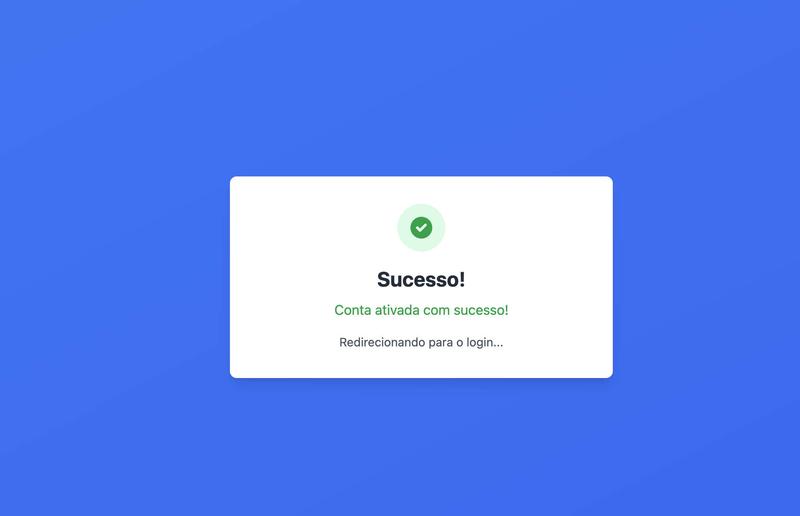
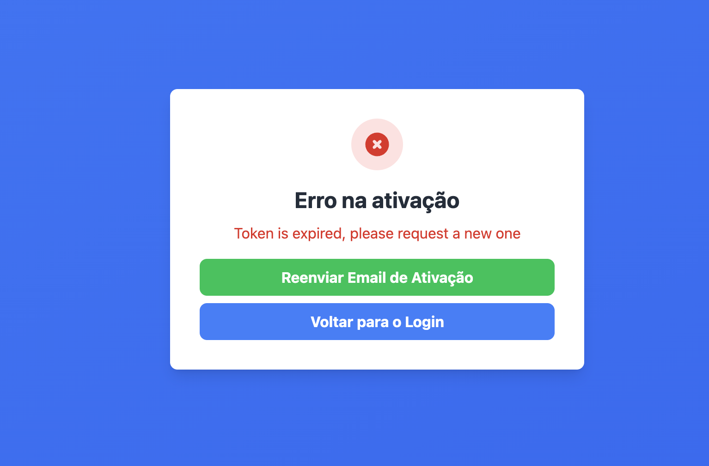

# Criando a tela de ativação da conta

Agora que o usuário já consegue se cadastrar e receber o e-mail com o link de ativação, é hora de disponibilizar essa página que o usuário vai abrir do e-mail.

Ao abrir o link, o que o sistema deve fazer é usar a rota `/api/v1/users/activate/{token}`, que vai verificar se o token é válido, e se for, a ativação será feita.

## Criando a página de ativação

Pelo padrão do Next.JS, para criarmos uma rota dinâmica, precisamos criar a estrutura de pastas de forma que a pasta que recebe o dado dinâmico tenha o nome da variável entre colchetes. Nesse caso, vamos criar a pasta `activate/[token_id]`, e dentro dela criar o arquivo `index.jsx`.

O valor passado no `token_id` pode ser recuperado na rota através da variável `router.query.token_id`


```javascript title="./next/pages/activate/[token_id]/index.jsx"
import { useEffect, useState } from "react";
import { useRouter } from "next/router";
import API_BASE_URL, { API_ENDPOINTS } from "../../../config/api";

export default function Activate() {
  const router = useRouter();
  const { token_id } = router.query;
  const [status, setStatus] = useState("loading"); // loading, success, error
  const [message, setMessage] = useState("");

  useEffect(() => {
    if (!token_id) return;

    const activateUser = async () => {
      try {
        const response = await fetch(
          `${API_BASE_URL}${API_ENDPOINTS.AUTH.ACTIVATE(token_id)}`,
          {
            method: "PATCH",
            headers: {
              "Content-Type": "application/json",
            },
          },
        );

        if (response.ok) {
          setStatus("success");
          setMessage("Conta ativada com sucesso!");
          setTimeout(() => {
            router.push("/");
          }, 2000);
        } else {
          const data = await response.json();
          setStatus("error");
          setMessage(
            data.detail || "Erro ao ativar a conta. O link pode ter expirado.",
          );
        }
      } catch (error) {
        setStatus("error");
        setMessage("Erro ao conectar com o servidor.");
        console.error("Activation error:", error);
      }
    };

    activateUser();
  }, [token_id, router]);

  return (
    <div className="min-h-screen bg-gradient-to-br from-blue-500 to-blue-600 flex items-center justify-center p-4">
      <div className="bg-white rounded-lg shadow-lg p-8 max-w-md w-full text-center">
        {status === "loading" && (
          <>
            <div className="flex justify-center mb-4">
              <div className="animate-spin rounded-full h-12 w-12 border-b-2 border-blue-500"></div>
            </div>
            <h1 className="text-2xl font-bold text-gray-800 mb-2">
              Ativando sua conta...
            </h1>
            <p className="text-gray-600">
              Por favor aguarde enquanto ativamos sua conta.
            </p>
          </>
        )}

        {status === "success" && (
          <>
            <div className="flex justify-center mb-4">
              <div className="bg-green-100 rounded-full p-3">
                <svg
                  className="w-8 h-8 text-green-600"
                  fill="currentColor"
                  viewBox="0 0 20 20"
                >
                  <path
                    fillRule="evenodd"
                    d="M10 18a8 8 0 100-16 8 8 0 000 16zm3.707-9.293a1 1 0 00-1.414-1.414L9 10.586 7.707 9.293a1 1 0 00-1.414 1.414l2 2a1 1 0 001.414 0l4-4z"
                    clipRule="evenodd"
                  />
                </svg>
              </div>
            </div>
            <h1 className="text-2xl font-bold text-gray-800 mb-2">Sucesso!</h1>
            <p className="text-green-600 mb-4">{message}</p>
            <p className="text-gray-600 text-sm">
              Redirecionando para o login...
            </p>
          </>
        )}

        {status === "error" && (
          <>
            <div className="flex justify-center mb-4">
              <div className="bg-red-100 rounded-full p-3">
                <svg
                  className="w-8 h-8 text-red-600"
                  fill="currentColor"
                  viewBox="0 0 20 20"
                >
                  <path
                    fillRule="evenodd"
                    d="M10 18a8 8 0 100-16 8 8 0 000 16zM8.707 7.293a1 1 0 00-1.414 1.414L8.586 10l-1.293 1.293a1 1 0 101.414 1.414L10 11.414l1.293 1.293a1 1 0 001.414-1.414L11.414 10l1.293-1.293a1 1 0 00-1.414-1.414L10 8.586 8.707 7.293z"
                    clipRule="evenodd"
                  />
                </svg>
              </div>
            </div>
            <h1 className="text-2xl font-bold text-gray-800 mb-2">
              Erro na ativação
            </h1>
            <p className="text-red-600 mb-4">{message}</p>
            <button
              onClick={() => router.push("/")}
              className="w-full mt-4 bg-blue-500 hover:bg-blue-600 text-white font-bold py-2 px-4 rounded-lg transition duration-200"
            >
              Voltar para o Login
            </button>
          </>
        )}
      </div>
    </div>
  );
}
```

## Criando sistema de reenvio de token

No caso de o usuário tentar ativar sua conta com um Token expirado, precisamos dar a ele a opção de gerar um novo token. Lá no back já temos criada a rota de `resend-token`, então no caso de a API de `PATCH` do `/activate` retornar algum erro com a string "expired", setaremos um novo state `isTokenExpired`, e exibiremos um botão de gerar um novo token.

### Principais mudanças:
- **[NEW]** Estados `isTokenExpired` e `isResending` para controlar o reenvio
- **[NEW]** Função `handleResendActivation()` para reenviar o token
- **[MODIFIED]** Detecção de token expirado no bloco catch
- **[NEW]** Novo status "resending" para feedback ao usuário
- **[NEW]** Botão "Reenviar Email de Ativação" condicional no JSX
- **[MODIFIED]** Estrutura de botões atualizada com flexbox e múltiplos botões

```javascript title="./next/pages/activate/[token_id]/index.jsx" hl_lines="8,9,20-23,35-38,61-79,176-181,193-202"
import { useEffect, useState } from "react";
import { useRouter } from "next/router";
import API_BASE_URL, { API_ENDPOINTS } from "../../../config/api";

export default function Activate() {
  const router = useRouter();
  const { token_id } = router.query;
  const [status, setStatus] = useState("loading"); // loading, success, error, resending
  const [message, setMessage] = useState("");
  const [isTokenExpired, setIsTokenExpired] = useState(false); // [NEW]
  const [isResending, setIsResending] = useState(false); // [NEW]

  useEffect(() => {
    if (!token_id) return;

    const activateUser = async () => {
      try {
        const response = await fetch(
          `${API_BASE_URL}${API_ENDPOINTS.AUTH.ACTIVATE(token_id)}`,
          {
            method: "PATCH",
            headers: {
              "Content-Type": "application/json",
            },
          },
        );

        if (response.ok) {
          setStatus("success");
          setMessage("Conta ativada com sucesso!");
          setTimeout(() => {
            router.push("/");
          }, 2000);
        } else {
          const data = await response.json();
          setStatus("error");
          setMessage(data.message);

          // [NEW] Verifica se é erro de token expirado
          const fullErrorText = JSON.stringify(data).toLowerCase();
          if (fullErrorText.includes("expired")) {
            setIsTokenExpired(true);
          }
        }
      } catch (error) {
        setStatus("error");
        setMessage("Erro ao conectar com o servidor.");
        console.error("Activation error:", error);
      }
    };

    activateUser();
  }, [token_id, router]);

  const handleResendActivation = async () => { // [NEW]
    setIsResending(true);
    try {
      const response = await fetch(
        `${API_BASE_URL}${API_ENDPOINTS.AUTH.RESEND_ACTIVATION(token_id)}`,
        {
          method: "POST",
          headers: {
            "Content-Type": "application/json",
          },
        },
      );

      if (response.ok) {
        setStatus("resending");
        setMessage(
          "Novo email de ativação enviado com sucesso! Verifique sua caixa de entrada.",
        );
        setTimeout(() => {
          router.push("/");
        }, 3000);
      } else {
        const data = await response.json();
        setMessage(data.message);
      }
    } catch (error) {
      setMessage("Erro ao conectar com o servidor.");
      console.error("Resend activation error:", error);
    } finally {
      setIsResending(false);
    }
  };

  return (
    <div className="min-h-screen bg-gradient-to-br from-blue-500 to-blue-600 flex items-center justify-center p-4">
      <div className="bg-white rounded-lg shadow-lg p-8 max-w-md w-full text-center">
        {status === "loading" && (
          <>
            <div className="flex justify-center mb-4">
              <div className="animate-spin rounded-full h-12 w-12 border-b-2 border-blue-500"></div>
            </div>
            <h1 className="text-2xl font-bold text-gray-800 mb-2">
              Ativando sua conta...
            </h1>
            <p className="text-gray-600">
              Por favor aguarde enquanto ativamos sua conta.
            </p>
          </>
        )}

        {status === "success" && (
          <>
            <div className="flex justify-center mb-4">
              <div className="bg-green-100 rounded-full p-3">
                <svg
                  className="w-8 h-8 text-green-600"
                  fill="currentColor"
                  viewBox="0 0 20 20"
                >
                  <path
                    fillRule="evenodd"
                    d="M10 18a8 8 0 100-16 8 8 0 000 16zm3.707-9.293a1 1 0 00-1.414-1.414L9 10.586 7.707 9.293a1 1 0 00-1.414 1.414l2 2a1 1 0 001.414 0l4-4z"
                    clipRule="evenodd"
                  />
                </svg>
              </div>
            </div>
            <h1 className="text-2xl font-bold text-gray-800 mb-2">Sucesso!</h1>
            <p className="text-green-600 mb-4">{message}</p>
            <p className="text-gray-600 text-sm">
              Redirecionando para o login...
            </p>
          </>
        )}

        {status === "error" && (
          <>
            <div className="flex justify-center mb-4">
              <div className="bg-red-100 rounded-full p-3">
                <svg
                  className="w-8 h-8 text-red-600"
                  fill="currentColor"
                  viewBox="0 0 20 20"
                >
                  <path
                    fillRule="evenodd"
                    d="M10 18a8 8 0 100-16 8 8 0 000 16zM8.707 7.293a1 1 0 00-1.414 1.414L8.586 10l-1.293 1.293a1 1 0 101.414 1.414L10 11.414l1.293 1.293a1 1 0 001.414-1.414L11.414 10l1.293-1.293a1 1 0 00-1.414-1.414L10 8.586 8.707 7.293z"
                    clipRule="evenodd"
                  />
                </svg>
              </div>
            </div>
            <h1 className="text-2xl font-bold text-gray-800 mb-2">
              Erro na ativação
            </h1>
            <p className="text-red-600 mb-4">{message}</p>
            <div className="flex gap-2 flex-col"> {/* [MODIFIED] */}
              {isTokenExpired && (
                <button
                  onClick={handleResendActivation}
                  disabled={isResending}
                  className="w-full bg-green-500 hover:bg-green-600 disabled:bg-gray-400 text-white font-bold py-2 px-4 rounded-lg transition duration-200"
                >
                  {isResending ? "Reenviando..." : "Reenviar Email de Ativação"} {/* [NEW] */}
                </button>
              )}
              <button
                onClick={() => router.push("/")}
                className="w-full bg-blue-500 hover:bg-blue-600 text-white font-bold py-2 px-4 rounded-lg transition duration-200"
              >
                Voltar para o Login
              </button>
            </div>
          </>
        )}

        {status === "resending" && (
          <>
            <div className="flex justify-center mb-4">
              <div className="bg-blue-100 rounded-full p-3">
                <svg
                  className="w-8 h-8 text-blue-600"
                  fill="currentColor"
                  viewBox="0 0 20 20"
                >
                  <path
                    fillRule="evenodd"
                    d="M4 4a2 2 0 00-2 2v4a2 2 0 002 2V6h10a2 2 0 00-2-2H4zm2 6a2 2 0 012-2h8a2 2 0 012 2v4a2 2 0 01-2 2H8a2 2 0 01-2-2v-4zm6-4a2 2 0 100-4 2 2 0 000 4z"
                    clipRule="evenodd"
                  />
                </svg>
              </div>
            </div>
            <h1 className="text-2xl font-bold text-gray-800 mb-2">Sucesso!</h1>
            <p className="text-green-600 mb-4">{message}</p>
            <p className="text-gray-600 text-sm">
              Redirecionando para o login...
            </p>
          </>
        )} {/* [NEW] */}
      </div>
    </div>
  );
}
```

!!! success

    Pronto! Ja temos a nossa tela de ativação pronta. Agora quando o usuário clicar no link para ativar sua conta, ele receberá essa mensagem de confirmação!
    

    Mas caso o token esteja expirado, ele terá a opção de gerar um novo:

    