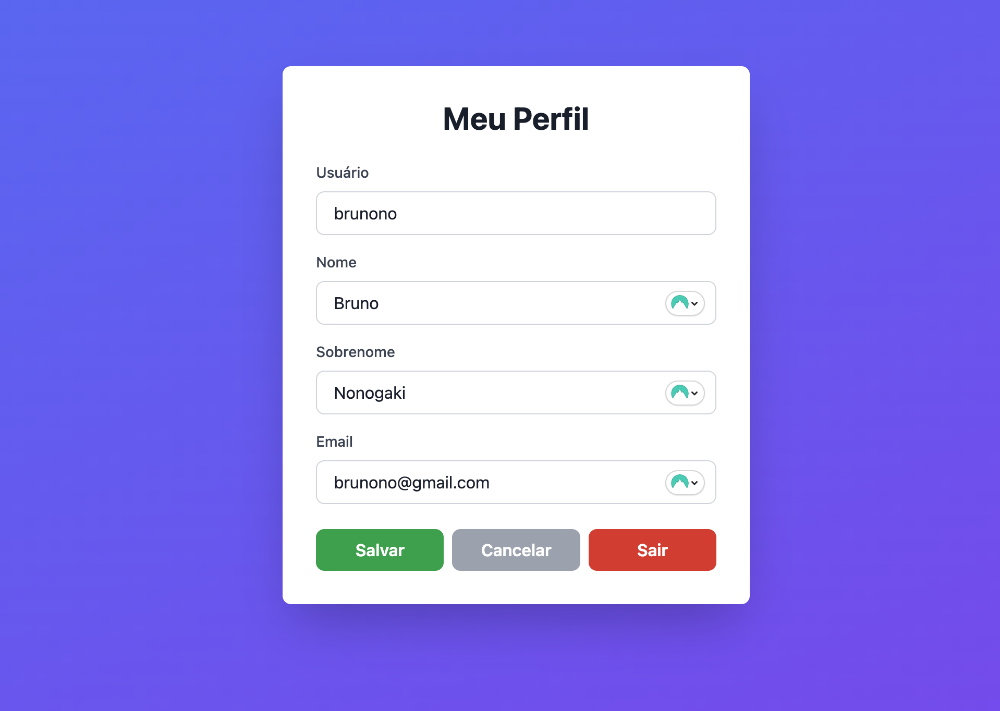
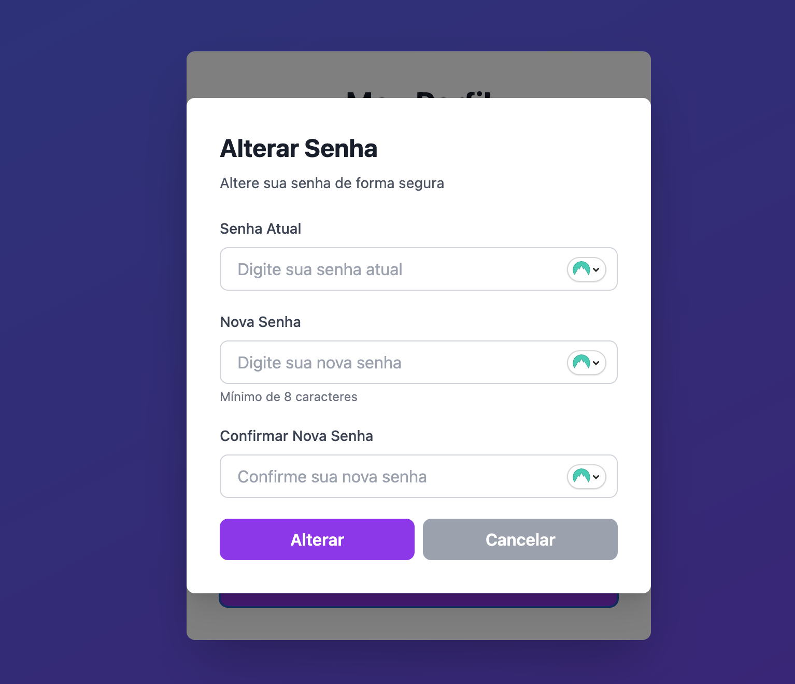

# Criando a tela de edição de dados do usuário

Atualmente depois do login com sucesso do usuário, estamos apenas abrindo uma tela super simples de Olá, <username>, e um botão de logout.

Vamos incrementar um pouco isso. Já que temos os dados do usuário que chegam do endpoint `/me`, podemos populá-los em um formulário, com a opção de o usuário alterar esses dados, inclusive a senha! E assim podemos testar os métodos de `PATCH` de `/users/{user_id}` e `/users/{user_id}/change-password`:

## Trazendo os dados do usuário

A variável `userData` já tem todas as informações do usuário que retornam da API. Então basta criarmos um form, colocando esses valores por padrão. Vamos aproveitar para criar um botão "Editar", que ao ser clicado, liberamos as caixas para edição.

```javascript title="./next/pages/home.jsx"
import { useEffect, useState } from "react";
import { useRouter } from "next/router";
import { getToken, logoutUser, getCurrentUser } from "utils/auth";

export default function Home() {
  const router = useRouter();
  const [user, setUser] = useState(null);
  const [isLoading, setIsLoading] = useState(true);
  const [isEditing, setIsEditing] = useState(false);
  const [formData, setFormData] = useState({
    username: "",
    first_name: "",
    last_name: "",
    email: "",
  });

  useEffect(() => {
    // Verifica se o usuário está autenticado
    if (!getToken()) {
      router.push("/");
      return;
    }

    // Busca dados do usuário autenticado
    const fetchUser = async () => {
      try {
        const userData = await getCurrentUser();

        // Verificar se houve erro
        if (userData.status_code && userData.status_code !== 200) {
          logoutUser();
          router.push("/");
          return;
        }

        setUser(userData);
        setFormData({
          username: userData.username || "",
          first_name: userData.first_name || "",
          last_name: userData.last_name || "",
          email: userData.email || "",
        });
      } catch (error) {
        console.error("Erro ao buscar dados do usuário:", error);
        logoutUser();
        router.push("/");
      } finally {
        setIsLoading(false);
      }
    };

    fetchUser();
  }, [router]);

  const handleLogout = () => {
    logoutUser();
    router.push("/");
  };

  const handleEditToggle = () => {
    if (isEditing) {
      // Cancelar edição
      setFormData({
        username: user?.username || "",
        first_name: user?.first_name || "",
        last_name: user?.last_name || "",
        email: user?.email || "",
      });
    }
    setIsEditing(!isEditing);
  };

  const handleInputChange = (e) => {
    const { name, value } = e.target;
    setFormData((prev) => ({
      ...prev,
      [name]: value,
    }));
  };

  if (isLoading) {
    return (
      <div className="min-h-screen bg-gradient-to-br from-blue-500 to-purple-600 flex items-center justify-center p-4">
        <div className="text-white text-center">
          <p className="text-xl">Carregando...</p>
        </div>
      </div>
    );
  }

  return (
    <div className="min-h-screen bg-gradient-to-br from-blue-500 to-purple-600 flex items-center justify-center p-4">
      <div className="bg-white rounded-lg shadow-2xl p-8 max-w-md w-full">
        <h1 className="text-3xl font-bold text-gray-900 mb-6 text-center">
          Meu Perfil
        </h1>

        {/* Username */}
        <div className="mb-4">
          <label className="block text-sm font-medium text-gray-700 mb-2">
            Usuário
          </label>
          <input
            type="text"
            name="username"
            value={formData.username}
            onChange={handleInputChange}
            disabled={!isEditing}
            className={`w-full px-4 py-2 border border-gray-300 rounded-lg ${
              isEditing
                ? "bg-white text-gray-900 cursor-text"
                : "bg-gray-100 text-gray-700 cursor-not-allowed"
            }`}
          />
        </div>

        {/* First Name */}
        <div className="mb-4">
          <label className="block text-sm font-medium text-gray-700 mb-2">
            Nome
          </label>
          <input
            type="text"
            name="first_name"
            value={formData.first_name}
            onChange={handleInputChange}
            disabled={!isEditing}
            className={`w-full px-4 py-2 border border-gray-300 rounded-lg ${
              isEditing
                ? "bg-white text-gray-900 cursor-text"
                : "bg-gray-100 text-gray-700 cursor-not-allowed"
            }`}
          />
        </div>

        {/* Last Name */}
        <div className="mb-4">
          <label className="block text-sm font-medium text-gray-700 mb-2">
            Sobrenome
          </label>
          <input
            type="text"
            name="last_name"
            value={formData.last_name}
            onChange={handleInputChange}
            disabled={!isEditing}
            className={`w-full px-4 py-2 border border-gray-300 rounded-lg ${
              isEditing
                ? "bg-white text-gray-900 cursor-text"
                : "bg-gray-100 text-gray-700 cursor-not-allowed"
            }`}
          />
        </div>

        {/* Email */}
        <div className="mb-6">
          <label className="block text-sm font-medium text-gray-700 mb-2">
            Email
          </label>
          <input
            type="email"
            name="email"
            value={formData.email}
            onChange={handleInputChange}
            disabled={!isEditing}
            className={`w-full px-4 py-2 border border-gray-300 rounded-lg ${
              isEditing
                ? "bg-white text-gray-900 cursor-text"
                : "bg-gray-100 text-gray-700 cursor-not-allowed"
            }`}
          />
        </div>

        {/* Buttons */}
        <div className="flex gap-2">
          <button
            onClick={handleEditToggle}
            className={`flex-1 font-semibold py-2 px-4 rounded-lg transition duration-200 ${
              isEditing
                ? "bg-gray-400 hover:bg-gray-500 text-white"
                : "bg-blue-600 hover:bg-blue-700 text-white"
            }`}
          >
            {isEditing ? "Cancelar" : "Editar"}
          </button>
          <button
            onClick={handleLogout}
            className="flex-1 bg-red-600 hover:bg-red-700 text-white font-semibold py-2 px-4 rounded-lg transition duration-200"
          >
            Sair
          </button>
        </div>
      </div>
    </div>
  );
}
```

## Alterando os dados do usuário

Show, agora sim vamos criar um botão de submit para salvar esses dados. 

### Criando o `utils/users.js`

Veja que ainda não temos o arquivo `utils/users.js` para tratar essas requests para o endpoint de `/users`, ne? Vamos criá-lo, já aproveitando para criar as funções de get, delete, patch.

```javascript title="./next/utils/users.js"
/**
 * User Utilities
 * Funções para gerenciar dados de usuários usando a API genérica
 */

import { apiCall } from "./api";
import { API_ENDPOINTS } from "config/api";

/**
 * Obter dados do usuário atual autenticado
 * Requer token JWT válido
 *
 * @returns {Promise} - Dados do usuário autenticado
 *
 * @example
 * const user = await getCurrentUser();
 * // { id: '...', username: 'bruno', email: 'bruno@email.com', first_name: 'Bruno', last_name: 'Nonogaki', is_active: true }
 */
export async function getCurrentUser() {
  const response = await apiCall(API_ENDPOINTS.USERS.ME, {
    method: "GET",
  });

  return response;
}

/**
 * Atualizar dados do usuário
 * Pode atualizar: username, first_name, last_name, email
 * Requer token JWT válido e permissão (owner ou admin)
 *
 * @param {string} userId - ID do usuário
 * @param {Object} userData - Objeto com dados a atualizar
 * @param {string} userData.username - (opcional) Novo nome de usuário
 * @param {string} userData.first_name - (opcional) Novo primeiro nome
 * @param {string} userData.last_name - (opcional) Novo sobrenome
 * @param {string} userData.email - (opcional) Novo email
 * @returns {Promise} - Dados do usuário atualizado
 *
 * @example
 * const updated = await updateUser('user-id-123', {
 *   first_name: 'João',
 *   last_name: 'Silva'
 * });
 * // { id: '...', username: 'bruno', first_name: 'João', last_name: 'Silva', ... }
 */
export async function updateUser(userId, userData) {
  const endpoint = API_ENDPOINTS.USERS.UPDATE(userId);

  const response = await apiCall(endpoint, {
    method: "PATCH",
    body: JSON.stringify(userData),
  });

  return response;
}

/**
 * Alterar senha do usuário
 * Requer senha atual para verificação
 * Requer token JWT válido
 *
 * @param {string} userId - ID do usuário
 * @param {string} currentPassword - Senha atual
 * @param {string} newPassword - Nova senha
 * @returns {Promise} - Resposta com status
 *
 * @example
 * const result = await changeUserPassword('user-id-123', 'senhaAtual123', 'novaSenha456');
 * // { message: 'Senha alterada com sucesso' }
 */
export async function changeUserPassword(userId, currentPassword, newPassword) {
  const endpoint = API_ENDPOINTS.USERS.CHANGE_PASSWORD(userId);

  const response = await apiCall(endpoint, {
    method: "PATCH",
    body: JSON.stringify({
      current_password: currentPassword,
      new_password: newPassword,
    }),
  });

  return response;
}

/**
 * Obter usuário por ID
 * Requer permissão apropriada
 *
 * @param {string} userId - ID do usuário
 * @returns {Promise} - Dados do usuário
 *
 * @example
 * const user = await getUserById('user-id-123');
 */
export async function getUserById(userId) {
  const endpoint = API_ENDPOINTS.USERS.GET(userId);

  const response = await apiCall(endpoint, {
    method: "GET",
  });

  return response;
}

/**
 * Deletar usuário
 * Requer permissão apropriada (owner ou admin)
 *
 * @param {string} userId - ID do usuário
 * @returns {Promise} - Resposta com status
 *
 * @example
 * const result = await deleteUser('user-id-123');
 */
export async function deleteUser(userId) {
  const endpoint = API_ENDPOINTS.USERS.DELETE(userId);

  const response = await apiCall(endpoint, {
    method: "DELETE",
  });

  return response;
}
```
!!! note

    Veja que movi a função getCurrentUser para esse novo arquivo, removendo do `auth.js`, já que se trata de uma função do usuário, e não da autenticação.

### Submetendo o formulário de alteração de dados

Agora basta criarmos uma função `handleSave` na nossa página, que vai invocar a função `updateUser`, que criamos lá no `utils/users.js`.

```javascript title="./next/pages/home.jsx"
import { useEffect, useState } from "react";
import { useRouter } from "next/router";
import { getToken, logoutUser } from "utils/auth";
import { getCurrentUser, updateUser } from "utils/users";

export default function Home() {
  const router = useRouter();
  const [user, setUser] = useState(null);
  const [isLoading, setIsLoading] = useState(true);
  const [isEditing, setIsEditing] = useState(false);
  const [isSaving, setIsSaving] = useState(false);
  const [message, setMessage] = useState({ type: "", text: "" });
  const [formData, setFormData] = useState({
    username: "",
    first_name: "",
    last_name: "",
    email: "",
  });

  useEffect(() => {
    // Verifica se o usuário está autenticado
    if (!getToken()) {
      router.push("/");
      return;
    }

    // Busca dados do usuário autenticado
    const fetchUser = async () => {
      try {
        const userData = await getCurrentUser();

        // Verificar se houve erro
        if (userData.status_code && userData.status_code !== 200) {
          logoutUser();
          router.push("/");
          return;
        }

        setUser(userData);
        setFormData({
          username: userData.username || "",
          first_name: userData.first_name || "",
          last_name: userData.last_name || "",
          email: userData.email || "",
        });
      } catch (error) {
        console.error("Erro ao buscar dados do usuário:", error);
        logoutUser();
        router.push("/");
      } finally {
        setIsLoading(false);
      }
    };

    fetchUser();
  }, [router]);

  const handleLogout = () => {
    logoutUser();
    router.push("/");
  };

  const handleEditToggle = () => {
    if (isEditing) {
      // Cancelar edição
      setFormData({
        username: user?.username || "",
        first_name: user?.first_name || "",
        last_name: user?.last_name || "",
        email: user?.email || "",
      });
    }
    setIsEditing(!isEditing);
  };

  const handleInputChange = (e) => {
    const { name, value } = e.target;
    setFormData((prev) => ({
      ...prev,
      [name]: value,
    }));
  };

  const handleSave = async () => {
    setIsSaving(true);
    setMessage({ type: "", text: "" });

    try {
      const updatedUser = await updateUser(user.id, formData);

      setUser(updatedUser);
      setIsEditing(false);
      setMessage({ type: "success", text: "Dados atualizados com sucesso!" });
      setTimeout(() => setMessage({ type: "", text: "" }), 3000);
    } catch (error) {
      console.error("Erro ao salvar:", error);
      const errorMessage = error.message || "Erro ao conectar com o servidor";
      setMessage({ type: "error", text: errorMessage });
    } finally {
      setIsSaving(false);
    }
  };

  if (isLoading) {
    return (
      <div className="min-h-screen bg-gradient-to-br from-blue-500 to-purple-600 flex items-center justify-center p-4">
        <div className="text-white text-center">
          <p className="text-xl">Carregando...</p>
        </div>
      </div>
    );
  }

  return (
    <div className="min-h-screen bg-gradient-to-br from-blue-500 to-purple-600 flex items-center justify-center p-4">
      <div className="bg-white rounded-lg shadow-2xl p-8 max-w-md w-full">
        <h1 className="text-3xl font-bold text-gray-900 mb-6 text-center">
          Meu Perfil
        </h1>

        {/* Username */}
        <div className="mb-4">
          <label className="block text-sm font-medium text-gray-700 mb-2">
            Usuário
          </label>
          <input
            type="text"
            name="username"
            value={formData.username}
            onChange={handleInputChange}
            disabled={!isEditing}
            className={`w-full px-4 py-2 border border-gray-300 rounded-lg ${
              isEditing
                ? "bg-white text-gray-900 cursor-text"
                : "bg-gray-100 text-gray-700 cursor-not-allowed"
            }`}
          />
        </div>

        {/* First Name */}
        <div className="mb-4">
          <label className="block text-sm font-medium text-gray-700 mb-2">
            Nome
          </label>
          <input
            type="text"
            name="first_name"
            value={formData.first_name}
            onChange={handleInputChange}
            disabled={!isEditing}
            className={`w-full px-4 py-2 border border-gray-300 rounded-lg ${
              isEditing
                ? "bg-white text-gray-900 cursor-text"
                : "bg-gray-100 text-gray-700 cursor-not-allowed"
            }`}
          />
        </div>

        {/* Last Name */}
        <div className="mb-4">
          <label className="block text-sm font-medium text-gray-700 mb-2">
            Sobrenome
          </label>
          <input
            type="text"
            name="last_name"
            value={formData.last_name}
            onChange={handleInputChange}
            disabled={!isEditing}
            className={`w-full px-4 py-2 border border-gray-300 rounded-lg ${
              isEditing
                ? "bg-white text-gray-900 cursor-text"
                : "bg-gray-100 text-gray-700 cursor-not-allowed"
            }`}
          />
        </div>

        {/* Email */}
        <div className="mb-6">
          <label className="block text-sm font-medium text-gray-700 mb-2">
            Email
          </label>
          <input
            type="email"
            name="email"
            value={formData.email}
            onChange={handleInputChange}
            disabled={!isEditing}
            className={`w-full px-4 py-2 border border-gray-300 rounded-lg ${
              isEditing
                ? "bg-white text-gray-900 cursor-text"
                : "bg-gray-100 text-gray-700 cursor-not-allowed"
            }`}
          />
        </div>

        {/* Message */}
        {message.text && (
          <div
            className={`mb-4 p-3 rounded-lg text-sm font-medium ${
              message.type === "success"
                ? "bg-green-100 text-green-700"
                : "bg-red-100 text-red-700"
            }`}
          >
            {message.text}
          </div>
        )}

        {/* Buttons */}
        <div className="flex gap-2">
          {isEditing ? (
            <>
              <button
                onClick={handleSave}
                disabled={isSaving}
                className="flex-1 bg-green-600 hover:bg-green-700 disabled:bg-gray-400 text-white font-semibold py-2 px-4 rounded-lg transition duration-200"
              >
                {isSaving ? "Salvando..." : "Salvar"}
              </button>
              <button
                onClick={handleEditToggle}
                disabled={isSaving}
                className="flex-1 bg-gray-400 hover:bg-gray-500 disabled:bg-gray-400 text-white font-semibold py-2 px-4 rounded-lg transition duration-200"
              >
                Cancelar
              </button>
            </>
          ) : (
            <button
              onClick={handleEditToggle}
              className="flex-1 bg-blue-600 hover:bg-blue-700 text-white font-semibold py-2 px-4 rounded-lg transition duration-200"
            >
              Editar
            </button>
          )}
          <button
            onClick={handleLogout}
            className="flex-1 bg-red-600 hover:bg-red-700 text-white font-semibold py-2 px-4 rounded-lg transition duration-200"
          >
            Sair
          </button>
        </div>
      </div>
    </div>
  );
}
```

!!! success

    Agora já somos capazes de efetuar o login na página e alterar os nossos dados:
    

## Alterando a senha do usuário

Para a alteração de senha, vamos criar mais 3 campos: dois para o usuário digitar uma senha nova, e um para digitar a senha atual. Para a interface ficar mais limpa, vamos criar um botão "Alterar Senha", que se clicado, vai setar a variável `isPasswordModalOpen` como True, e vai exibir um modal, que escreveremos em um componente chamado `ChangePasswordModal`. Futuramente, podemos até jogar esse modal em uma pasta de componentes reutilizáveis, mas por enquanto vamos deixar nessa página mesmo.

```javascript title="./next/pages/home.jsx"
import { useEffect, useState } from "react";
import { useRouter } from "next/router";
import { getToken, logoutUser } from "utils/auth";
import { getCurrentUser, updateUser, changeUserPassword } from "utils/users";

export default function Home() {
  const router = useRouter();
  const [user, setUser] = useState(null);
  const [isLoading, setIsLoading] = useState(true);
  const [isEditing, setIsEditing] = useState(false);
  const [isSaving, setIsSaving] = useState(false);
  const [message, setMessage] = useState({ type: "", text: "" });
  const [formData, setFormData] = useState({
    username: "",
    first_name: "",
    last_name: "",
    email: "",
  });
  const [isPasswordModalOpen, setIsPasswordModalOpen] = useState(false);

  useEffect(() => {
    // Verifica se o usuário está autenticado
    if (!getToken()) {
      router.push("/");
      return;
    }

    // Busca dados do usuário autenticado
    const fetchUser = async () => {
      try {
        const userData = await getCurrentUser();

        // Verificar se houve erro
        if (userData.status_code && userData.status_code !== 200) {
          logoutUser();
          router.push("/");
          return;
        }

        setUser(userData);
        setFormData({
          username: userData.username || "",
          first_name: userData.first_name || "",
          last_name: userData.last_name || "",
          email: userData.email || "",
        });
      } catch (error) {
        console.error("Erro ao buscar dados do usuário:", error);
        logoutUser();
        router.push("/");
      } finally {
        setIsLoading(false);
      }
    };

    fetchUser();
  }, [router]);

  const handleLogout = () => {
    logoutUser();
    router.push("/");
  };

  const handleEditToggle = () => {
    if (isEditing) {
      // Cancelar edição
      setFormData({
        username: user?.username || "",
        first_name: user?.first_name || "",
        last_name: user?.last_name || "",
        email: user?.email || "",
      });
    }
    setIsEditing(!isEditing);
  };

  const handleInputChange = (e) => {
    const { name, value } = e.target;
    setFormData((prev) => ({
      ...prev,
      [name]: value,
    }));
  };

  const handleSave = async () => {
    setIsSaving(true);
    setMessage({ type: "", text: "" });

    try {
      const updatedUser = await updateUser(user.id, formData);

      setUser(updatedUser);
      setIsEditing(false);
      setMessage({ type: "success", text: "Dados atualizados com sucesso!" });
      setTimeout(() => setMessage({ type: "", text: "" }), 3000);
    } catch (error) {
      console.error("Erro ao salvar:", error);
      const errorMessage = error.message || "Erro ao conectar com o servidor";
      setMessage({ type: "error", text: errorMessage });
    } finally {
      setIsSaving(false);
    }
  };

  const handlePasswordInputChange = (e) => {
    const { name, value } = e.target;
    setPasswordFormData((prev) => ({
      ...prev,
      [name]: value,
    }));
  };

  const validatePasswordForm = () => {
    // Validar campos vazios
    if (!passwordFormData.currentPassword) {
      setPasswordMessage({ type: "error", text: "Informe sua senha atual" });
      return false;
    }

    if (!passwordFormData.newPassword) {
      setPasswordMessage({ type: "error", text: "Informe a nova senha" });
      return false;
    }

    if (!passwordFormData.confirmPassword) {
      setPasswordMessage({ type: "error", text: "Confirme a nova senha" });
      return false;
    }

    // Validar comprimento mínimo
    if (passwordFormData.newPassword.length < 8) {
      setPasswordMessage({
        type: "error",
        text: "A nova senha deve ter pelo menos 8 caracteres",
      });
      return false;
    }

    // Validar se as senhas batem
    if (passwordFormData.newPassword !== passwordFormData.confirmPassword) {
      setPasswordMessage({
        type: "error",
        text: "As novas senhas não correspondem",
      });
      return false;
    }

    // Validar se a senha atual é igual à nova
    if (passwordFormData.currentPassword === passwordFormData.newPassword) {
      setPasswordMessage({
        type: "error",
        text: "A nova senha deve ser diferente da atual",
      });
      return false;
    }

    return true;
  };

  const handlePasswordSubmit = async (e) => {
    e.preventDefault();
    setPasswordMessage({ type: "", text: "" });

    if (!validatePasswordForm()) {
      return;
    }

    setIsChangingPassword(true);

    try {
      await changeUserPassword(
        user.id,
        passwordFormData.currentPassword,
        passwordFormData.newPassword,
      );

      setPasswordMessage({
        type: "success",
        text: "Senha alterada com sucesso!",
      });

      // Limpar formulário
      setPasswordFormData({
        currentPassword: "",
        newPassword: "",
        confirmPassword: "",
      });

      // Fechar modal após 2 segundos
      setTimeout(() => {
        setIsPasswordModalOpen(false);
      }, 2000);
    } catch (error) {
      console.error("Erro ao alterar senha:", error);
      const errorMessage = error.message || "Erro ao alterar senha";
      setPasswordMessage({ type: "error", text: errorMessage });
    } finally {
      setIsChangingPassword(false);
    }
  };

  if (isLoading) {
    return (
      <div className="min-h-screen bg-gradient-to-br from-blue-500 to-purple-600 flex items-center justify-center p-4">
        <div className="text-white text-center">
          <p className="text-xl">Carregando...</p>
        </div>
      </div>
    );
  }

  return (
    <div className="min-h-screen bg-gradient-to-br from-blue-500 to-purple-600 flex items-center justify-center p-4">
      <div className="bg-white rounded-lg shadow-2xl p-8 max-w-md w-full">
        <h1 className="text-3xl font-bold text-gray-900 mb-6 text-center">
          Meu Perfil
        </h1>

        {/* Username */}
        <div className="mb-4">
          <label className="block text-sm font-medium text-gray-700 mb-2">
            Usuário
          </label>
          <input
            type="text"
            name="username"
            value={formData.username}
            onChange={handleInputChange}
            disabled={!isEditing}
            className={`w-full px-4 py-2 border border-gray-300 rounded-lg ${
              isEditing
                ? "bg-white text-gray-900 cursor-text"
                : "bg-gray-100 text-gray-700 cursor-not-allowed"
            }`}
          />
        </div>

        {/* First Name */}
        <div className="mb-4">
          <label className="block text-sm font-medium text-gray-700 mb-2">
            Nome
          </label>
          <input
            type="text"
            name="first_name"
            value={formData.first_name}
            onChange={handleInputChange}
            disabled={!isEditing}
            className={`w-full px-4 py-2 border border-gray-300 rounded-lg ${
              isEditing
                ? "bg-white text-gray-900 cursor-text"
                : "bg-gray-100 text-gray-700 cursor-not-allowed"
            }`}
          />
        </div>

        {/* Last Name */}
        <div className="mb-4">
          <label className="block text-sm font-medium text-gray-700 mb-2">
            Sobrenome
          </label>
          <input
            type="text"
            name="last_name"
            value={formData.last_name}
            onChange={handleInputChange}
            disabled={!isEditing}
            className={`w-full px-4 py-2 border border-gray-300 rounded-lg ${
              isEditing
                ? "bg-white text-gray-900 cursor-text"
                : "bg-gray-100 text-gray-700 cursor-not-allowed"
            }`}
          />
        </div>

        {/* Email */}
        <div className="mb-6">
          <label className="block text-sm font-medium text-gray-700 mb-2">
            Email
          </label>
          <input
            type="email"
            name="email"
            value={formData.email}
            onChange={handleInputChange}
            disabled={!isEditing}
            className={`w-full px-4 py-2 border border-gray-300 rounded-lg ${
              isEditing
                ? "bg-white text-gray-900 cursor-text"
                : "bg-gray-100 text-gray-700 cursor-not-allowed"
            }`}
          />
        </div>

        {/* Message */}
        {message.text && (
          <div
            className={`mb-4 p-3 rounded-lg text-sm font-medium ${
              message.type === "success"
                ? "bg-green-100 text-green-700"
                : "bg-red-100 text-red-700"
            }`}
          >
            {message.text}
          </div>
        )}

        {/* Buttons */}
        <div className="space-y-3">
          {/* Top Row - Edit/Save/Cancel */}
          <div className="flex gap-2">
            {isEditing ? (
              <>
                <button
                  onClick={handleSave}
                  disabled={isSaving}
                  className="flex-1 bg-green-600 hover:bg-green-700 disabled:bg-gray-400 text-white font-semibold py-2 px-4 rounded-lg transition duration-200"
                >
                  {isSaving ? "Salvando..." : "Salvar"}
                </button>
                <button
                  onClick={handleEditToggle}
                  disabled={isSaving}
                  className="flex-1 bg-gray-400 hover:bg-gray-500 disabled:bg-gray-400 text-white font-semibold py-2 px-4 rounded-lg transition duration-200"
                >
                  Cancelar
                </button>
              </>
            ) : (
              <button
                onClick={handleEditToggle}
                className="flex-1 bg-blue-600 hover:bg-blue-700 text-white font-semibold py-2 px-4 rounded-lg transition duration-200"
              >
                Editar
              </button>
            )}
            <button
              onClick={handleLogout}
              className="flex-1 bg-red-600 hover:bg-red-700 text-white font-semibold py-2 px-4 rounded-lg transition duration-200"
            >
              Sair
            </button>
          </div>

          {/* Change Password Button */}
          <button
            onClick={() => setIsPasswordModalOpen(true)}
            className="w-full bg-purple-600 hover:bg-purple-700 text-white font-semibold py-2 px-4 rounded-lg transition duration-200"
          >
            Alterar Senha
          </button>
        </div>

        {/* Password Modal */}
        <ChangePasswordModal
          isOpen={isPasswordModalOpen}
          userId={user.id}
          onClose={() => setIsPasswordModalOpen(false)}
        />
      </div>
    </div>
  );
}

/**
 * Modal para alterar senha do usuário
 */
function ChangePasswordModal({ isOpen, userId, onClose }) {
  const [isChangingPassword, setIsChangingPassword] = useState(false);
  const [passwordMessage, setPasswordMessage] = useState({
    type: "",
    text: "",
  });
  const [passwordFormData, setPasswordFormData] = useState({
    currentPassword: "",
    newPassword: "",
    confirmPassword: "",
  });

  const handlePasswordInputChange = (e) => {
    const { name, value } = e.target;
    setPasswordFormData((prev) => ({
      ...prev,
      [name]: value,
    }));
  };

  const validatePasswordForm = () => {
    // Validar campos vazios
    if (!passwordFormData.currentPassword) {
      setPasswordMessage({ type: "error", text: "Informe sua senha atual" });
      return false;
    }

    if (!passwordFormData.newPassword) {
      setPasswordMessage({ type: "error", text: "Informe a nova senha" });
      return false;
    }

    if (!passwordFormData.confirmPassword) {
      setPasswordMessage({ type: "error", text: "Confirme a nova senha" });
      return false;
    }

    // Validar comprimento mínimo
    if (passwordFormData.newPassword.length < 8) {
      setPasswordMessage({
        type: "error",
        text: "A nova senha deve ter pelo menos 8 caracteres",
      });
      return false;
    }

    // Validar se as senhas batem
    if (passwordFormData.newPassword !== passwordFormData.confirmPassword) {
      setPasswordMessage({
        type: "error",
        text: "As novas senhas não correspondem",
      });
      return false;
    }

    // Validar se a senha atual é igual à nova
    if (passwordFormData.currentPassword === passwordFormData.newPassword) {
      setPasswordMessage({
        type: "error",
        text: "A nova senha deve ser diferente da atual",
      });
      return false;
    }

    return true;
  };

  const handlePasswordSubmit = async (e) => {
    e.preventDefault();
    setPasswordMessage({ type: "", text: "" });

    if (!validatePasswordForm()) {
      return;
    }

    setIsChangingPassword(true);

    try {
      await changeUserPassword(
        userId,
        passwordFormData.currentPassword,
        passwordFormData.newPassword,
      );

      setPasswordMessage({
        type: "success",
        text: "Senha alterada com sucesso!",
      });

      // Limpar formulário
      setPasswordFormData({
        currentPassword: "",
        newPassword: "",
        confirmPassword: "",
      });

      // Fechar modal após 2 segundos
      setTimeout(() => {
        onClose();
      }, 2000);
    } catch (error) {
      console.error("Erro ao alterar senha:", error);
      const errorMessage = error.message || "Erro ao alterar senha";
      setPasswordMessage({ type: "error", text: errorMessage });
    } finally {
      setIsChangingPassword(false);
    }
  };

  const handleCloseModal = () => {
    setPasswordFormData({
      currentPassword: "",
      newPassword: "",
      confirmPassword: "",
    });
    setPasswordMessage({ type: "", text: "" });
    onClose();
  };

  if (!isOpen) return null;

  return (
    <div className="fixed inset-0 bg-black bg-opacity-50 flex items-center justify-center p-4 z-50">
      <div className="bg-white rounded-lg shadow-xl max-w-md w-full p-8 max-h-screen overflow-y-auto">
        {/* Header */}
        <div className="mb-6">
          <h2 className="text-2xl font-bold text-gray-900">Alterar Senha</h2>
          <p className="text-gray-600 text-sm mt-2">
            Altere sua senha de forma segura
          </p>
        </div>

        {/* Message */}
        {passwordMessage.text && (
          <div
            className={`mb-6 p-4 rounded-lg text-sm font-medium ${
              passwordMessage.type === "success"
                ? "bg-green-100 text-green-700"
                : "bg-red-100 text-red-700"
            }`}
          >
            {passwordMessage.text}
          </div>
        )}

        {/* Form */}
        <form onSubmit={handlePasswordSubmit} className="space-y-5">
          {/* Senha Atual */}
          <div>
            <label className="block text-sm font-medium text-gray-700 mb-2">
              Senha Atual
            </label>
            <input
              type="password"
              name="currentPassword"
              value={passwordFormData.currentPassword}
              onChange={handlePasswordInputChange}
              placeholder="Digite sua senha atual"
              disabled={isChangingPassword}
              className="w-full px-4 py-2 border border-gray-300 rounded-lg focus:ring-2 focus:ring-purple-500 focus:border-transparent disabled:bg-gray-100 disabled:cursor-not-allowed"
            />
          </div>

          {/* Nova Senha */}
          <div>
            <label className="block text-sm font-medium text-gray-700 mb-2">
              Nova Senha
            </label>
            <input
              type="password"
              name="newPassword"
              value={passwordFormData.newPassword}
              onChange={handlePasswordInputChange}
              placeholder="Digite sua nova senha"
              disabled={isChangingPassword}
              className="w-full px-4 py-2 border border-gray-300 rounded-lg focus:ring-2 focus:ring-purple-500 focus:border-transparent disabled:bg-gray-100 disabled:cursor-not-allowed"
            />
            <p className="text-xs text-gray-500 mt-1">Mínimo de 8 caracteres</p>
          </div>

          {/* Confirmar Nova Senha */}
          <div>
            <label className="block text-sm font-medium text-gray-700 mb-2">
              Confirmar Nova Senha
            </label>
            <input
              type="password"
              name="confirmPassword"
              value={passwordFormData.confirmPassword}
              onChange={handlePasswordInputChange}
              placeholder="Confirme sua nova senha"
              disabled={isChangingPassword}
              className="w-full px-4 py-2 border border-gray-300 rounded-lg focus:ring-2 focus:ring-purple-500 focus:border-transparent disabled:bg-gray-100 disabled:cursor-not-allowed"
            />
          </div>

          {/* Buttons */}
          <div className="flex gap-2 mt-6">
            <button
              type="submit"
              disabled={isChangingPassword}
              className="flex-1 bg-purple-600 hover:bg-purple-700 disabled:bg-gray-400 text-white font-semibold py-2 px-4 rounded-lg transition duration-200"
            >
              {isChangingPassword ? "Alterando..." : "Alterar"}
            </button>
            <button
              type="button"
              onClick={handleCloseModal}
              disabled={isChangingPassword}
              className="flex-1 bg-gray-400 hover:bg-gray-500 disabled:bg-gray-400 text-white font-semibold py-2 px-4 rounded-lg transition duration-200"
            >
              Cancelar
            </button>
          </div>
        </form>
      </div>
    </div>
  );
}
```

!!! success

    Agora temos uma tela de alteração de senha funcionando!

    