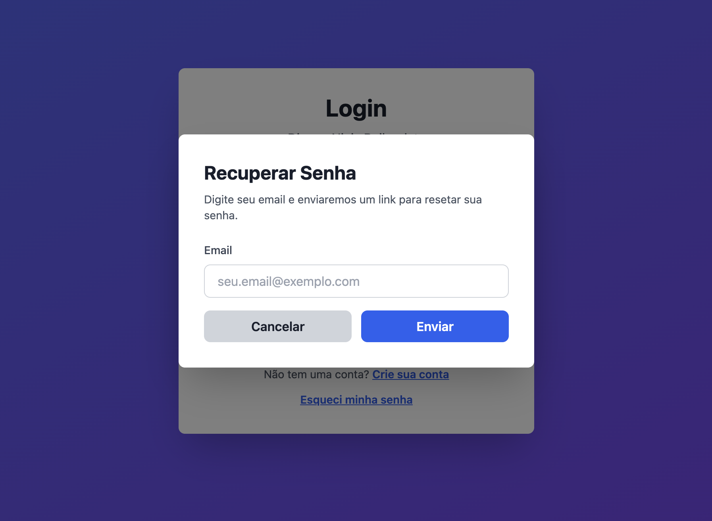
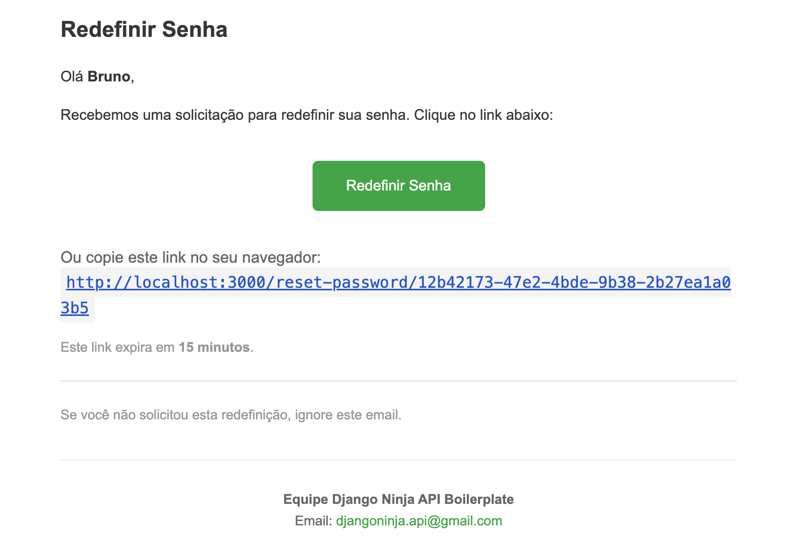
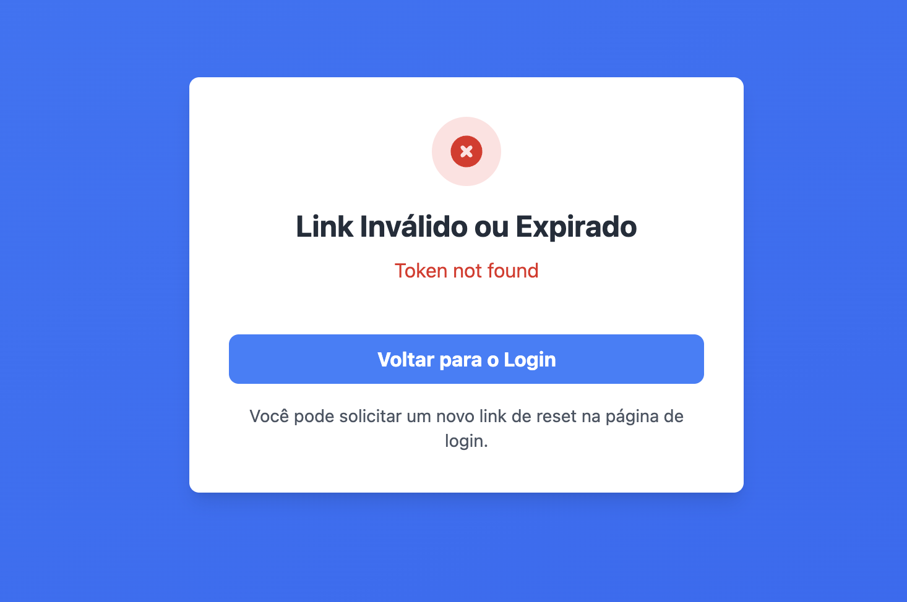
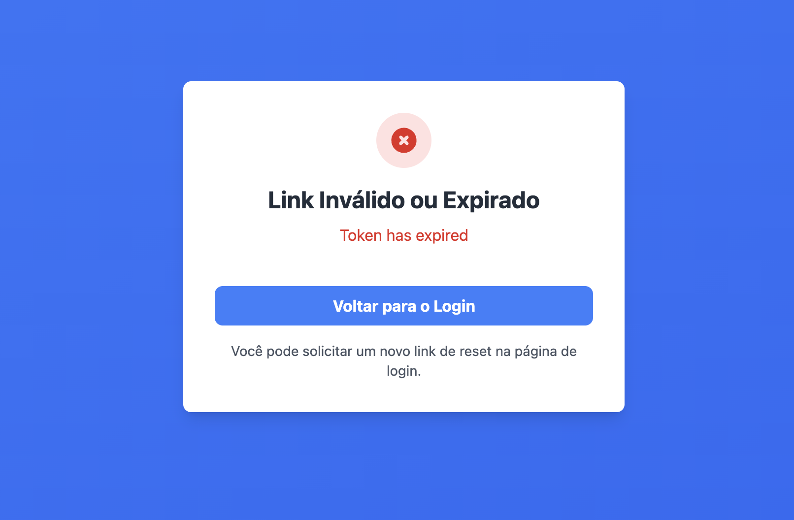
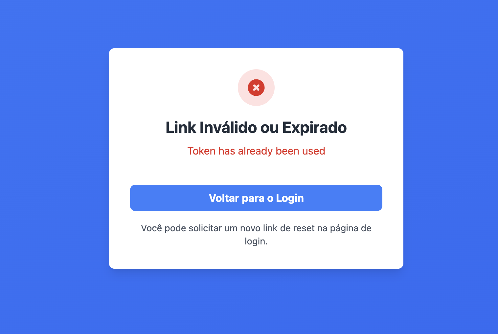
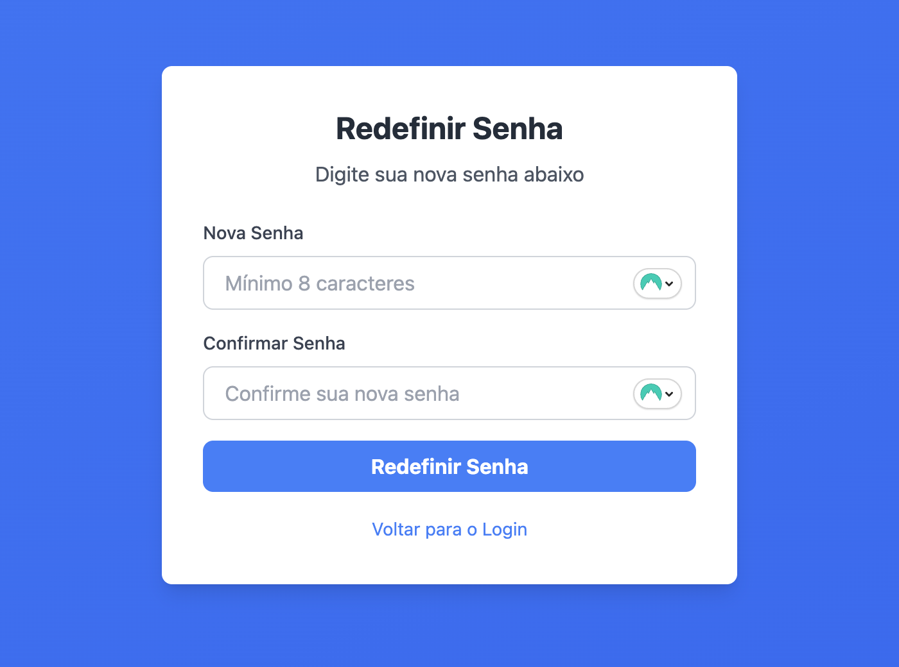

# Criando a tela de reset de senha

Agora vamos implementar na tela de login um link para o usuário realizar o reset de senha. O fluxo será o usuário inserir um `username`, e se ele existir, o sistema enviará um e-mail com um link e um token com validade de 15 minutos. Através desse link, o usuário poderá alterar a sua senha.

Primeiramente, vamos colocar no arquivo `config/api.js` essas rotas que foram criadas no backend:

```javascript title="./next/config/api.js"
  // Password Reset endpoints
  PASSWORD_RESET: {
    REQUEST: "/api/v1/users/password-reset/request",
    VALIDATE: (tokenId) => `/api/v1/users/password-reset/${tokenId}/validate`,    
    CONFIRM: (tokenId) => `/api/v1/users/password-reset/${tokenId}/confirm`,
  },
```

E já podemos também deixar essas funções de `requestPasswordReset` e `confirmPasswordReset` criadas no arquivo `utils/users.js`:

```javascript title="./next/utils/users.js"

/**
 * Solicitar reset de senha
 * Envia email com link de reset para o usuário
 * Não requer autenticação (endpoint público)
 *
 * @param {string} email - Email do usuário
 * @returns {Promise} - Resposta com mensagem de sucesso
 *
 * @example
 * const result = await requestPasswordReset('usuario@email.com');
 * // { message: 'If email exists, a reset link will be sent' }
 */
export async function requestPasswordReset(email) {
  const response = await apiCall(API_ENDPOINTS.PASSWORD_RESET.REQUEST, {
    method: "POST",
    body: JSON.stringify({ email }),
  });

  return response;
}

/**
 * Confirmar reset de senha
 * Altera a senha usando o token de reset enviado por email
 * Não requer autenticação (endpoint público)
 *
 * @param {string} tokenId - ID do token de reset (UUID)
 * @param {string} newPassword - Nova senha
 * @returns {Promise} - Resposta com mensagem de sucesso
 *
 * @example
 * const result = await confirmPasswordReset('token-uuid-123', 'novaSenha456');
 * // { message: 'Password changed successfully' }
 */
export async function confirmPasswordReset(tokenId, newPassword) {
  const endpoint = API_ENDPOINTS.PASSWORD_RESET.CONFIRM(tokenId);

  const response = await apiCall(endpoint, {
    method: "POST",
    body: JSON.stringify({ new_password: newPassword }),
  });

  return response;
}

/**
 * Validar token de reset de senha
 * Verifica se o token é válido, não expirado e ainda não foi usado
 * Não requer autenticação (endpoint público)
 *
 * @param {string} tokenId - ID do token de reset (UUID)
 * @returns {Promise} - Objeto com valid (boolean) e message (string)
 *
 * @example
 * const result = await validatePasswordReset('token-uuid-123');
 * // { valid: true, message: 'Token is valid' }
 * // ou
 * // { valid: false, message: 'Token has expired' }
 */
export async function validatePasswordReset(tokenId) {
  const endpoint = API_ENDPOINTS.PASSWORD_RESET.VALIDATE(tokenId);

  const response = await apiCall(endpoint, {
    method: "GET",
  });

  return response;
}
```

Beleza, agora vamos para a criação das páginas!

## Criando o botão de reset de senha

Para ficar mais simples, vamos criar um modal dentro de um componente chamado `ForgotPasswordModal`, que vai ter a tela para o usuário digitar seu e-mail e pedir para recuperar a senha. Esse botão vai simplesmente chamar a função `requestPasswordReset`, que fará a chamada à nossa API para enviar o e-mail de recuperação de senha.

```javascript title="./next/pages/index.jsx" hl_lines="5 7-107 115 216-222 225-229"
import { useState } from "react";
import { useRouter } from "next/router";
import Link from "next/link";
import { loginUser } from "utils/auth";
import { requestPasswordReset } from "utils/users";

/**
 * Modal de Recuperação de Senha
 * Permite ao usuário solicitar um link de reset de senha via email
 */
function ForgotPasswordModal({ isOpen, onClose }) {
  const [email, setEmail] = useState("");
  const [message, setMessage] = useState("");
  const [isLoading, setIsLoading] = useState(false);

  const handleSubmit = async (e) => {
    e.preventDefault();
    setMessage("");
    setIsLoading(true);

    try {
      const response = await requestPasswordReset(email);

      setMessage(
        response.message || "Verifique seu email para resetar a senha"
      );
      setEmail("");

      // Fechar modal após 3 segundos
      setTimeout(() => {
        onClose();
        setMessage("");
      }, 3000);
    } catch (err) {
      setMessage("Erro ao solicitar reset de senha. Tente novamente.");
    } finally {
      setIsLoading(false);
    }
  };

  const handleClose = () => {
    setMessage("");
    setEmail("");
    onClose();
  };

  if (!isOpen) return null;

  return (
    <div className="fixed inset-0 bg-black bg-opacity-50 flex items-center justify-center p-4 z-50">
      <div className="bg-white rounded-lg shadow-2xl p-8 max-w-md w-full">
        <h2 className="text-2xl font-bold text-gray-900 mb-2">
          Recuperar Senha
        </h2>
        <p className="text-gray-600 mb-6 text-sm">
          Digite seu email e enviaremos um link para resetar sua senha.
        </p>

        <form onSubmit={handleSubmit} className="space-y-4">
          {/* Mensagem de Feedback */}
          {message && (
            <div className="bg-green-50 border border-green-200 text-green-700 px-4 py-3 rounded-lg text-sm">
              {message}
            </div>
          )}

          {/* Campo Email */}
          <div>
            <label
              htmlFor="forgotPasswordEmail"
              className="block text-sm font-medium text-gray-700 mb-2"
            >
              Email
            </label>
            <input
              id="forgotPasswordEmail"
              type="email"
              placeholder="seu.email@exemplo.com"
              value={email}
              onChange={(e) => setEmail(e.target.value)}
              className="w-full px-4 py-2 border border-gray-300 rounded-lg focus:outline-none focus:ring-2 focus:ring-blue-500 focus:border-transparent"
              required
            />
          </div>

          {/* Botões */}
          <div className="flex gap-3">
            <button
              type="button"
              onClick={handleClose}
              className="flex-1 bg-gray-300 hover:bg-gray-400 text-gray-900 font-semibold py-2 px-4 rounded-lg transition duration-200"
            >
              Cancelar
            </button>
            <button
              type="submit"
              disabled={isLoading}
              className="flex-1 bg-blue-600 hover:bg-blue-700 disabled:bg-blue-400 text-white font-semibold py-2 px-4 rounded-lg transition duration-200 disabled:cursor-not-allowed"
            >
              {isLoading ? "Enviando..." : "Enviar"}
            </button>
          </div>
        </form>
      </div>
    </div>
  );
}

export default function Home() {
  const router = useRouter();
  const [username, setUsername] = useState("");
  const [password, setPassword] = useState("");
  const [isLoading, setIsLoading] = useState(false);
  const [error, setError] = useState("");
  const [isForgotPasswordModalOpen, setIsForgotPasswordModalOpen] = useState(false);

  const handleLogin = async (e) => {
    e.preventDefault();
    setError("");
    setIsLoading(true);

    try {
      const response = await loginUser(username, password);

      // Verificar se houve erro (status_code presente)
      if (response.status_code && response.status_code !== 200) {
        setError(response.message || "Erro ao fazer login");
        setIsLoading(false);
        return;
      }

      // Se o login foi bem-sucedido, redireciona para home
      router.push("/home");
    } finally {
      setIsLoading(false);
    }
  };

  return (
    <div className="min-h-screen bg-gradient-to-br from-blue-500 to-purple-600 flex items-center justify-center p-4">
      <div className="bg-white rounded-lg shadow-2xl p-8 max-w-md w-full">
        <h1 className="text-3xl font-bold text-gray-900 mb-2 text-center">
          Login
        </h1>
        <p className="text-gray-600 mb-8 text-center">
          Django Ninja Boilerplate
        </p>

        <form onSubmit={handleLogin} className="space-y-5">
          {/* Mensagem de Erro */}
          {error && (
            <div className="bg-red-50 border border-red-200 text-red-700 px-4 py-3 rounded-lg text-sm">
              {error}
            </div>
          )}

          {/* Campo Username */}
          <div>
            <label
              htmlFor="username"
              className="block text-sm font-medium text-gray-700 mb-2"
            >
              Usuário
            </label>
            <input
              id="username"
              type="text"
              placeholder="Digite seu usuário"
              value={username}
              onChange={(e) => setUsername(e.target.value)}
              className="w-full px-4 py-2 border border-gray-300 rounded-lg focus:outline-none focus:ring-2 focus:ring-blue-500 focus:border-transparent"
              required
            />
          </div>

          {/* Campo Senha */}
          <div>
            <label
              htmlFor="password"
              className="block text-sm font-medium text-gray-700 mb-2"
            >
              Senha
            </label>
            <input
              id="password"
              type="password"
              placeholder="Digite sua senha"
              value={password}
              onChange={(e) => setPassword(e.target.value)}
              className="w-full px-4 py-2 border border-gray-300 rounded-lg focus:outline-none focus:ring-2 focus:ring-blue-500 focus:border-transparent"
              required
            />
          </div>

          {/* Botão Login */}
          <button
            type="submit"
            disabled={isLoading}
            className="w-full bg-blue-600 hover:bg-blue-700 disabled:bg-blue-400 text-white font-semibold py-2 px-4 rounded-lg transition duration-200 disabled:cursor-not-allowed"
          >
            {isLoading ? "Entrando..." : "Entrar"}
          </button>
        </form>

        {/* Link para Signup e Esqueci Senha */}
        <div className="mt-6 space-y-3 text-center">
          <p className="text-gray-600 text-sm">
            Não tem uma conta?{" "}
            <Link
              href="/registration"
              className="text-blue-600 hover:text-blue-700 font-semibold underline"
            >
              Crie sua conta
            </Link>
          </p>
          <button
            type="button"
            onClick={() => setIsForgotPasswordModalOpen(true)}
            className="text-blue-600 hover:text-blue-700 text-sm font-semibold underline w-full"
          >
            Esqueci minha senha
          </button>
        </div>

        {/* Modal Esqueci Senha */}
        <ForgotPasswordModal
          isOpen={isForgotPasswordModalOpen}
          onClose={() => setIsForgotPasswordModalOpen(false)}
        />
      </div>
    </div>
  );
}
```

!!! success

    Agora temos um botão de recuperação de senha, que abre um modal pedindo o e-mail do usuário

    

    E caso seja um e-mail válido, o usuário receberá um e-mail assim:

    


## Criando a página de redefinição da senha

Até agora estamos simplesmente enviando o email para o usuário com um link para o reset da senha, mas ainda não estamos implementando essa página `/reset-password`. Vamos criá-la agora!

Seguindo o funcionamento do Next, criaremos o arquivo `./next/pages/reset-password/[token_id]/index.jsx`, e isso automaticamente vai criar a URL.

Essa página terá um `useEffect` para já validar se o token é válido, através de uma chamada para a função validadePasswordReset (que chama o nosso endpoint `/api/v1/users/password-reset/{token_id}/validate`). Caso não sejá válido, retornaremos o erro que vem da API. Caso seja válido, mudaremos o state `status` para `form`, indicando ao componente que ele deve renderizar o formulário.

O formulário, uma vez aberto depois da validação do token, vai chamar uma função `handleSubmit`, que vai validar se as senhas estão iguais, se tem 8 caracteres, e depois faz uma chamada para a função `confirmPasswordReset`, que vai invocar o endpoint `/api/v1/users/password-reset/{token_id}/confirm` e fazer a troca da senha.

```javascript title="./next/pages/reset-password/[token_id]/index.jsx"
import { useEffect, useState } from 'react';
import { useRouter } from 'next/router';
import { validatePasswordReset, confirmPasswordReset } from 'utils/users';

export default function ResetPassword() {
  const router = useRouter();
  const { token_id } = router.query;
  const [status, setStatus] = useState('loading'); // loading, form, success, error
  const [message, setMessage] = useState('');

  const [formData, setFormData] = useState({
    newPassword: '',
    confirmPassword: '',
  });

  const [formError, setFormError] = useState('');

  // Validar token ao carregar a página
  useEffect(() => {
    if (!token_id) return;

    const validateToken = async () => {
      try {
        const result = await validatePasswordReset(token_id);
        if (result.valid) {
          setStatus('form');
        } else {
          setStatus('error');
          setMessage(result.message || 'Link inválido ou expirado');
        }
      } catch (error) {
        setStatus('error');
        setMessage('Erro ao conectar com o servidor.');
        console.error('Validation error:', error);
      }
    };

    validateToken();
  }, [token_id]);

  // Validar força da senha
  const validatePassword = (password) => {
    if (password.length < 8) {
      return 'A senha deve ter no mínimo 8 caracteres';
    }
    return '';
  };

  // Manipular mudanças no formulário
  const handleInputChange = (e) => {
    const { name, value } = e.target;
    setFormData((prev) => ({
      ...prev,
      [name]: value,
    }));
    // Limpar erro ao usuário começar a digitar
    if (formError) {
      setFormError('');
    }
  };

  // Submeter formulário
  const handleSubmit = async (e) => {
    e.preventDefault();

    // Validações
    const passwordError = validatePassword(formData.newPassword);
    if (passwordError) {
      setFormError(passwordError);
      return;
    }

    if (formData.newPassword !== formData.confirmPassword) {
      setFormError('As senhas não correspondem');
      return;
    }

    setStatus('loading');

    try {
      await confirmPasswordReset(token_id, formData.newPassword);
      setStatus('success');
      setMessage('Senha redefinida com sucesso!');

      // Redirecionar para login após 2 segundos
      setTimeout(() => {
        router.push('/');
      }, 2000);
    } catch (error) {
      setStatus('form');
      setFormError(error.message || 'Erro ao redefinir senha. Tente novamente.');
    }
  };

  return (
    <div className="min-h-screen bg-gradient-to-br from-blue-500 to-blue-600 flex items-center justify-center p-4">
      <div className="bg-white rounded-lg shadow-lg p-8 max-w-md w-full text-center">
        {status === 'loading' && (
          <>
            <div className="flex justify-center mb-4">
              <div className="animate-spin rounded-full h-12 w-12 border-b-2 border-blue-500"></div>
            </div>
            <h1 className="text-2xl font-bold text-gray-800 mb-2">
              Validando link...
            </h1>
            <p className="text-gray-600">
              Por favor aguarde enquanto validamos seu link de reset.
            </p>
          </>
        )}

        {status === 'form' && (
          <>
            <h1 className="text-2xl font-bold text-gray-800 mb-2">
              Redefinir Senha
            </h1>
            <p className="text-gray-600 mb-6">
              Digite sua nova senha abaixo
            </p>

            {formError && (
              <div className="mb-4 bg-red-100 rounded-lg p-3">
                <p className="text-red-600 text-sm">{formError}</p>
              </div>
            )}

            <form onSubmit={handleSubmit} className="space-y-4 text-left">
              <div>
                <label htmlFor="newPassword" className="block text-sm font-medium text-gray-700 mb-2">
                  Nova Senha
                </label>
                <input
                  id="newPassword"
                  name="newPassword"
                  type="password"
                  required
                  value={formData.newPassword}
                  onChange={handleInputChange}
                  className="w-full px-4 py-2 border border-gray-300 rounded-lg focus:outline-none focus:ring-2 focus:ring-blue-500"
                  placeholder="Mínimo 8 caracteres"
                />
              </div>

              <div>
                <label htmlFor="confirmPassword" className="block text-sm font-medium text-gray-700 mb-2">
                  Confirmar Senha
                </label>
                <input
                  id="confirmPassword"
                  name="confirmPassword"
                  type="password"
                  required
                  value={formData.confirmPassword}
                  onChange={handleInputChange}
                  className="w-full px-4 py-2 border border-gray-300 rounded-lg focus:outline-none focus:ring-2 focus:ring-blue-500"
                  placeholder="Confirme sua nova senha"
                />
              </div>

              <button
                type="submit"
                className="w-full mt-6 bg-blue-500 hover:bg-blue-600 text-white font-bold py-2 px-4 rounded-lg transition duration-200"
              >
                Redefinir Senha
              </button>
            </form>

            <div className="mt-4 text-center">
              <button
                onClick={() => router.push('/')}
                className="text-sm text-blue-500 hover:text-blue-600 transition duration-200"
              >
                Voltar para o Login
              </button>
            </div>
          </>
        )}

        {status === 'success' && (
          <>
            <div className="flex justify-center mb-4">
              <div className="bg-green-100 rounded-full p-3">
                <svg
                  className="w-8 h-8 text-green-600"
                  fill="currentColor"
                  viewBox="0 0 20 20"
                >
                  <path
                    fillRule="evenodd"
                    d="M10 18a8 8 0 100-16 8 8 0 000 16zm3.707-9.293a1 1 0 00-1.414-1.414L9 10.586 7.707 9.293a1 1 0 00-1.414 1.414l2 2a1 1 0 001.414 0l4-4z"
                    clipRule="evenodd"
                  />
                </svg>
              </div>
            </div>
            <h1 className="text-2xl font-bold text-gray-800 mb-2">Sucesso!</h1>
            <p className="text-green-600 mb-4">{message}</p>
            <p className="text-gray-600 text-sm">
              Redirecionando para o login...
            </p>
          </>
        )}

        {status === 'error' && (
          <>
            <div className="flex justify-center mb-4">
              <div className="bg-red-100 rounded-full p-3">
                <svg
                  className="w-8 h-8 text-red-600"
                  fill="currentColor"
                  viewBox="0 0 20 20"
                >
                  <path
                    fillRule="evenodd"
                    d="M10 18a8 8 0 100-16 8 8 0 000 16zM8.707 7.293a1 1 0 00-1.414 1.414L8.586 10l-1.293 1.293a1 1 0 101.414 1.414L10 11.414l1.293 1.293a1 1 0 001.414-1.414L11.414 10l1.293-1.293a1 1 0 00-1.414-1.414L10 8.586 8.707 7.293z"
                    clipRule="evenodd"
                  />
                </svg>
              </div>
            </div>
            <h1 className="text-2xl font-bold text-gray-800 mb-2">
              Link Inválido ou Expirado
            </h1>
            <p className="text-red-600 mb-6">{message}</p>
            <button
              onClick={() => router.push('/')}
              className="w-full mt-4 bg-blue-500 hover:bg-blue-600 text-white font-bold py-2 px-4 rounded-lg transition duration-200"
            >
              Voltar para o Login
            </button>
            <div className="mt-4 text-center">
              <p className="text-sm text-gray-600">
                Você pode solicitar um novo link de reset na página de login.
              </p>
            </div>
          </>
        )}
      </div>
    </div>
  );
}
```

!!! success

    Agora quando o usuário clicar no e-mail, será feita a validação do token. Se falhar, ele receberá esses erros:

    

    

    

    Mas caso o token seja válido, o usuário poderá alterar sua senha:

    

    


