# Configurando o Login Social do Google usando `django-allauth`

Agora vamos implementar o login social no nosso app, e dessa forma os usuários poderão se cadastrar e se autenticar na ferramenta usando o login do Google.

A forma mais fácil de fazermos isso no Django é atavés da biblioteca `django-allauth`, pois ela já controla todo o workflow do oAuth, apesar de dar menos espaço para customizações. Para o nosso boilerplate, ela é mais que suficiente:

```bash
poetry add django-allauth
poetry add cryptography
poetry add requests
```

E depois de instalar, precisamos gerar uma migração:

```bash
python3 manage.py migrate
```

## Explicando o fluxo de autenticação

O fluxo de autenticação funciona da seguinte forma:

```bash
┌─────────────────────────────────────────────────────────────┐
│                    FRONTEND (React/Next)                     │
│  "Login com Google" button                                   │
└──────────────────────┬──────────────────────────────────────┘
                       │
                       │ window.location.href = '/accounts/google/login/'
                       ↓
┌──────────────────────────────────────────────────────────────┐
│         BACKEND (Django + Allauth)                            │
│  /accounts/google/login/                                     │
│  (allauth gera URL do Google)                                │
└──────────────────────┬──────────────────────────────────────┘
                       │
                       │ Redireciona pra Google
                       ↓
┌──────────────────────────────────────────────────────────────┐
│                    GOOGLE OAuth                               │
│  User faz login (email + password)                           │
└──────────────────────┬──────────────────────────────────────┘
                       │
                       │ Redireciona /callback?code=abc123
                       ↓
┌──────────────────────────────────────────────────────────────┐
│         BACKEND (Django + Allauth)                            │
│  /accounts/google/login/callback/                            │
│  ✅ Cria/atualiza User no banco                              │
│  ✅ Cria Sessão Django (cookie)                              │
│  Redireciona pra /home/                                      │
└──────────────────────┬──────────────────────────────────────┘
                       │
                       │
                       ↓
┌──────────────────────────────────────────────────────────────┐
│                   FRONTEND (/home)                            │
│  Agora tem: Sessão (cookie) mas NÃO tem JWT                 │
└──────────────────────┬──────────────────────────────────────┘
                       │
                       │ POST /api/v1/social-token
                       │ (envia cookies: credentials='include')
                       ↓
┌──────────────────────────────────────────────────────────────┐
│         BACKEND (Django Ninja)                                │
│  /api/v1/social-token (POST)                                 │
│  ✅ Valida sessão (request.user.is_authenticated)            │
│  ✅ Gera JWT                                                 │
│  Retorna: {access_token, refresh_token}                      │
└──────────────────────┬──────────────────────────────────────┘
                       │
                       │
                       ↓
┌──────────────────────────────────────────────────────────────┐
│                   FRONTEND (/home) ✅ LOGADO                  │
│  localStorage:                                                │
│  - access_token: "eyJ0eXAi..."                               │
│  - refresh_token: "eyJ0eXAi..."                              │
│  Agora pode fazer requisições na API com o JWT!              │
└──────────────────────────────────────────────────────────────┘
```

## Configurando o `django-allauth` no `settings.py`

Para ativar esse plugin, precisaremos fazer algumas configurações no arquivo `settings.py`

```python title="./myapi/settings.py"
INSTALLED_APPS = [
    'django.contrib.admin',
    'django.contrib.auth',
    'django.contrib.contenttypes',
    'django.contrib.sessions',
    'django.contrib.messages',
    'django.contrib.staticfiles',
    # django-allauth
    'django.contrib.sites',
    'allauth',
    'allauth.account',
    'allauth.socialaccount',
    'allauth.socialaccount.providers.google',
    # custom apps
    'corsheaders',
    'django_extensions',
    'myapi.core',
    'myapi.users',
]

MIDDLEWARE = [
    'django.middleware.security.SecurityMiddleware',
    'whitenoise.middleware.WhiteNoiseMiddleware',
    'django.contrib.sessions.middleware.SessionMiddleware',
    'django.middleware.common.CommonMiddleware',
    'django.middleware.csrf.CsrfViewMiddleware',
    'django.contrib.auth.middleware.AuthenticationMiddleware',
    'allauth.account.middleware.AccountMiddleware', # <= add this
    'django.contrib.messages.middleware.MessageMiddleware',
    'django.middleware.clickjacking.XFrameOptionsMiddleware',
    # CORS
    'corsheaders.middleware.CorsMiddleware',
]

# Permitir credenciais (cookies) em requisições CORS
CORS_ALLOW_CREDENTIALS = True

# Session cookie configuration
SESSION_COOKIE_SECURE = False  # True em produção com HTTPS
SESSION_COOKIE_HTTPONLY = True
SESSION_COOKIE_SAMESITE = 'Lax'  # Permite requisições cross-site POST

# SITE_ID (required for allauth)
SITE_ID = 1

# django-allauth settings
AUTHENTICATION_BACKENDS = [
    'django.contrib.auth.backends.ModelBackend',    # traditional login
    'allauth.account.auth_backends.AuthenticationBackend', # social login
]

# allauth config
SOCIALACCOUNT_AUTO_SIGNUP = True  # Cria conta automaticamente
ACCOUNT_EMAIL_REQUIRED = True  # Email obrigatório
ACCOUNT_USERNAME_REQUIRED = True  # Username obrigatório (será gerado automaticamente)
ACCOUNT_AUTHENTICATION_METHOD = 'email'  # Usa email para autenticar
ACCOUNT_EMAIL_VERIFICATION = 'none'  # Não requer verificação de email
ACCOUNT_USER_MODEL_EMAIL_FIELD = 'email'  # Define email como campo principal
ACCOUNT_USERNAME_BLACKLIST = []  # Remove restrições de username
SOCIALACCOUNT_EMAIL_AUTHENTICATION = True  # Conecta automaticamente se email existir
SOCIALACCOUNT_EMAIL_AUTHENTICATION_AUTO_CONNECT = True  # Auto-conecta contas com mesmo email
SOCIALACCOUNT_LOGIN_ON_GET = True  # Pula a página de confirmação e vai direto pro Google!

# Configurações de login
FRONTEND_FQDN = config('FRONTEND_FQDN', default='localhost:3000')
FRONTEND_PROTOCOL = 'https' if 'localhost' not in FRONTEND_FQDN else 'http'
LOGIN_REDIRECT_URL = f'{FRONTEND_PROTOCOL}://{FRONTEND_FQDN}/accounts/google/login/callback'
ACCOUNT_LOGOUT_REDIRECT_URL = f'{FRONTEND_PROTOCOL}://{FRONTEND_FQDN}/'

# Configurações dos providers sociais
SOCIALACCOUNT_PROVIDERS = {
    "google": {
        "SCOPE": [
            "profile",
            "email",
        ],
        "AUTH_PARAMS": {
            "access_type": "online",
        },
    }
}
```

!!! success

    Com o `django-allauth` instalado e configurado, você verá esses novos elementos na interface de admin do Django:

    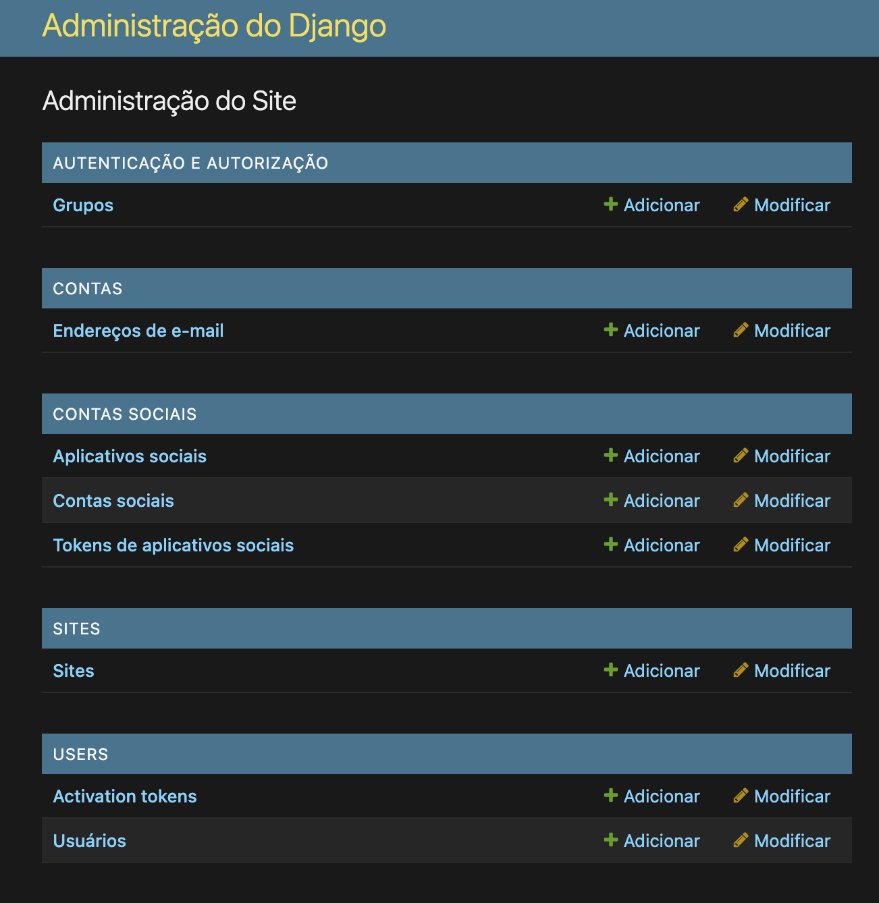

## Configurando o Google

Agora vamos criar um projeto no Google Cloud para permitir essa integração. Faça o login na conta Google que criamos para esse projeto, e acesse o [Google Cloud Console](https://console.cloud.google.com/)

1. Crie um novo projeto

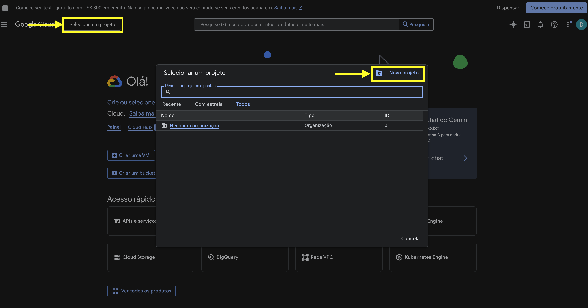

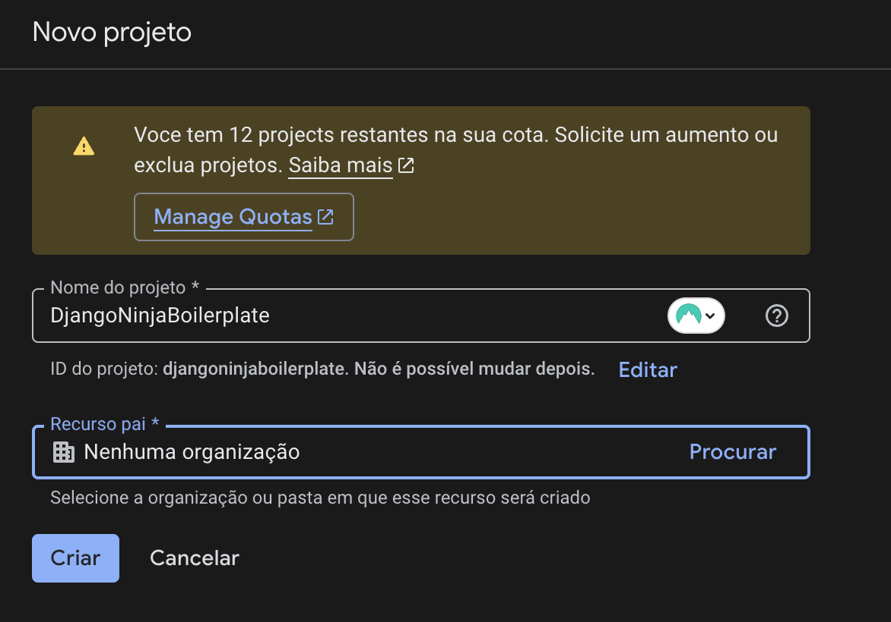

2. Entre nesse novo projeto

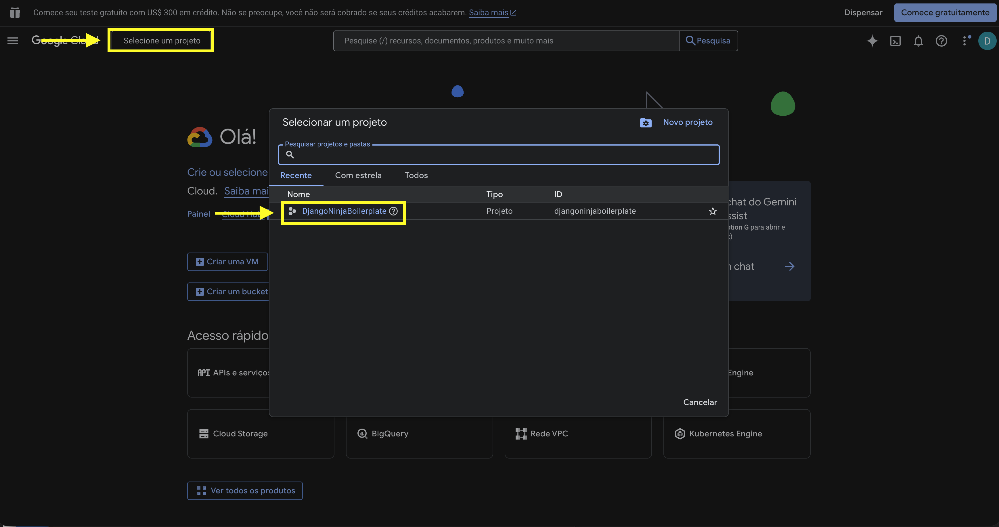

3. Acesse o menu `API e serviços`, e depois em `Ativar APIs e serviços`:

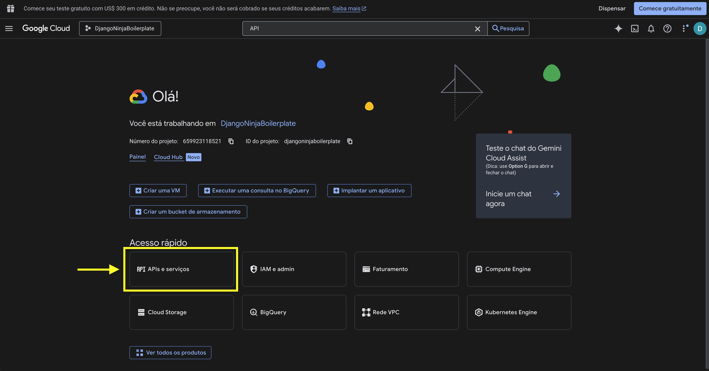

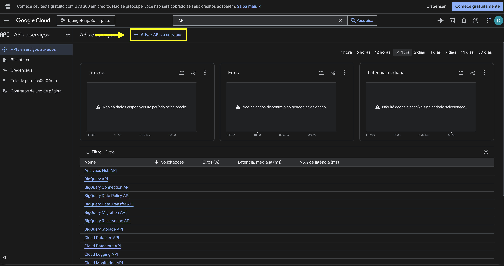

4. Procure a API "Google+ API" e ative ela

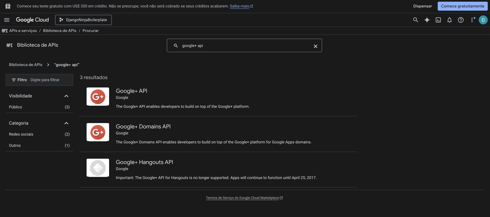

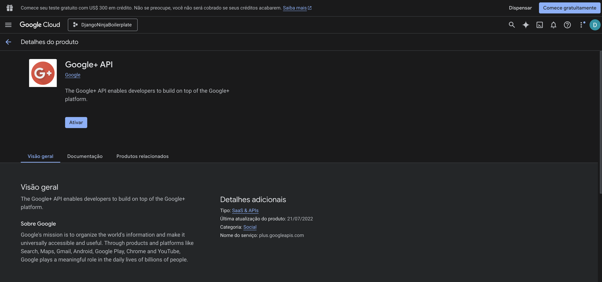

5. Vá no menu `Tela de permissão OAuth`, clique em "Vamos começar" e siga o Wizard:
   
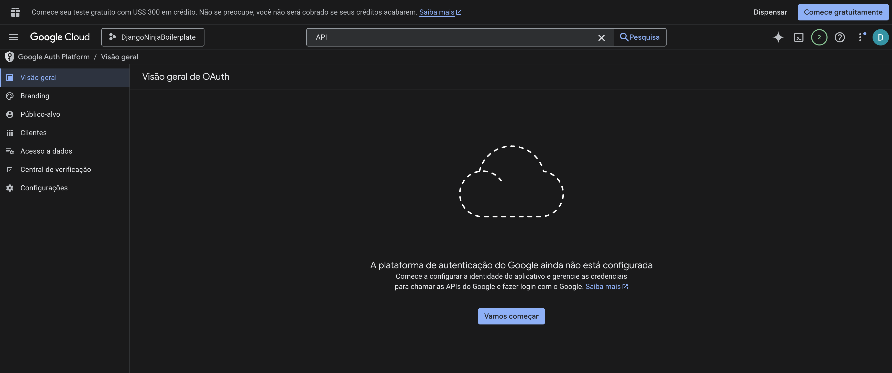   

* Nome do app: DjangoNinjaOAuth
* Email para suporte: djangoninja.api@gmail.com
* Público: Externo
* Dados de contato: djangoninja.api@gmail.com

Ao final do wizard, clique em `Criar um cliente OAuth`

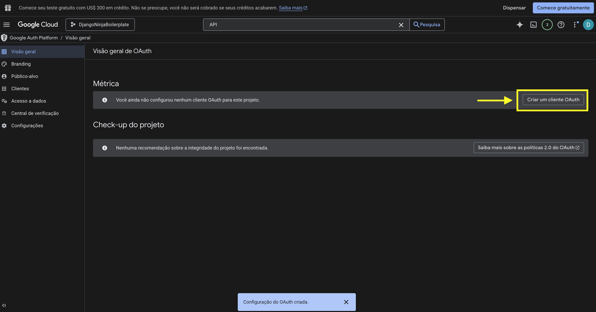

6. Selecione o tipo de aplicativo `Aplication da Web`, e siga o Wizard:

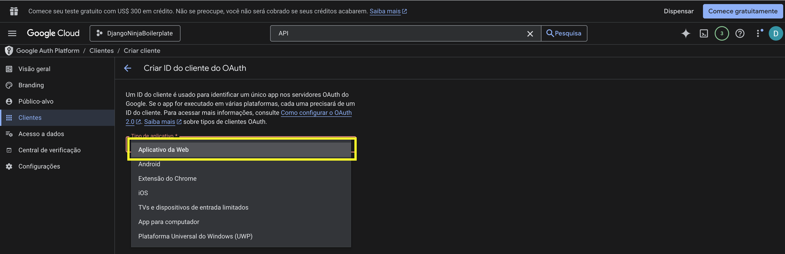

* Nome: Cliente Web 1
* URIs de redirecionamento autorizados:
  * `http://localhost:8000/accounts/google/login/callback/`
  * `https://myapi.brunononogaki.com/accounts/google/login/callback/`

1. Salve os dados do Client ID e Secret Key no .env, nas variáveis `GOOGLE_CLIENT_ID` e `GOOGLE_CLIENT_SECRET`

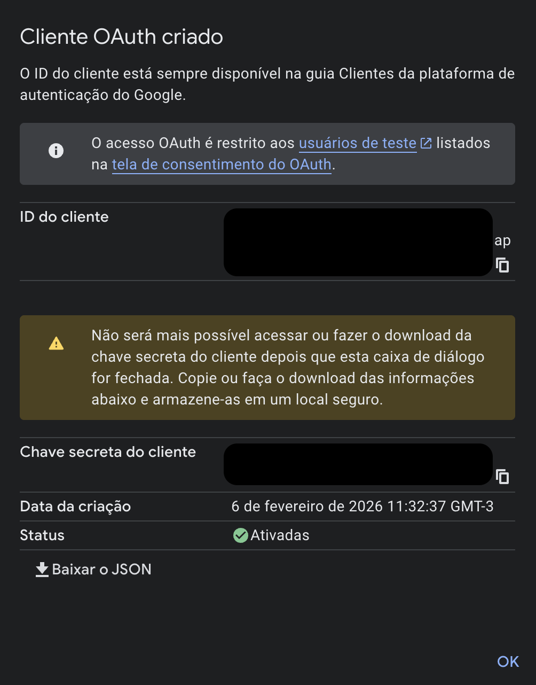

```bash title="./env-production"
# GOOGLE OAUTH
GOOGLE_CLIENT_ID=XXXXXX
GOOGLE_CLIENT_SECRET=XXXXXX
```

## Configurando no Django Admin

Agora entre no Django Admin, entre no menu `Sites`, e altere o site default `example.com` para `localhost:3000` (se estiver no seu ambiente local de desenvolvimento, ou coloque o domínio real do site em produção.)

Agora vá para `Aplicativos Sociais` (ou `Social Application`), e adicione um novo. Tenha certeza que esse site está no ID 1 (é possível ver pela URL), porque ele tem que dar match com o valor que colocamos em SITE_ID do `settings.py`.

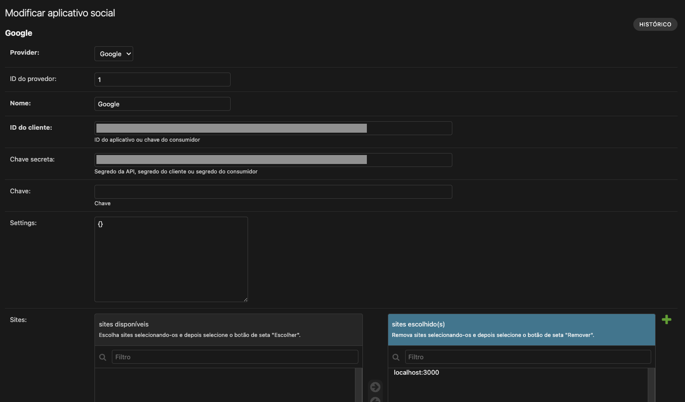

Preencha os campos:
* Provider: Google
* ID do provedor: 1
* Nome: Google Auth
* ID do cliente: ClientID retornado do Google
* Chave Secreta: Secret Key retornada do Google
* Sites: Mova o seu site para a coluna da direita


## Adicionando as rotas de Redirect URI

Agora o nosso backend precisa ter a rota `/accounts` para o `django-allauth` conseguir encaminhar a tela de login. Então vamos entrar no arquivo principal de urls.py e adicionar o path `accounts/`

```python title="./myapi/urls.py" hl_lines="2 8"
from django.contrib import admin
from django.urls import path, include

from .api import api

urlpatterns = [
    path('admin/', admin.site.urls),
    path('accounts/', include('allauth.urls')),
]

api_urlpatterns = [
    path('api/v1/', api.urls),
]

urlpatterns += api_urlpatterns
```


!!! tip

    Caso o projeto Django fosse um monolito (Django puro), com o frontend em templates Django no mesmo servidor, somente essa configuração seria o suficiente, porque o **allauth** recebe os dados do Google, cria/atualiza o usuário no banco, e marca uma **sessão Django** com cookie HTTP. O usuário fica com o atributo `is_authenticated` marcado como True.
    
    Mas como no nosso caso o Django é apenas o back, que se comunica com o nosso front em Next, o front não tem acesso aos cookies da sessão. Precisaremos fazer um passo adicional: gerar um token JWT para o usuário e armazenar no localStorage do browser, para que o frontend possa autenticar nas requisições da API.

## Criando o token JWT para o usuário

Vamos criar a rota `/social-token` para que o front possa enviar os Cookies de sessão e o back possa validar se o usuárioe stá autenticado, e caso positivo, devolver um token JWT:

```python title="./myapi/core/api.py"
@router.post('social-token', tags=['Auth'], response=TokenResponse)
def social_token(request):
    """
    Generate a JWT for the authenticated user via OAuth.
    """
    # Verifica se tem usuário autenticado (via sessão Django)
    if not request.user.is_authenticated:
        logger.warning(f'Attempt to get social token without authentication')
        raise UnauthorizedError(message='User is not authenticated')

    user = request.user
    logger.info(f'User {user.username} (id={user.id}) requested social token')

    tokens = create_token(user)
    return 200, {'token_type': 'bearer', **tokens}
```

## Testando a rota de `/social-token`

O fluxo completo de autenticação com o Google é muito complexo de testar, mas podemos pelo menos validar se o endpoint `/social-token` está retornando um token JWT caso haja um usuário logado na sessão Django, e se ele retorna `401 Forbidden` caso não haja usuários autenticados.

```python title="./myapi/core/tests/test_auth.py"
@pytest.mark.django_db
def test_social_token_success(client):
    """Test JWT generation for authenticated user via OAuth"""
    User = get_user_model()
    user = User.objects.create_user(username='google_user', email='google@example.com', password='testpass123')

    # Login via sessão Django
    client.login(username='google_user', password='testpass123')

    # Chama endpoint social-token
    response = client.post('/api/v1/social-token')

    assert response.status_code == HTTPStatus.OK
    data = response.json()
    assert 'access_token' in data
    assert 'refresh_token' in data
    assert data['token_type'] == 'bearer'


@pytest.mark.django_db
def test_social_token_not_authenticated(client):
    """Test JWT endpoint rejects unauthenticated users"""
    response = client.post('/api/v1/social-token')

    assert response.status_code == HTTPStatus.UNAUTHORIZED
```


## Criando o botão de login no front

Certo, agora vamos criar o botão no front para fazermos o login via Google.

### Declarando as novas rotas no `api.js`

Primeiro, vamos adicionar essas rotas de API no nosso arquivo `config/api.js`:

```javascript title="./next/config/api.js" hl_lines="6 12-15"
export const API_ENDPOINTS = {
  // Authentication endpoints
  AUTH: {
    LOGIN: "/api/v1/login",
    REFRESH: "/api/v1/refresh",
    SOCIAL_TOKEN: "/api/v1/social-token",
    ACTIVATE: (tokenId) => `/api/v1/users/activate/${tokenId}`,
    RESEND_ACTIVATION: (tokenId) =>
      `/api/v1/users/resend-activation/${tokenId}`,
  },

  // Social Auth endpoints
  SOCIAL_AUTH: {
    GOOGLE_LOGIN: "/accounts/google/login/",
  },
  // ...
```

E podemos criar também essas chamadas no arquivo `utils/auth.js`. Chamaremos as funções de `loginWithGoogle()` (redirecionar o usuário para a página de autenticação do google) e `getSocialToken()` (obter o token JWT após a autenticação oAuth)

```javascript title="./next/utils/auth.js"
//...
/**
 * Iniciar login com Google
 * Redireciona o usuário para a página de autenticação do Google
 *
 * @example
 * const handleGoogleLogin = () => {
 *   loginWithGoogle();
 * };
 */
export function loginWithGoogle() {
  const googleAuthUrl = `${API_BASE_URL}${API_ENDPOINTS.SOCIAL_AUTH.GOOGLE_LOGIN}`;
  window.location.href = googleAuthUrl;
}

/**
 * Obter token JWT após autenticação OAuth
 * Chamado após o usuário ser redirecionado de volta do Google
 * Envia os cookies da sessão Django e recebe JWT
 *
 * @returns {Promise} - Resposta com access_token e refresh_token
 *
 * @example
 * // Após ser redirecionado de /accounts/google/login/callback/
 * const response = await getSocialToken();
 * // { access_token: '...', refresh_token: '...' }
 */
export async function getSocialToken() {
  const response = await apiCall(API_ENDPOINTS.AUTH.SOCIAL_TOKEN, {
    method: "POST",
    credentials: "include", // Importante: envia cookies da sessão Django
  });

  // Salvar tokens no localStorage
  if (response.access_token) {
    localStorage.setItem("access_token", response.access_token);
  }
  if (response.refresh_token) {
    localStorage.setItem("refresh_token", response.refresh_token);
  }

  return response;
}
```

### Criando o botão de login com o Google

Agora vamos lá no nosso `index.jsx` e criar o botão de login social logo abaixo do botão de login padrão. A ação desse botão é simplesmente chamar a função `loginWithGoogle`, que faz um redirect para a rota `/accounts/google/login/` do Django (tecnicamente, não é uma API)

```javascript title="./next/pages/index.jsx"
// ...
        {/* Social Login */}
        <div className="mt-6 space-y-4">
          <p className="text-center text-gray-600 text-sm">ou entre com</p>
          <button
            type="button"
            onClick={loginWithGoogle}
            className="w-full bg-white hover:bg-gray-50 text-gray-700 font-semibold py-2 px-4 rounded-lg transition duration-200 border border-gray-300 flex items-center justify-center gap-3"
          >
            <svg width="18" height="18" viewBox="0 0 18 18">
              <path fill="#4285F4" d="M16.51 8H8.98v3h4.3c-.18 1-.74 1.48-1.6 2.04v2.01h2.6a7.8 7.8 0 0 0 2.38-5.88c0-.57-.05-.66-.15-1.18z"/>
              <path fill="#34A853" d="M8.98 17c2.16 0 3.97-.72 5.3-1.94l-2.6-2a4.8 4.8 0 0 1-7.18-2.54H1.83v2.07A8 8 0 0 0 8.98 17z"/>
              <path fill="#FBBC05" d="M4.5 10.52a4.8 4.8 0 0 1 0-3.04V5.41H1.83a8 8 0 0 0 0 7.18l2.67-2.07z"/>
              <path fill="#EA4335" d="M8.98 4.18c1.17 0 2.23.4 3.06 1.2l2.3-2.3A8 8 0 0 0 1.83 5.4L4.5 7.49a4.77 4.77 0 0 1 4.48-3.3z"/>
            </svg>
            Continuar com Google
          </button>
        </div>
```

!!! success

    Perfeito, por enquanto temos um botão de login via Google, que se pressionado, vai abrir uma tela de login padrão do Google! Mas se tentarmos o login ainda não vai funcionar, porque ainda não implementamos a tela de callback.


### Criando a página de callback

A página de callback é a que definimos no Google como:

* URIs de redirecionamento autorizados:
  * `http://localhost:8000/accounts/google/login/callback/`
  * `https://react.brunononogaki.com/accounts/google/login/callback/`

O nosso front precisa ter essas rotas criadas. Então vamos criar o arquivo `/accounts/google/login/callback/index.js` para o Next já automaticamente criar esse caminho.

```javascript title="./next/pages/accounts/google/login/callback/index.js"
import { useEffect, useState } from "react";
import { useRouter } from "next/router";
import { getSocialToken } from "utils/auth";

/**
 * Página de Callback do Google OAuth
 *
 * Fluxo:
 * 1. User clica em "Login com Google"
 * 2. Redireciona pra /accounts/google/login/
 * 3. User autentica no Google
 * 4. Google redireciona de volta pro /accounts/google/login/callback/ (Django)
 * 5. Django cria user + sessão
 * 6. Django redireciona pra LOGIN_REDIRECT_URL
 * 7. User chega nessa página com sessão Django ativa
 * 8. Essa página chama getSocialToken() pra gerar JWT
 * 9. Armazena tokens no localStorage
 * 10. Redireciona pra /home
 */
export default function GoogleCallback() {
  const router = useRouter();
  const [isLoading, setIsLoading] = useState(true);
  const [error, setError] = useState("");

  useEffect(() => {
    const handleCallback = async () => {
      try {
        setError("");
        setIsLoading(true);

        // Chamar endpoint pra gerar JWT usando a sessão Django
        const response = await getSocialToken();

        if (response.access_token) {
          // JWT foi gerado com sucesso
          console.log("✅ JWT gerado com sucesso");

          // Pequeno delay pra garantir que o localStorage foi salvo
          setTimeout(() => {
            router.push("/home");
          }, 500);
        } else {
          throw new Error("Nenhum token de acesso recebido");
        }
      } catch (err) {
        console.error("❌ Erro ao gerar JWT:", err);

        // Mensagem de erro mais clara
        let errorMessage = "Erro ao processar autenticação. Tente novamente.";
        if (err.message) {
          errorMessage = err.message;
        }

        setError(errorMessage);
        setIsLoading(false);
      }
    };

    handleCallback();
  }, [router]);

  return (
    <div className="min-h-screen bg-gradient-to-br from-blue-500 to-purple-600 flex items-center justify-center p-4">
      <div className="bg-white rounded-lg shadow-2xl p-8 max-w-md w-full text-center">
        {isLoading && !error && (
          <>
            <div className="flex justify-center mb-4">
              <div className="animate-spin">
                <svg
                  className="w-12 h-12 text-blue-600"
                  fill="none"
                  stroke="currentColor"
                  viewBox="0 0 24 24"
                >
                  <path
                    strokeLinecap="round"
                    strokeLinejoin="round"
                    strokeWidth={2}
                    d="M4 4v5h.582m15.356 2A8.001 8.001 0 004.582 9m0 0H9m11 11v-5h-.581m0 0a8.003 8.003 0 01-15.357-2m15.357 2H15"
                  />
                </svg>
              </div>
            </div>
            <h1 className="text-2xl font-bold text-gray-900 mb-2">
              Processando Login
            </h1>
            <p className="text-gray-600 text-sm">
              Estamos gerando seus tokens de acesso...
            </p>
          </>
        )}

        {error && (
          <>
            <div className="flex justify-center mb-4">
              <svg
                className="w-12 h-12 text-red-600"
                fill="none"
                stroke="currentColor"
                viewBox="0 0 24 24"
              >
                <path
                  strokeLinecap="round"
                  strokeLinejoin="round"
                  strokeWidth={2}
                  d="M12 8v4m0 4v.01M21 12a9 9 0 11-18 0 9 9 0 0118 0z"
                />
              </svg>
            </div>
            <h1 className="text-2xl font-bold text-gray-900 mb-2">
              Erro na Autenticação
            </h1>
            <div className="bg-red-50 border border-red-200 text-red-700 px-4 py-3 rounded-lg text-sm mb-4">
              {error}
            </div>
            <button
              onClick={() => (window.location.href = "/")}
              className="w-full bg-blue-600 hover:bg-blue-700 text-white font-semibold py-2 px-4 rounded-lg transition duration-200"
            >
              Voltar para Login
            </button>
          </>
        )}
      </div>
    </div>
  );
}
```

!!! success

    Agora é possível fazer o login ou o cadastro usando a conta do Google! O único detalhe é que quando um usuário cria a sua conta usando o Google, o campo de Usuário é salvo em branco. Vamos criar um adapter para que sempre que ocorra um cadastro via login social, o username fica sendo o e-mail do usuário.

## Criando adapter customizado

Os adaptadores do django-allauth fornecem funcionalidades extras para o oAuth e gestão de contas. Usaremos ele para popularmos automaticamente o campo de username como sendo o e-mail do usuário.

```python title="./myapi/core/adapters.py"


class SocialAccountAdapter(DefaultSocialAccountAdapter):
    """Adaptador customizado para contas sociais (Google, etc)"""

    def pre_social_login(self, request, sociallogin):
        """
        Chamado antes do login social
        """
        pass

    def populate_user(self, request, sociallogin, data):
        """
        Preenche os dados do usuário a partir dos dados do provider social
        """
        user = super().populate_user(request, sociallogin, data)

        # Garante que username seja sempre o email
        if user.email:
            user.username = user.email

        return user
```

Para surtir efeito, precisamos configurá-lo no `settings.py`

```python title="./myapi/settings.py"
# Adaptador customizado para gerar username automaticamente
SOCIALACCOUNT_ADAPTER = 'myapi.core.adapters.SocialAccountAdapter'
```

!!! success

    Agora temos um sistema de login social funcional. É possível se cadastrar no site usando uma conta do Google:

    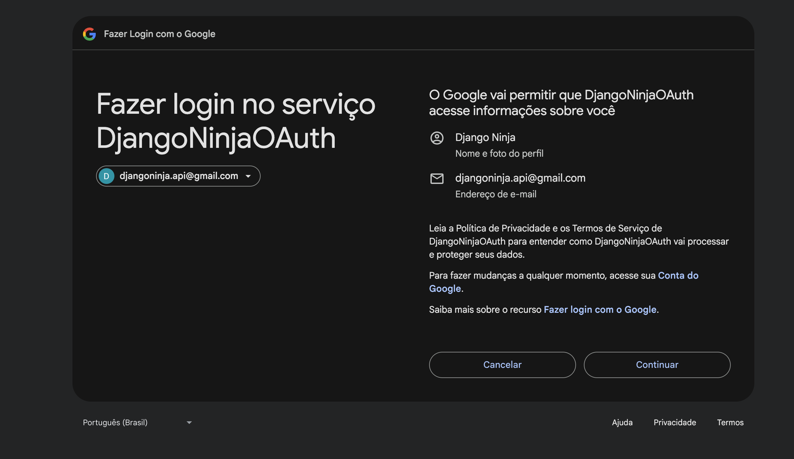

    E depois do cadastro, o username fica sendo o e-mail do usuário

    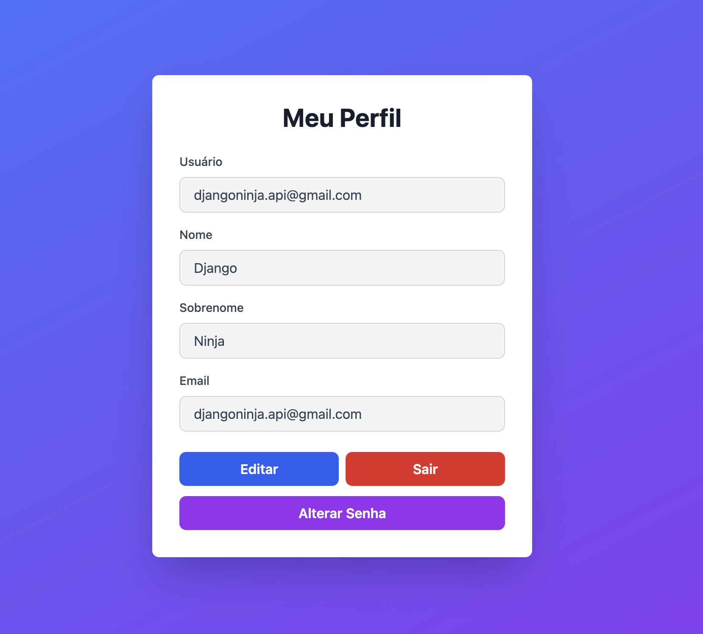